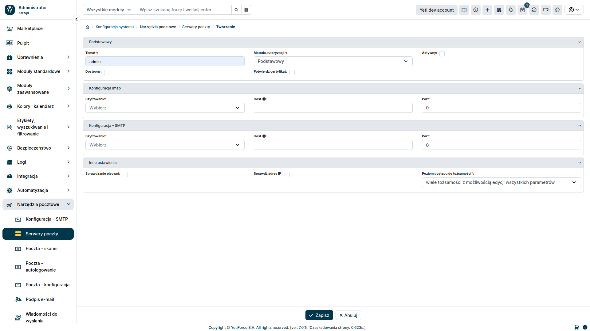
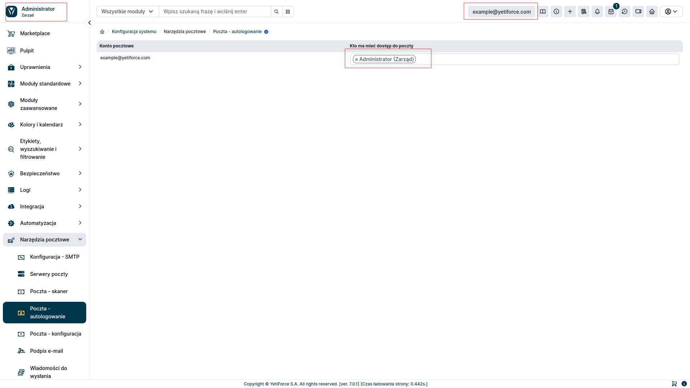
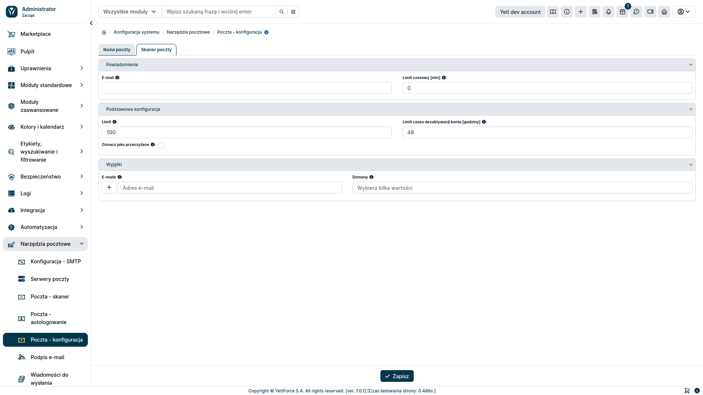
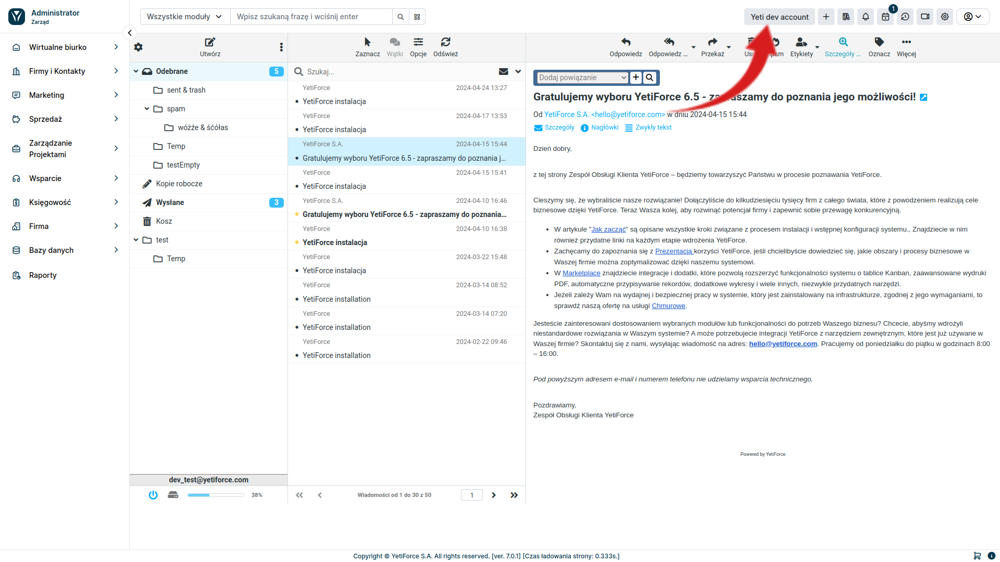

Corporate mailboxes in the YetiForce system are a functionality that allows for central management of email correspondence in the organization. They allow for monitoring, receiving and sending emails from different email accounts directly from the YetiForce system.

Company mailboxes are closely integrated with other YetiForce modules. This allows emails to be automatically related to relevant records in the system.

## Configuration

In order to be able to use the Corporate mailbox functionality, it's necessary to configure the `Mail server` and `Mail scanner` in the administration section. Additionally, you must configure the `Auto login` section to be able to send messages via the YetiForce system. Below is a description of how to do it.

### Mail server configuration

It's necessary to configure the mail server to start using the corporate mailbox. To do this, select `Mail Tools ➞ Mail Servers` in the administration section in the left-hand menu. Here you can add new configurations using the <kbd>Add record</kbd> button or edit the currently existing ones.

After clicking the <kbd>Add record</kbd> button, you will be able to fully configure the connection to the email service. IMAP configuration will allow you to receive emails, and SMTP will allow you to send them from the corporate mailbox in YetiForce.

### Mail Scanner configuration

The next step is to configure the mail scanner. It's a tool that downloads emails from the mail server and then initiates relevant actions in the YetiForce system based on them. To configure it, select `Mail Tools ➞ Mail - Scanner` from the left menu.

The <kbd>Add record</kbd> button allows you to create a new mail scanner.

#### Mail scanner - form fields

- Server - mail server created in `Mail Tools ➔ Mail Servers`
- Login - login used to log in to the email
- Password - password to log in to the email (optional for OAuth authentication)
- Mail scanner actions
  - Create email - selecting this option downloads emails from the mail server
  - Bind email message - allows you to relate an email with a user or other system resource based on the criteria specified in the `Search box`
  - Open a ticket - sets the appropriate status for the ticket related with the downloaded email message
  - Create a ticket - creates a new ticket in the system
- Search fields - defines the criteria for relating an email to another element in the system
- User - specifies the user that the created element will be assigned to

### Sending emails

This functionality applies only to the internal email client (RoundCube). If you want the YetiForce system to not only receive emails, but also allow you to send emails, you should select `Email Tools ➔ Mail - autologin` in the administration section.

For each created email account, select a user from the YetiForce system who should have access to it. Leaving this value empty will prevent anyone in the system from logging in to the mailbox. When you grant the user access to the mailbox, an additional button with the name you entered in the mail scanner will appear in the bar at the top of the page on the right. If the user has been granted access to several mailboxes, a drop-down list will appear instead of the button, where you can select the mailbox.

### Mail configuration

The `Mail - configuration` tab allows you to configure the function that downloads messages from the mail server, such as:

- frequency of checking for new messages
- max number of messages that can be downloaded at once
- filters that allow you to specify which messages the email scanner should ignore.

### Mail client

Once you complete the steps above, the YetiForce system will be able to download messages from the mail server and handle them accordingly. To view downloaded messages or send an email, select the mail name located in the upper right menu. You will then be transferred to the mail client.

You can also access the mail client from the user section. To do this, select `Virtual desk ➔ Mailbox` from the left menu

### Mail scanner logs

The YetiForce system allows you to review the operation of the mail scanner based on logs containing the scanner's work time and the number of messages downloaded. To check this, select `Logs ➔ Mails - download history` from the left menu in the administration section

