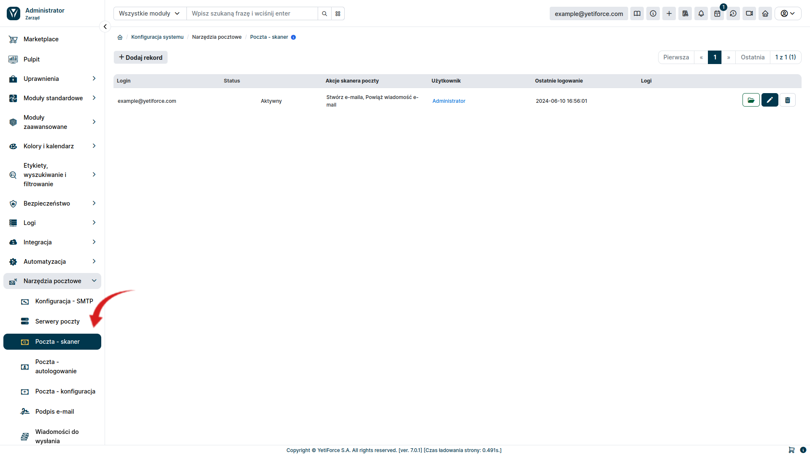
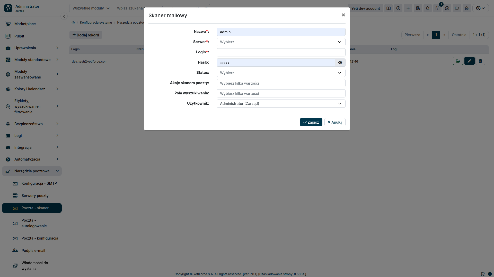

Skrzynki korporacyjne w systemie YetiForce to funkcjonalność pozwalająca na centralne zarządzanie korespondencją e-mailową w ramach organizacji. Dzięki nim możliwe jest monitorowanie, odbieranie i wysyłanie wiadomości e-mail z różnych kont pocztowych bezpośrednio z poziomu systemu YetiForce.

Skrzynki firmowe są ściśle zintegrowane z innymi modułami YetiForce. Pozwala to na automatyczne przypisywanie e-maili do odpowiednich rekordów w systemie.

## Konfiguracja

By móc skorzystać z funkcjonalności skrzynki korporacyjnej konieczne jest skonfigurowanie w sekcji administracyjnej ```Serwera poczty``` oraz ```Skanera poczty```. Natomiast by móc wysyłać wiadomości przez system YetiForce należy dodatkowo ustawić sekcję ```Autologowanie```. Poniżej znajduje się opis, jak można to zrobić.

### Konfiguracja Serwera poczty

W celu rozpoczęcia korzystania ze skrzynki korporacyjnej niezbędnym będzie skonfigurowanie serwera pocztowego. Żeby to zrobić, należy wybrać w sekcji administracyjnej w menu po lewej stronie ```Narzędzia pocztowe ➞ Serwery poczty```. W tym miejscu możemy dodać nowe konfiguracje za pomocą przycisku <kbd>Dodaj rekord</kbd> lub edytować aktualnie istniejące.


Po naciśnięciu przycisku <kbd>Dodaj rekord</kbd>, będziemy mieć możliwość w pełni skonfigurować sposób podłączenia się pod usługę mailową. Konfiguracja imap umożliwi prawidłowe odbieranie wiadomości pocztowych a natomiast SMTP na wysyłanie wiadomości przez YetiForce z korporacyjnej skrzynki mailowej.


### Konfiguracja Skanera poczty

Kolejnym krokiem jest skonfigurowanie skanera poczty. Jego zadaniem jest pobieranie wiadomości e-mail z serwera pocztowego, a następnie inicjowanie na ich podstawie odpowiednich akcji w systemie YetiForce. W celu jego konfiguracji z lewego menu należy wybrać ```Narzędzia pocztowe ➞ Poczta - skaner```.



Przycisk <kbd>Dodaj rekord</kbd> umożliwi stworzenie nowego skanera poczty.



#### Pole formularza tworzenia skanera pocztowego
- Serwer - serwer pocztowy utworzony w ```Narzędzia pocztowe ➔ Serwery poczty```
- Login - login służący do zalogowania się do poczty
- Hasło - hasło umożliwiające zalogowanie się do poczty (opcjonalne przy uwierzytelnianiu OAuth)
- Akcje skanera poczty
    - Stwórz e-maila - wybranie tej opcji powoduje pobieranie wiadomości email z serwera pocztowego
    - Powiąż wiadomość e-mail - pozwala połączyć wiadomość z użytkownikiem lub innym zasobem systemu na podstawie kryteriów określonych w ```Pole wyszukiwania```
    - Otwórz zgłoszenie - ustawia odpowiedni status dla zgłoszenia powiązanego z pobraną wiadomością mailową
    - Utwórz zgłoszenie - tworzy nowe zgłoszenie w systemie
- Pola wyszukiwania - określa kryteria powiązania wiadomości z elementem systemu
- Użytkownik - określa użytkownika, do którego będzie przypisane utworzony element systemu

### Wysyłanie wiadomości pocztowych

Funkcjonalność wysyłania wiadomości pocztowych ma zastosowanie tylko w zakresie wewnętrznego klienta pocztowego (RoundCube). Jeżeli chcemy by system YetiForce nie tylko odbierał pocztę, ale także umożliwiał nam wysyłanie wiadomości pocztowych, należy w sekcji administracyjnej wybrać  ```Narzędzia pocztowe ➔ Poczta - autologowanie```.


Dla każdego utworzonego konta pocztowego wybieramy użytkownika z systemu YetiForce, który ma mieć do niego dostęp. Pozostawienie pustej wartości spowoduje, że nikt w systemie nie będzie mógł się zalogować do skrzynki pocztowej. Gdy nadamy użytkownikowi prawo dostępu do skrzynki, w pasku na górze strony, po prawej stronie, pojawi się dodatkowy przycisk z nazwą jaką podaliśmy w skanerze poczty. Jeżeli użytkownik będzie miał nadany dostęp do kilku skrzynek, zamiast przycisku pojawi się lista rozwijana, z której możemy wybrać interesującą nas skrzynkę.


### Konfiguracja poczty

Zakładka ```Poczta - konfiguracja``` pozwala nam ustawić parametry funkcji pobierającej wiadomości z serwera pocztowego, takie jak:
* częstotliwość sprawdzania czy pojawiły się nowe wiadomości
* limit maksymalnej liczby wiadomości, które można pobrać jednorazowo
* filtry pozwalające określić jakie wiadomości skaner poczty ma pomijać.


### Klient poczty

Po wykonaniu powyższych kroków, system YetiForce będzie w stanie pobierać wiadomości z serwera pocztowego i odpowiednio je obsłużyć. Żeby przejrzeć pobrane wiadomości lub wysłać wiadomość mailową, wybieramy nazwę poczty, która znajduje się w górnym menu po prawej stronie. Zostaniemy wówczas przeniesieni do klienta pocztowego.


Do klienta pocztowego możemy również się dostać z poziomu sekcji użytkownika. Należy w tym celu wybrać z lewego menu ```Wirtualne biurko ➔ Moja poczta```


### Logi skanera poczty

System YetiForce pozwala przejrzeć pracę skanera poczty na podstawie logów zawierających czas pracy skanera i liczbę pobranych wiadomości.
By to sprawdzić należy w sekcji administracyjnej wybrać z lewego menu ```Logi ➔ Maile - historia pobrań```


