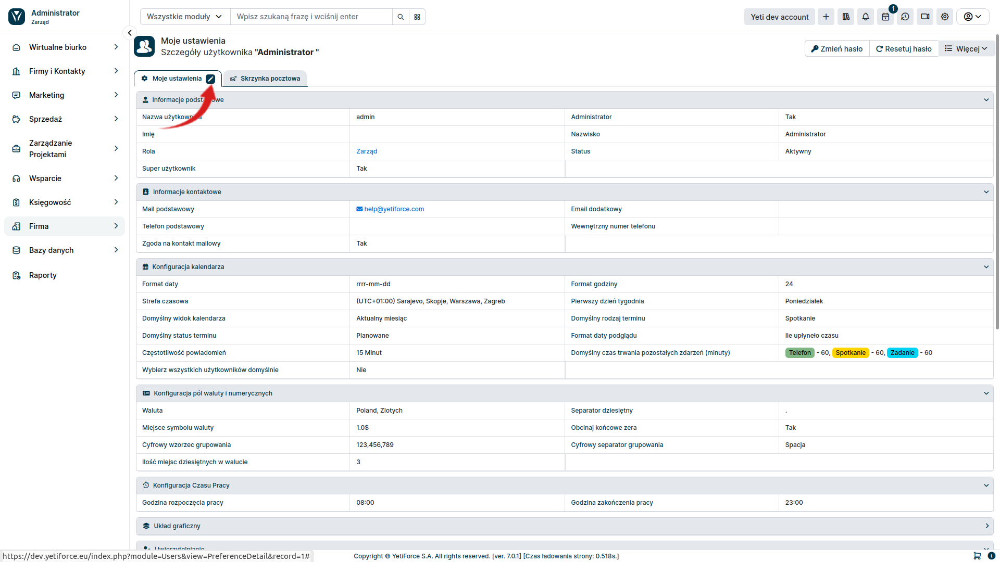
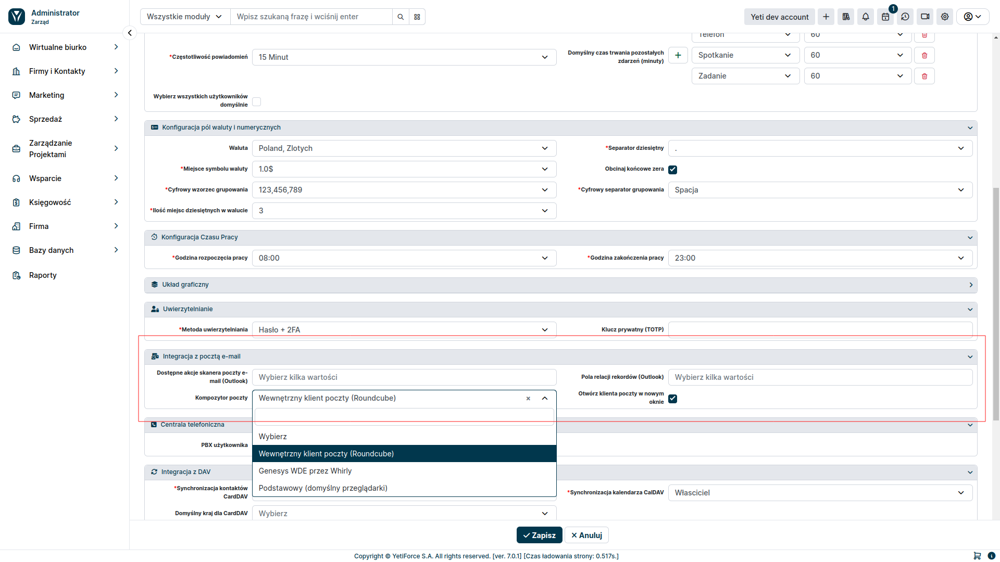
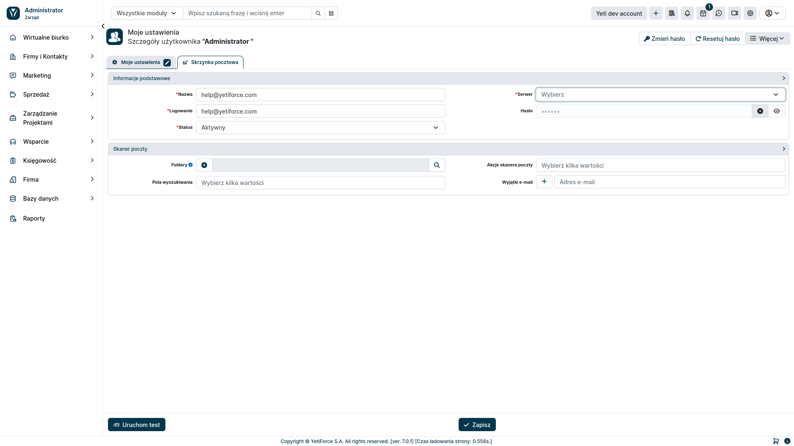
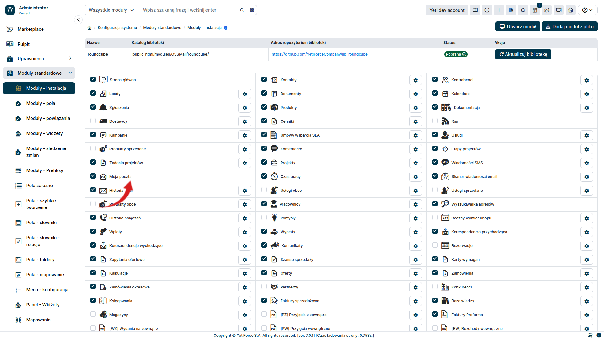

Skrzynki prywatne to indywidualne konta pocztowe użytkowników, które służą do osobistej korespondencji e-mailowej.
Dostęp do niej może mieć tylko jeden użytkownik.

## Konfiguracja

W celu skonfigurowania skrzynki prywatnej wybierz ikonę użytkownika znajdującą się w prawym górnym rogu a następnie z menu, które się pojawi wybierz <kbd>Moje ustawienia</kbd>


Przejdź do edycji ustawień konta, wybierając znak edycji znajdujący się koło zakładki <kbd>Moje ustawienia</kbd>



W widoku edycji, znajdź sekcję ```Integracja z pocztą e-mail``` i odpowiednio ją skonfiguruj.



Następnie przechodzimy do zakładki ```Skrzynka pocztowa```.


W widoku skrzynki pocztowej, możemy skonfigurować połączenie z usługa pocztową oraz ustawić skaner poczty.



#### Informacje podstawowe
- Nazwa - nazwa pod jaką będzie widnieć skrzynka pocztowa
- Serwer - serwer pocztowy utworzony w konfiguracji systemu w ```Narzędzia pocztowe``` > ```Serwery poczty```
- Logowanie - login służący do zalogowania się do poczty (opcjonalne przy uwierzytelnianiu OAuth)
- Hasło - hasło umożliwiające zalogowanie się do poczty (opcjonalne przy uwierzytelnianiu OAuth)

#### Skaner poczty
- Akcje skanera poczty
    - Stwórz e-maila - wybranie tej opcji powoduje pobieranie wiadomości email z serwera pocztowego
    - Powiąż wiadomość e-mail - pozwala połączyć wiadomość z użytkownikiem lub innym zasobem systemu na podstawie kryteriów określonych w ```Pole wyszukiwania```
    - Otwórz zgłoszenie - ustawia odpowiedni status dla zgłoszenia powiązanego z pobraną wiadomością mailową
    - Utwórz zgłoszenie - tworzy nowe zgłoszenie w systemie
- Pola wyszukiwania - określa kryteria powiązania wiadomości z elementem systemu
- wyjątki e-mail - określa adresy mailowe, z których wysłane wiadomości mają być pomijane przez skaner poczty

### Uruchomienie modułu

W celu uruchomienia skrzynki prywatnej, upewnij się, masz uruchomiony moduł ```Moja poczta```. W tym celu w Konfiguracji systemu, w lewym menu wybierz ```Moduy standardowe ➞ Moduły - instalacja```.
Checkbox przy module ```Moja poczta``` musi być zaznaczony.




