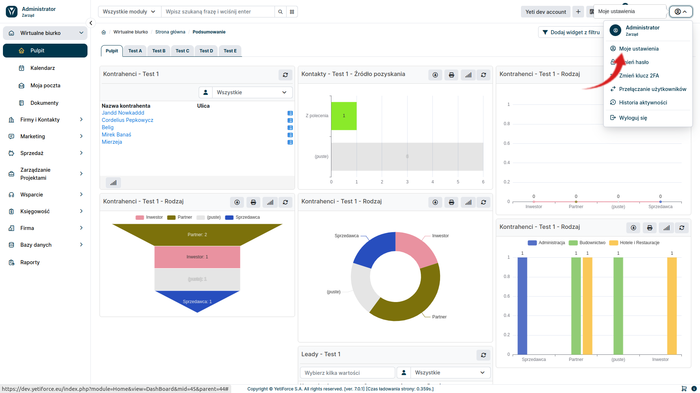

Private mailboxes are individual user email accounts that are used for personal email correspondence. Only one user can have access to it.

## Configuration

To configure your private mailbox, select the user icon in the upper right corner and then select <kbd>My preferences</kbd> from the menu that appears

Edit your account settings by selecting the edit icon next to the <kbd>My preferences</kbd> tab

In the edit view, find the `Email Integration` section and configure it accordingly.

Go to the `Mailbox` tab.

In this view, you can configure the mail service connection and the mail scanner.

#### General information

- Name - the display name of the mailbox
- Server - mail server created in `Mail Tools ➔ Mail Servers`
- Login - login used to log in to email (optional for OAuth authentication)
- Password - password to log in to the email (optional for OAuth authentication)

#### Mail scanner

- Mail scanner actions
  - Create email - selecting this option downloads emails from the mail server
  - Bind email message - allows you to relate an email with a user or other system resource based on the criteria specified in the `Search box`
  - Open a ticket - sets the appropriate status for the ticket related with the downloaded email message
  - Create a ticket - creates a new ticket in the system
- Search fields - defines the criteria for relating an email to another element in the system
- Email exceptions - the email scanner will omit messages received from addresses listed in this field

### Uruchomienie modułu

To enable a private mailbox, make sure your `My mailbox` module is active. To do this, in the System Configuration, in the left menu, select `Standard modules ➞ Modules - installation`. The checkbox next to the `My mailbox` module must be checked.

