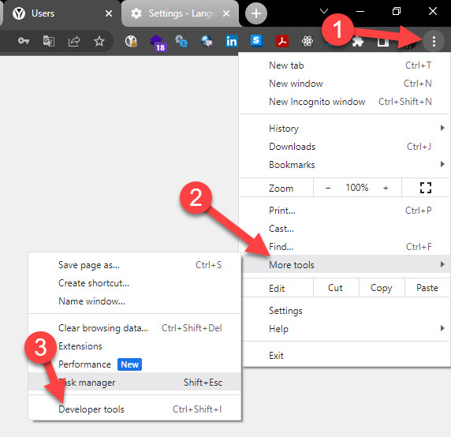
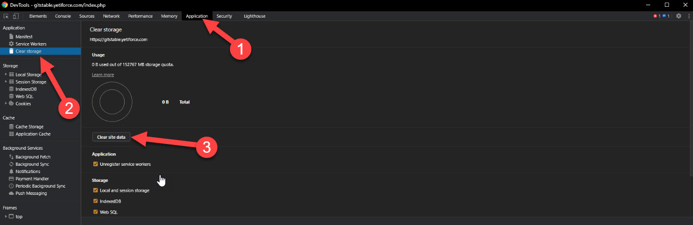
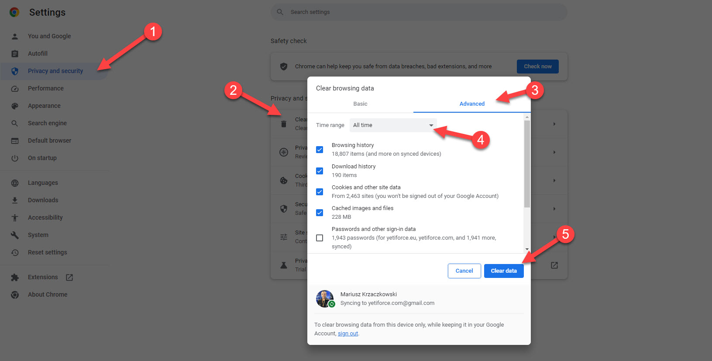
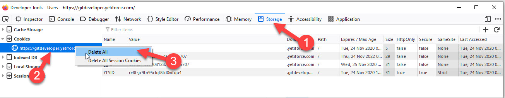

Clearing browser cache is a very useful step that should be performed after updating the system in order to make sure that the pages are displayed correctly and that the old cache files don't cause problems.

## Clearing cache in `Google Chrome`

1. Open your YetiForce in Google Chrome

2. Press <kbd>F12</kbd> or go to\*\* Developer tools.\*\*

   To open Developer tools follow these steps:

   

3. Select the `Application` tab in the popup window

4. In the `Application` tab in the panel on the left select `Clear storage`
   Click `Clear site data`

   Then click `Clear site data`

### Alternative method

Another option is to clear your browsing data. A description of this process can be found in the following article: [Clear cache & cookies](https://support.google.com/accounts/answer/32050).

:::warning

Select all the items you want to remove and the time range

:::

## Clearing cache in `Firefox`

1. Open your YetiForce system in the Firefox browser
2. Press <kbd>F12</kbd>
3. Select the `Storage` tab in the window that showed up after pressing <kbd>F12</kbd>
4. In the `Storage` tab in the panel on the left side right-click your YetiForce's URL and select `Delete All`

