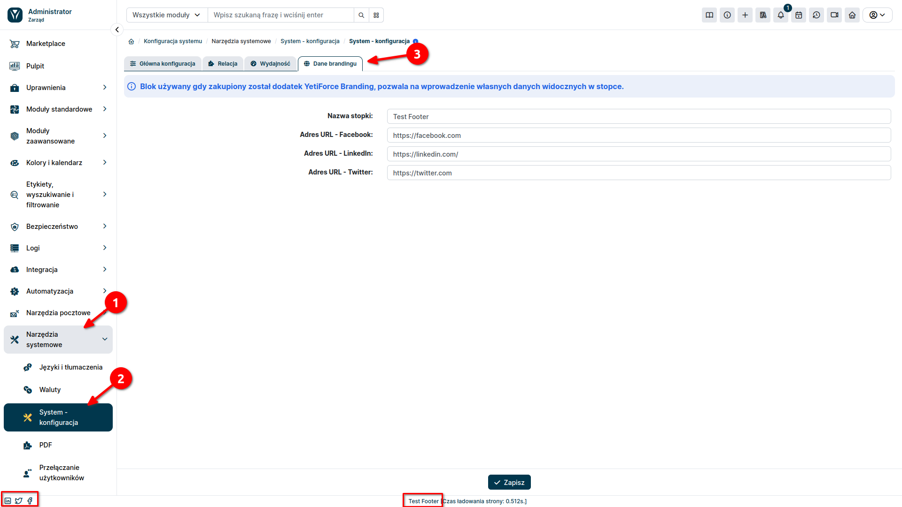

:::warning

Usługa Personalizacji Brandingu nie usuwa całkowicie systemowego brandingu YetiForce do własnych potrzeb. Przed zakupem prosimy dokładnie zapoznać się z opisem funkcji

:::

Dodatek personalizacji brandingu pozwala na pełniejsze dostosowanie wyglądu systemu YetiForce. Umożliwia wstawienie danych swojej firmy do stopki oraz ustawienie własnych linków do profili w mediach społecznościowych.

### Features

- Dodanie do stopki odnośników z własnymi linkami do mediów społecznościowych
- Usunięcie informacji o twórcy oprogramowania w stopce strony
- Usunięcie stopki producenta z maili systemowych
- Usunięcie stopki producenta z wydruków PDF

Należy pamiętać, że usługa personalizacji nie jest zamiennikiem tzw. “white labellingu” i nie usunie z systemu całkowicie wszystkich informacji o producencie systemu.

### Personalizacja informacji widocznych w stopce strony

Dane o brandingu firmy ustawia się wybierając w sekcji administracyjnej z lewego menu `Narzędzia systemowe → System - konfiguracja`. Następnie należy wybrać zakładkę **Dane brandingu**. W tym miejscu będziemy mogli ustawić wartości jakie mają sie pojawić w stopce strony. Ikony mediów społecznościowych nie pokażą się w stopce jeśli odnośniki nie zostały uzupełnione w konfiguracji.

Stopka strony bez wykupionego brandingu

Stopka strony z wykupionym brandingiem

## FAQ

Czy usługa Disable Branding pozwala zmienić logo w systemie?

Zmiana logo widocznego między innymi na stronie logowania możliwa jest bez konieczności wykupienia usługi Disable Branding. Szczegółowy opis jak zmienić logo w swoim systemie dostępny jest w naszej dokumentacji: [Jak zmienić logo YetiForce na własne?](https://doc.yetiforce.com/pl/administrator-guides/faq/how-to-change-logo/)

