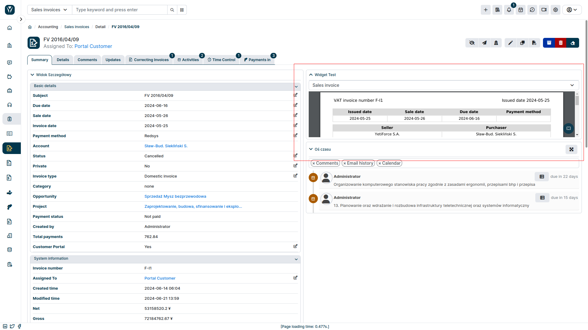
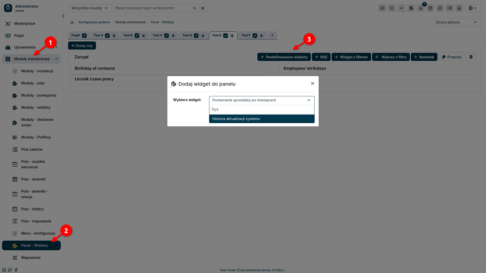
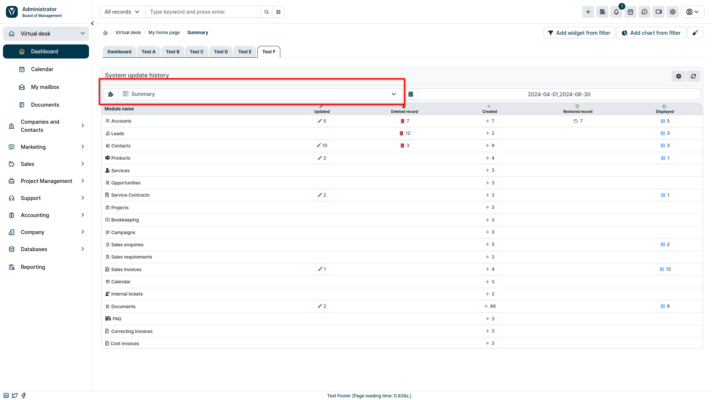
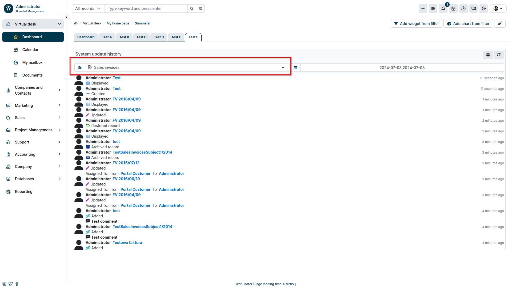
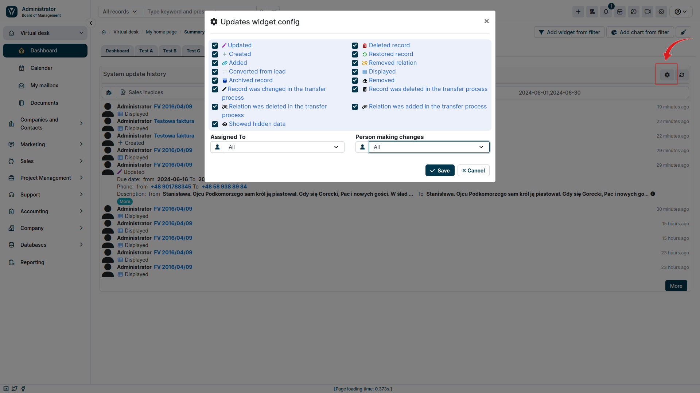

**Widgets Premium** allow you to display additional information on the desktop and in the record summary, making all the necessary details available to the user at their fingertips. Currently, the set includes 2 widgets - **PDF Preview** and **Updates**.

:::warning

The Widgets Premium add-on is a paid extension and requires purchasing a subscription.

:::

## PDF Preview

It is a widget that allows you to preview a system generated PDF document. This solution will significantly facilitate the work of users responsible for issuing and sending PDF documents by allowing to preview them before issuing them.

\*\*Benefits""

- **Quick preview**: Stay up to date with the contents of an invoice or other PDF document at every stage of generation.
- **Better control**: Make corrections and approve documents before they are finalized.
- **Save time**: Avoid errors and the need to re-issue documents.
- **User Convenience**: Make work easier for people responsible for issuing and sending PDF documents.
- **Increased Accounting Efficiency**: Verify documents before approving them, streamlining accounting processes.

### PDF Preview - configuration

First, make sure you have a PDF template created for the module.Then you can proceed to configuring the widget itself:

1. Go to the YetiForce administration section.
2. Select `Standard Modules ➜ Modules - Widgets` from the left menu.
3. From the dropdown list on the right, select the module where you want to add the **PDF Preview** widget.
4. Click the <kbd>Add Widget</kbd> button.
5. Select the **PDF Preview** widget from the list of available widgets.
6. Enter a name for the widget and save changes.

The **PDF Preview** widget is now ready to use. In the user section, go to the module where you added it and select one of the records. The widget should appear on the record summary.

## Change history

The **Change History** add-on in the YetiForce system provides comprehensive insight into user activity and changes they make. It allows you to track record modifications in selected modules or in the entire system, identifying the users responsible for each operation and recording in detail the time of updates made.

**Get detailed insight into updates made by users:**

- Track modifications in a selected module or the entire system.
- Zobacz listę otwieranych i modyfikowanych rekordów.
- Poznaj czas przeprowadzonych akcji.
- Zidentyfikuj użytkowników odpowiedzialnych za każdą operację.

**Wykorzystaj zaawansowane filtry, aby:**

- Skupić się na konkretnych rekordach lub użytkownikach.
- Zlokalizować zmiany wprowadzone w określonym czasie.
- Szybko odnaleźć interesujące Cię informacje.

**Korzyści ze stosowania dodatku Historia Zmian:**

- **Zwiększona przejrzystość**: Zyskaj pełną widoczność aktywności użytkowników i wprowadzanych zmian, co ułatwia audyt i kontrolę nad systemem.
- **Poprawa odpowiedzialności**: Jasno identyfikuj użytkowników odpowiedzialnych za modyfikacje, zapewniając rozliczalność i zapobiegając nieupoważnionym zmianom.
- **Usprawnienie współpracy**: Ułatwiaj współpracę zespołową, udostępniając historię zmian i zapewniając kontekst dla wprowadzonych modyfikacji.

### Konfiguracja Historii Zmian

:::warning

Pamiętaj, by przy tworzeniu widżetu wybrać odpowiednią rolę oraz pulpit, na którym ma się on pojawić.

:::

1. Go to the YetiForce administration section.
2. Wybierz z lewego menu `Moduły standardowe ➜ Panel widżety`.
3. Kliknij przycisk <kbd>Predefiniowane widżety</kbd>.
4. Wybierz widżet **Historia aktualizacji systemu** z listy dostępnych widżetów.
5. Wprowadź parametry widżetu i zapisz zmiany.

Widżet **Historia aktualizacji systemu** jest już gotowy do użycia. W sekcji użytkownika przejdź do Zakładki **Pulpit**, gdzie pojawi się widżet.

Pierwsza lista rozwijana pozwala nam wybrać moduł systemu, dla którego chcemy śledzić zmiany. Jeżeli z listy wybierzemy pozycję **Podsumowanie**, pojawi nam się historia aktualizacji w wybranym okresie dla całego systemu z podziałem na moduły.

Wybierając natomiast z listy konkretny moduł, uzyskamy dodatkowe informacje, takie jak: kto wykonał akcję, na jakim rekordzie czy też, z jakich danych, na jakie zostały zmienione.

W prawym górnym rogu widżetu znajduje się ikona trybika, pozwalająca ustawić wyświetlane przez niego dane. Możemy wybrać jakie akcje chcemy, żeby zostały wyświetlone oraz z jakimi użytkownikami mają być one powiązane.

