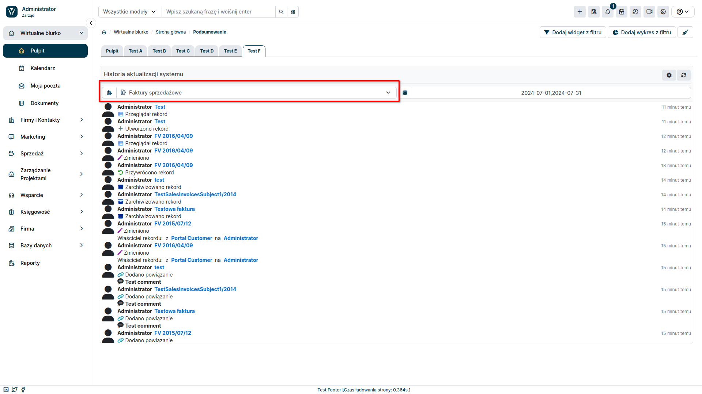

**Widżety Premium** pozwalają na wyświetlenie na pulpicie i w podsumowaniu rekordu dodatkowych informacji, dzięki czemu wszystkie niezbędne szczegóły mogą być dostępne dla użytkownika na wyciągnięcie ręki. Aktualnie w zestawie dostępne są 2 widżety: **Podgląd PDF** oraz **Historia zmian**

:::warning

Widżety Premium są dodatkiem płatnym i wymagają wykupienia subskrypcji.
:::

## Podgląd PDF

Widżet umożliwiający podgląd dokumentów PDF przed ich wygenerowaniem! Ten dodatek znacznie ułatwi pracę użytkownikom systemu odpowiedzialnym za wystawianie i przesyłanie dokumentów PDF, gdyż umożliwia weryfikacje dokumentu przed jego wystawieniem.

**Korzyści:**

* **Szybki podgląd**: Bądź na bieżąco z zawartością faktury lub innego dokumentu PDF na każdym etapie generowania.
* **Lepsza kontrola**: Dokonuj korekt i zatwierdzaj dokumenty przed ich finalnym wygenerowaniem.
* **Oszczędność czasu**: Unikaj błędów i konieczności ponownego generowania dokumentów.
* **Wygoda dla użytkowników**: Ułatw pracę osobom odpowiedzialnym za wystawianie i wysyłanie dokumentów PDF.
* **Zwiększona efektywność działu księgowego**: Weryfikuj dokumenty przed ich zatwierdzeniem, usprawniając procesy księgowe.

### Konfiguracja Podglądu PDF

W pierwszej kolejności należy się upewnić, czy dla danego modułu posiadamy stworzony szablon PDF. Następnie możemy przejść do konfiguracji samego widżetu:

1. Przejdź do sekcji administracyjnej YetiForce.
2. Wybierz z lewego menu ```Moduły standardowe ➜ Moduły widżety```.
3. Z pola wyboru, po prawej stronie wybierz moduł, dla którego chcesz dodać widżet **Podgląd PDF**.
4. Kliknij przycisk <kbd>Dodaj widżet</kbd>.
5. Wybierz widżet **Podgląd PDF** z listy dostępnych widżetów.
6. Wprowadź nazwę widżetu i zapisz zmiany.


Widżet **Podgląd PDF** jest już gotowy do użycia. W sekcji użytkownika przejdź do modułu, dla którego go dodałeś, a następnie wybierz jeden z rekordów. Widżet powinien pojawić się na podsumowaniu rekordu.


## Historia zmian

Dodatek **Historia Zmian** w systemie YetiForce zapewnia kompleksowy wgląd w aktywność użytkowników i wprowadzane przez nich zmiany. Umożliwia śledzenie modyfikacji rekordów w wybranych modułach lub w całym systemie, identyfikując użytkowników odpowiedzialnych za każdą operację i szczegółowo rejestrując czas wprowadzonych zmian.

**Uzyskaj szczegółowy wgląd w zmiany wprowadzane przez użytkowników:**

* Śledź modyfikacje w wybranym module lub w całym systemie.
* Zobacz listę otwieranych i modyfikowanych rekordów.
* Poznaj czas przeprowadzonych akcji.
* Zidentyfikuj użytkowników odpowiedzialnych za każdą operację.

**Wykorzystaj zaawansowane filtry, aby:**

* Skupić się na konkretnych rekordach lub użytkownikach.
* Zlokalizować zmiany wprowadzone w określonym czasie.
* Szybko odnaleźć interesujące Cię informacje.

**Korzyści ze stosowania dodatku Historia Zmian:**

* **Zwiększona przejrzystość**: Zyskaj pełną widoczność aktywności użytkowników i wprowadzanych zmian, co ułatwia audyt i kontrolę nad systemem.
* **Poprawa odpowiedzialności**: Jasno identyfikuj użytkowników odpowiedzialnych za modyfikacje, zapewniając rozliczalność i zapobiegając nieupoważnionym zmianom.
* **Usprawnienie współpracy**: Ułatwiaj współpracę zespołową, udostępniając historię zmian i zapewniając kontekst dla wprowadzonych modyfikacji.

### Konfiguracja Historii Zmian

:::warning

Pamiętaj, by przy tworzeniu widżetu wybrać odpowiednią rolę oraz pulpit, na którym ma się on pojawić.
:::

1. Przejdź do sekcji administracyjnej YetiForce.
2. Wybierz z lewego menu ```Moduły standardowe ➜ Panel widżety```.
4. Kliknij przycisk <kbd>Predefiniowane widżety</kbd>.
5. Wybierz widżet **Historia aktualizacji systemu** z listy dostępnych widżetów.
6. Wprowadź parametry widżetu i zapisz zmiany.


Widżet **Historia aktualizacji systemu** jest już gotowy do użycia. W sekcji użytkownika przejdź do Zakładki **Pulpit**, gdzie pojawi się widżet.

Pierwsza lista rozwijana pozwala nam wybrać moduł systemu, dla którego chcemy śledzić zmiany. Jeżeli z listy wybierzemy pozycję **Podsumowanie**, pojawi nam się historia aktualizacji w wybranym okresie dla całego systemu z podziałem na moduły.


Wybierając natomiast z listy konkretny moduł, uzyskamy dodatkowe informacje, takie jak: kto wykonał akcję, na jakim rekordzie czy też, z jakich danych, na jakie zostały zmienione.



W prawym górnym rogu widżetu znajduje się ikona trybika, pozwalająca ustawić wyświetlane przez niego dane. Możemy wybrać jakie akcje chcemy, żeby zostały wyświetlone oraz z jakimi użytkownikami mają być one powiązane.


