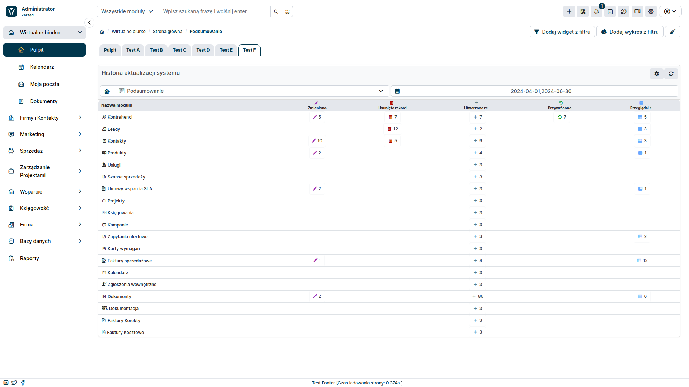

**Widgets Premium** allow you to display additional information on the desktop and in the record summary, making all the necessary details available to the user at their fingertips. Currently, the set includes 2 widgets - **PDF Preview** and **Updates**.

:::warning

The Widgets Premium add-on is a paid extension and requires purchasing a subscription.

:::

## PDF Preview

It is a widget that allows you to preview a system generated PDF document. This solution will significantly facilitate the work of users responsible for issuing and sending PDF documents by allowing to preview them before issuing them.

**Benefits**

- **Quick preview**: Stay up to date with the contents of an invoice or other PDF document at every stage of generation.
- **Better control**: Make corrections and approve documents before they are finalized.
- **Save time**: Avoid errors and the need to re-issue documents.
- **User Convenience**: Make work easier for people responsible for issuing and sending PDF documents.
- **Increased Accounting Efficiency**: Verify documents before approving them, streamlining accounting processes.

### PDF Preview - configuration

First, make sure you have a PDF template created for the module.Then you can proceed to configuring the widget itself:

1. Go to the YetiForce administration section.
2. Select `Standard Modules ➜ Modules - Widgets` from the left menu.
3. From the dropdown list on the right, select the module where you want to add the **PDF Preview** widget.
4. Click the <kbd>Add Widget</kbd> button.
5. Select the **PDF Preview** widget from the list of available widgets.
6. Enter a name for the widget and save changes.

The **PDF Preview** widget is now ready to use. In the user section, go to the module where you added it and select one of the records. The widget should appear on the record summary.

## Change history

The **Change History** add-on in the YetiForce system provides comprehensive insight into user activity and changes they make. It allows you to track record modifications in selected modules or in the entire system, identifying the users responsible for each operation and recording in detail the time of updates made.

**Get detailed insight into updates made by users:**

- Track modifications in a selected module or the entire system.
- View a list of opened and modified records.
- Find out the time of the actions.
- Identify users responsible for each operation.

**Use advanced filters to:**

- Focus on specific records or users.
- Locate changes made over a specific period.
- Quickly find relevant information.

**Benefits of using the Updates add-on:**

- **Increased transparency**: Gain full visibility into user activity and changes, making it easier to audit and control your system.
- **Improve Accountability**: Identify users responsible for modifications, ensuring accountability and preventing unauthorized changes.
- **Enhance Collaboration**: Make it easier for teams to collaborate by sharing update history and providing context around changes made.

### Update history configuration

:::warning

When creating a widget, remember to select the role and dashboard where it should appear.

:::

1. Go to the YetiForce administration section.
2. Select `Standard Modules ➜ Modules - Widgets` from the left menu.
3. Click <kbd>Predefined widgets</kbd>.
4. Select the **System Update History** widget from the list of available widgets.
5. Enter a name for the widget and save changes.

The **System Update History** widget is now ready to use. In the user section, go to the **Dashboard** Tab, where the widget will appear.

The first drop-down list allows you to select the system module where you want to track changes. If you select **Summary** from the list, you will see the update history for the selected period for the entire system, divided into modules.

By selecting a specific module from the list, you'll see additional information, such as: who performed the action, on which record, or on what data, and to what data they were changed.

In the upper right corner of the widget, you can find a gear icon that lets you set the data it displays. You can choose which actions you want to be displayed and which users you want them to be related to.

