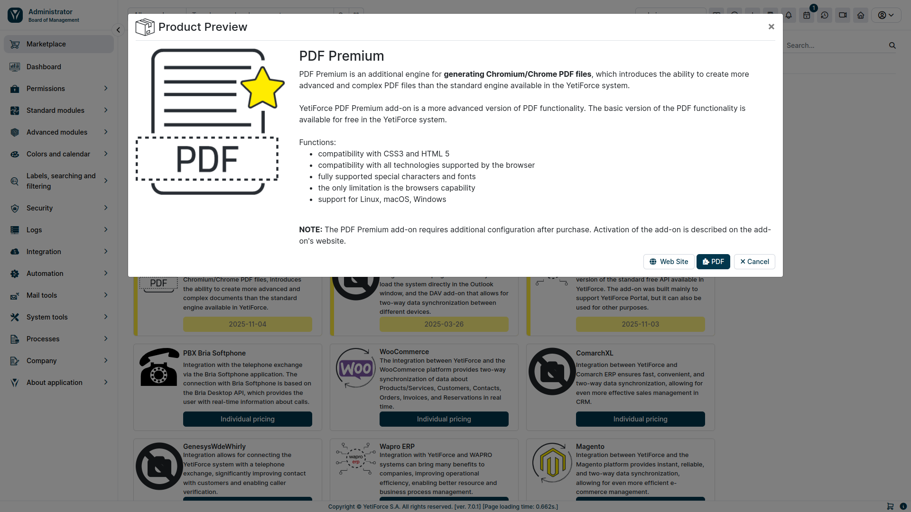

YetiForce offers a wide range of features, including generating PDF reports. There are two main engines for generating PDF documents in the system:

- free, built-in YetiForce engine
- paid **YetiForce PDF Premium** based on **Chromium**.

The system allows you to connect data from YetiForce with PDF templates, which allows you to automatically generate personalized documents. This allows you to dynamically insert information from contact records, companies, offers, invoices and other modules, which significantly saves time and eliminates errors related to manual data entry.

The basic version of PDF functionality is available for free in YetiForce, while **PDF Premium** is an extension that allows you to create more advanced and professional PDF documents than the standard engine available in YetiForce. It uses the Chromium browser to render and generate PDF documents.

#### What makes YetiForce PDF Premium stand out

- CSS3 and HTML 5 compatibility
- compatibility with all browser supported technologies
- fully supported special characters and fonts
- the only limitation is the browser's capabilities
- operating system support: Linux, macOS, Windows

This article will guide you through how to install and use this module.

:::tip

The Chromium/Chrome engine is necessary in order for this addon to work properly. Information on how to configure it can be found [in this article](en//administrator-guides/system-tools/pdf)

:::

## Purchasing the addon

It is best to buy add-ons in the Marketplace located in the administration section of the YetiForce system. You can also email us at hello@yetiforce.com to receive a pro forma in case you're interested in purchasing the add-on for a year in advance.

## Activating the addon by the YetiForce team

We activate the subscription manually. If your addon is not active within 48h in your system, please read the following article: [Troubleshooting inactive and malfunctioning addons](/administrator-guides/marketplace/troubleshooting)

## Configuration

A description of the configuration panel can be found in the Administrator section: [`Software configuration → System tools → PDF`](/administrator-guides/system-tools/pdf/#chromiumchrome)
