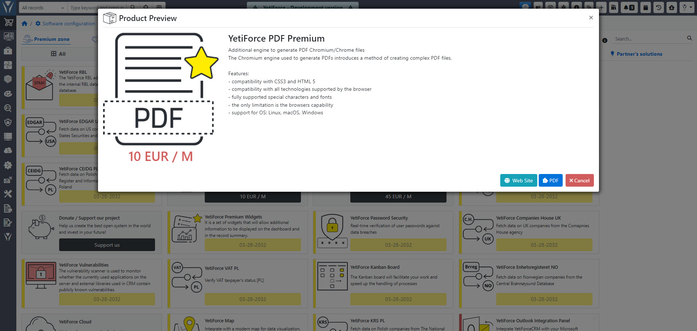

YetiForce oferuje szeroki wachlarz funkcji, w skład, których wchodzi generowanie raportów PDF. W systemie istnieją dwa główne silniki do generowania dokumentów PDF:

- darmowy, wbudowany silnik YetiForce
- płatny **YetiForce PDF Premium** oparty o **Chromium**.

System umożliwia połączenie danych z YetiForce z szablonami PDF, co pozwala na automatyczne generowanie spersonalizowanych dokumentów. Dzięki temu można dynamicznie wstawiać informacje z rekordów kontaktów, firm, ofert, faktur i innych modułów, co znacznie oszczędza czas i eliminuje błędy związane z ręcznym wprowadzaniem danych.

Podstawowa wersja funkcjonalności PDF jest dostępna za darmo w systemie YetiForce, natomiast **PDF Premium** to rozszerzenie, które umożliwia tworzenie bardziej zaawansowanych i profesjonalnych dokumentów PDF, niż standardowy silnik dostępny w systemie YetiForce. Wykorzystuje ono przeglądarkę Chromium do renderowania i generowania dokumentów PDF.

#### Co wyróżnia YetiForce PDF Premium

- kompatybilność z CSS3 i HTML 5
- kompatybilność ze wszystkimi technologiami obsługiwanymi przez przeglądarkę
- w pełni obsługiwane znaki specjalne i czcionki
- jedynym ograniczeniem są możliwości przeglądarki
- wsparcie systemu operacyjnego: Linux, macOS, Windows

W tym artykule znajdziesz instrukcje, jak zainstalować i korzystać z tego modułu.

:::tip

The Chromium/Chrome engine is necessary in order for this addon to work properly. Informacje jak go skonfigurować znajdziesz w [tym artykule](/administrator-guides/system-tools/pdf)

:::

## Purchasing the addon

Dodatki najlepiej kupować w Marketplace, który znajduje się w sekcji administracyjnej systemu YetiForce. Jeżeli ktoś byłby zainteresowany innymi formami płatności i rozliczeń to możliwym jest również skorzystanie z naszej strony WWW lub skontaktowanie się z nami za pomocą formularza kontaktowego.

## Activating the addon by the YetiForce team

We activate the subscription manually. If your addon is not active within 48h in your system, please read the following article: [Troubleshooting inactive and malfunctioning addons](/administrator-guides/marketplace/troubleshooting)

## Configuration

A description of the configuration panel can be found in the Administrator section: [`Software configuration → System tools → PDF`](/administrator-guides/system-tools/pdf/#chromiumchrome)
