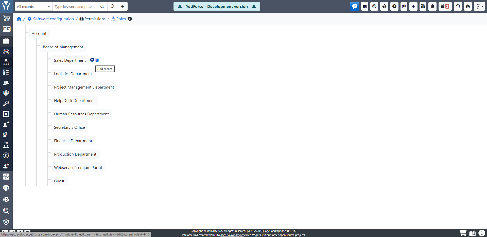
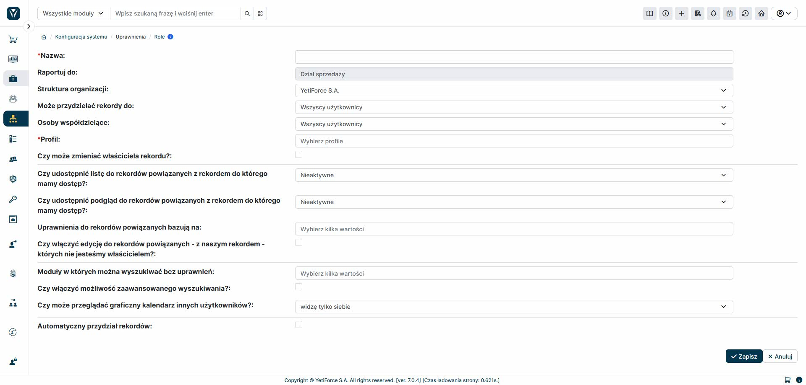

The YetiForce system features a Roles module that allows you to map your company's organizational structure—even a very complex one. To configure roles, go to "System Configuration" → "Permissions" → "Roles."

A sample structure might look like this: at the top is the CEO, below them is a director, then several managers, and below each of them are employees. The system has no limits on the number of levels in the structure.

## Role tree

The `Roles` module links users to profiles where they inherit permissions to modules, tools and actions.

## Create a role

When creating a role, you can precisely define permissions for users assigned to that role. Key features include:

1. Define who can own a record (globally for the entire system).
2. Define who can share a record (globally).
3. Assign to one or more profiles (permissions add up together).
4. Block the change of record owner (then a newly created record will always have an owner from this role assigned, without the possibility of changing it).

For the permissions from points 1 and 2, you can choose one of the following mechanisms:

- Only me - the currently logged in user
- Users with a subordinate role
- Users who have a subordinate role or the same role as me
- All Users
- From the record assignment panel

Depending on the option selected, a corresponding list of users or groups will be available for assignment when creating a record. The latter option allows for free configuration in an independent panel.

Additionally, you can set parameters for permission inheritance in a role:

1. Share a list of records related to the record we have access to?
2. Show preview of related records?
3. On what basis permissions should be granted to related records:
   - Assigned to
   - Share with
   - Record access
   - Access exceptions

These settings allow you to access related data according to the hierarchy – for example, if you have access to a Customer, you can access their documents, comments, or invoices, even if you do not have direct permissions to them.

You can also enable the option to edit related records that you are not the owner of - the system will allow editing if the permissions result from the relation to another record.

The role can also specify the level of access to the search engine and the data that can be searched, e.g.:

- Modules searchable without permissions
- Advanced search

It is also possible to disable viewing other users' calendars (from the graphical interface).

The "Automatic record assignment" option allows you to automatically distribute records in the system, which is especially useful when there are large quantities of leads or sales opportunities.
