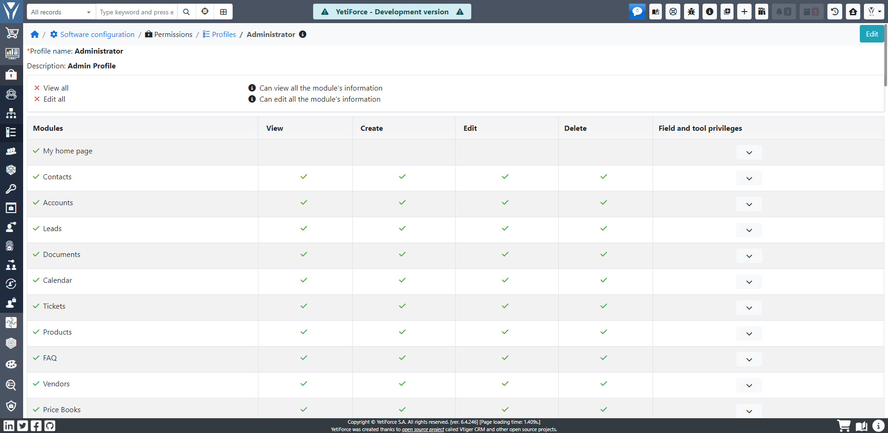
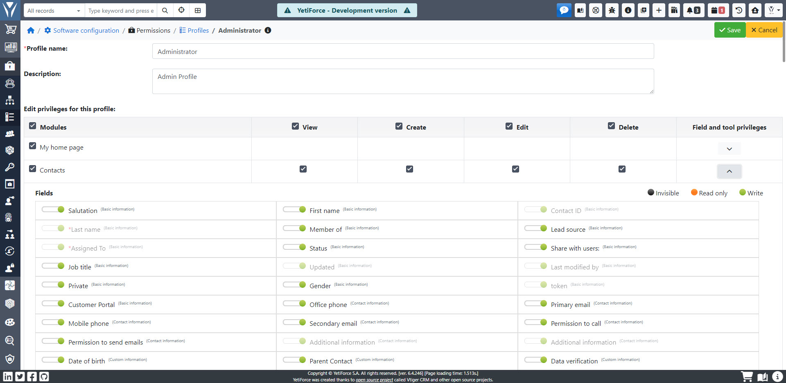

Profiles allow you to define permissions to many functionalities and views available in the system

## Add new profile

By default, there is 1 profile in the system - Administrator. To add a new profile with pre-configured permissions, click the <kbd>+ Add profile</kbd> button in the upper left corner of the screen. You will see the new profile page, where you have to choose a name for it and optionally fill its description.

Then, in the `Edit permissions for this profile` table, select the permissions to actions in individual modules that you want the newly created profile to have.

In addition to general permissions to create, view, edit, and delete records in selected modules, you can also configure permissions for fields and tools. In order to modify these permissions, click the down arrow button <kbd>˅</kbd> in the `field and tool privileges` column and configure the additional options:

The module supports mass selection and deselection of permissions - if you click the checkbox at the top of the "Modules" column, you will deselect / select all options for all modules. If you click on the checkbox next to any name of the action, you will deselect / select the permissions for this action for all modules:

Once you finish configuring the permissions, click <kbd>Save</kbd>.

## Edit profile

In order to modify permissions granted to an existing profile, click the edit button <kbd>✎</kbd> in the last column of the profiles table. The system will display the current permissions for this profile, which you can freely modify as described above.

Once you finish editing the permissions, click <kbd>Save</kbd>.

## Duplicate profile

Duplicating a profile allows you to create a profile with similar permissions, without the need to create it from scratch. To duplicate a profile, click the duplication icon <kbd>⧉</kbd> in the last column. The system will copy permissions from the selected profile to the new one, which you will then be able to modify according to your needs.

Once you finish configuring the permissions in the duplicated profile, click <kbd>Save</kbd>.

## Delete profile

To delete the selected profile, click on the trash can icon <kbd>🗑</kbd> visible in the last column of the profile table. The system will display a pop-up window where you can specify which of the remaining profiles inherits the roles.

Click <kbd>Save</kbd> to remove the profile and transfer the roles.

## Icons

-  - the permission is active
-  - the permission is inactive
-  - the field is invisible for the selected profile
-  - the selected profile can only view data from this field
-  - the selected profile can save data in this field
