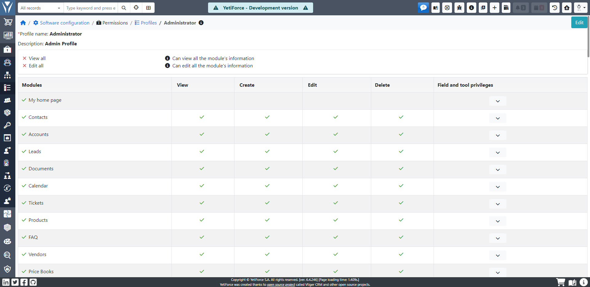
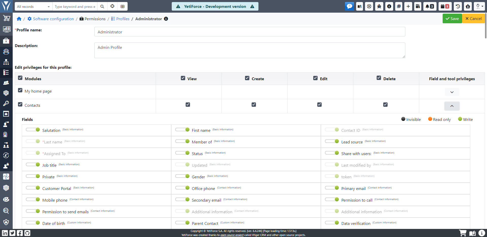

Profiles allow for precise definition of permissions for viewing, creating, editing, and deleting records in the modules the user can access. Additionally, in each module, you can specify which fields the user has access to (viewing, editing) and which tools they can use.

## Create new profile

By default, there is one profile in the system - Administrator. To add a new profile with pre-configured permissions, click the <kbd>+ Add profile</kbd> button in the upper left corner of the screen. You will see the new profile page, where you have to choose a name for it and optionally fill in its description.

Then, in the `Edit permissions for this profile` table, select the permissions to actions in individual modules that you want the newly created profile to have.

In addition to general permissions to create, view, edit, and delete records in selected modules, you can also configure permissions for fields and tools. In order to modify these permissions, click the down arrow button <kbd>˅</kbd> in the `field and tool privileges` column and configure the additional options:

The module supports mass selection and deselection of permissions - if you click the checkbox at the top of the "Modules" column, you will deselect / select all options for all modules. If you click on the checkbox next to any name of the action, you will deselect / select the permissions for this action for all modules.

Once you finish configuring the permissions, click <kbd>Save</kbd>.

## Edit profile

To modify the permissions of an existing profile, click the edit icon <kbd>✎</kbd> in the last column of the profile table. The system will display the current settings; you can change them as needed. When you're finished, click <kbd>Save</kbd>.

## Duplicate profile

Duplicating a profile allows you to quickly create a new profile based on an existing one. Click the <kbd>⧉</kbd> icon in the last column, and the system will copy the permissions to the new profile, which you can then edit. When you're finished, click <kbd>Save</kbd>.

## Delete profile

To delete a profile, click the trash can icon <kbd>🗑</kbd> in the last column of the table. The system will ask you to select the profile to transfer roles from the profile you are about to delete. Confirm by clicking <kbd>Save</kbd>.

## Ikony

-  – permission active
-  – permission inactive
-  – field invisible for selected profile
-  – profile has access only to read data from the field
-  – profile has access to save data in the field
