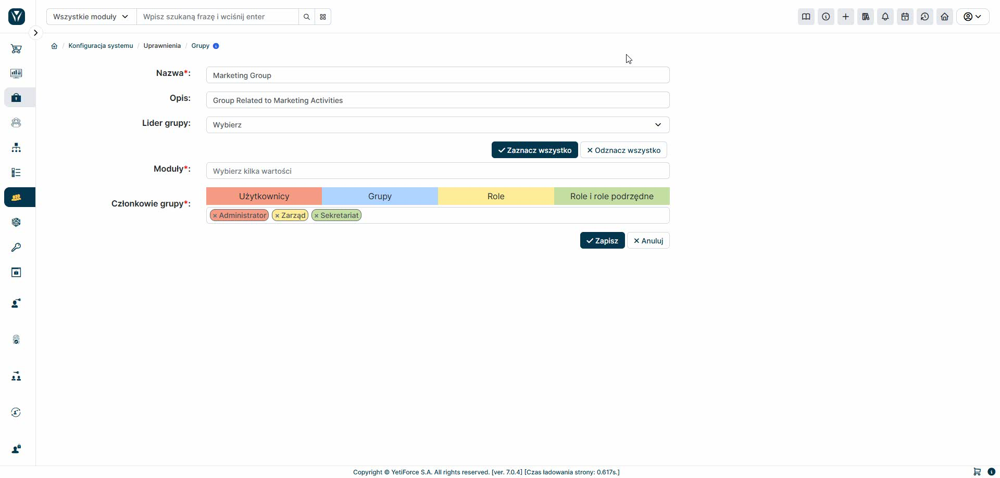

Groups allow you to manage permissions for records in the YetiForce system. They allow you to precisely define who has access to a given record using the "assigned to" and "share with" fields.

You can assign the following to groups:

- Users
- Other groups
- Roles
- Roles and subordinates

This allows you to flexibly build access structures tailored to the needs of your organization.
