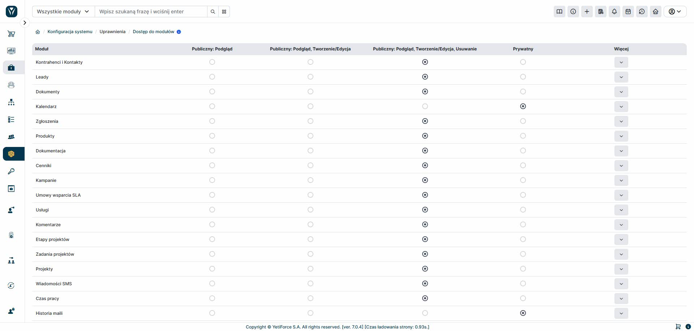

The "Module Access" module is a key element of permission management in the YetiForce system. It allows you to specify who can view and edit records that don't belong to a given user. Additionally, exceptions can be set for each module, granting access to selected data to other individuals or groups, even if they aren't the owner.
