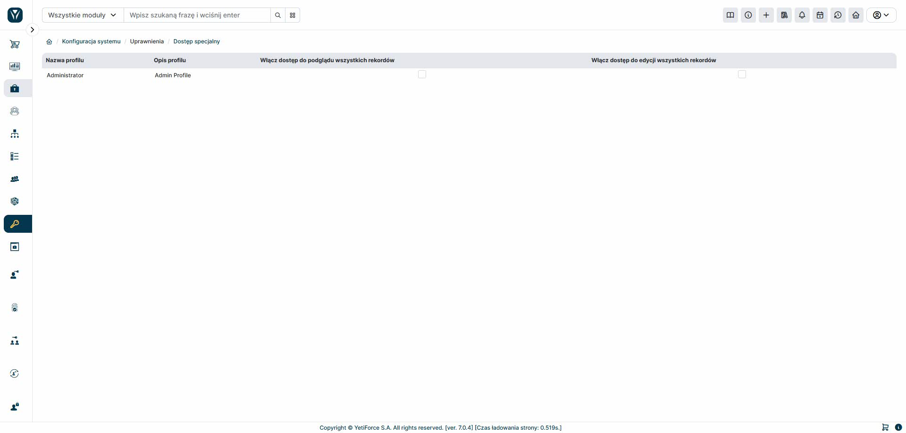

The "Special Access" module allows you to grant special permissions to selected user profiles. These permissions allow the user to view and edit all records in the selected modules, regardless of other permission settings. If a user has access to a module, they automatically gain full access to all its data.
