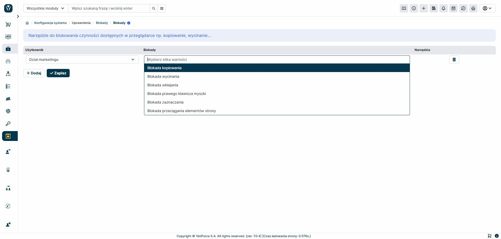

The tool allows users to restrict copying, cutting, and pasting data to and from the YetiForce system. Basic features include:

- Lock cutting
- Lock copying
- Lock pasting
- Lock right mouse button
- Lock selecting
- Lock dragging

Please note that these restrictions are imposed at the browser level. If the user has a browser that does not support these types of security measures, the locks may not work.
