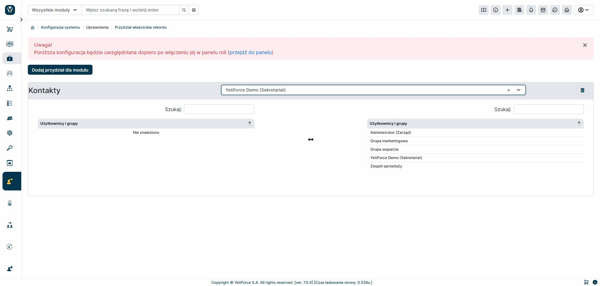

The panel works similarly to the "Record Owner Assignment" module, but applies to the "share with" field. This tool allows you to view data in a record list based not only on the owner but also on inherited permissions.

It's worth remembering that in large systems with extensive databases and multiple users, the module may run slower. Furthermore, the assignment mechanism operates with a certain delay – the waiting time depends on the CRON configuration.
