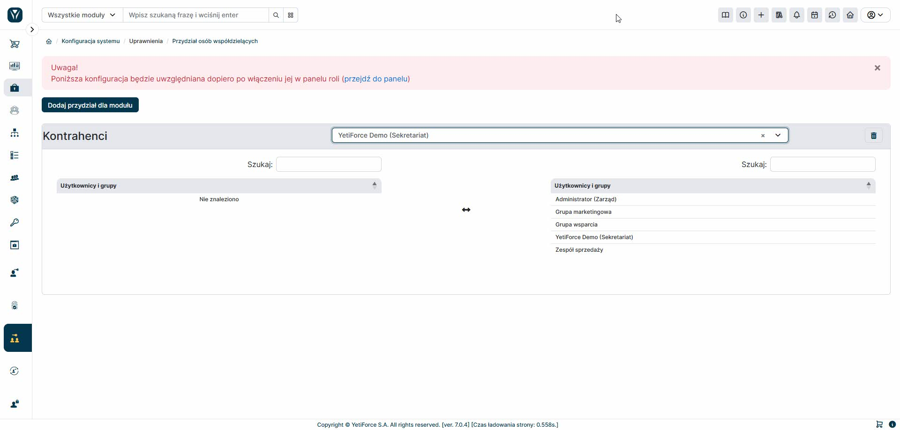

The "Record Owner Assignment" tool allows you to specify which users or groups will be available for selection when creating a record in the selected module. If the options available within a role are insufficient, this tool allows for more flexible configuration of record owner availability.
