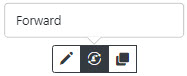

:::warning

This addon available in our Marketplace - [**Buy YetiForce YetiForce Automatic Assignment**](https://yetiforce.com/en/yetiforce-automatic-assignment)

:::

## Configuration

The following settings blocks are available in the panel:

- selecting the module and the place where the functionality is enabled;
- **Conditions for the record** - setting the conditions that the record must meet in order for it to be automatically assigned;
- **Users to be assigned** - including the default option when none of the set users meets the availability criteria;
- **Conditions for user selection** - which constitute the basis for the selection of previously selected users. There are currently two selection methods available: _Load Balanced, Round Robin_.

:::important

Uwaga! The mechanism works only for users who have automatic record assignment enabled. It does not apply to the default option.

:::

## Description

In the first section of the settings there are three places where automatic assignment process can be started.

- **AVAILABLE WORKFLOW** Selecting this option will make it available in workflow actions, which will enable e.g.

- **ACTIVE - BEFORE SAVE** The option activates automatic record assignment only for newly created records, i.e.

- **AVAILABLE IN GUI** This option allows you to manually assign a record. the criteria set for the record and the permission to the automatic assignment action has been granted in the profile of a given user, the manual assignment button will appear on the record preview.

Once you click the button you will see a popup with properly sorted users who can be assigned to the records.

