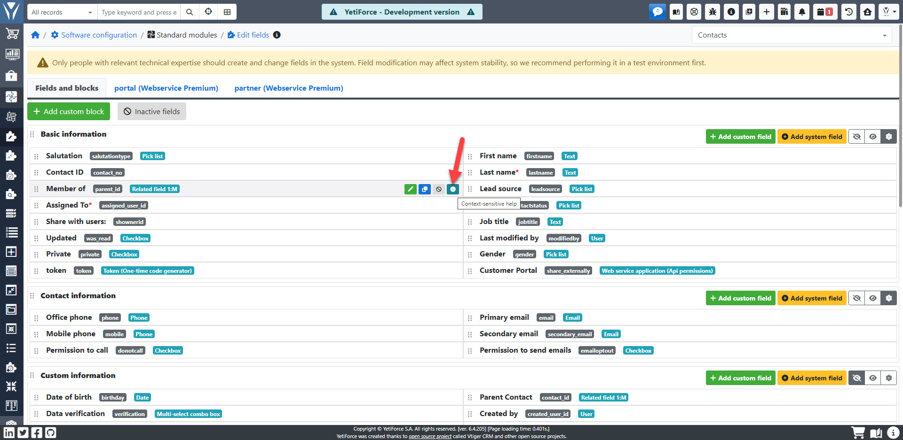
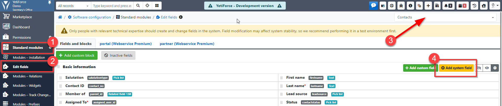

## Help icons

Help icons are a simple mechanism that allows to add detailed information to every field within the system. statuses, stages, fields that are automatically updated, etc. Each help icon might be translated individually to every language.

Only an administrator can use this tool. When you enter Translations Management and go to the Help Icons, you will see that there are a few functionalities available. Primarily, you should select languages in which you would like to modify descriptions for icons. Then select a module and a list of available fields will be displayed. There is also an option to have a list narrowed down to fields without any description or an option to search for a specific field.

It is very simple to activate a help icon. If a help icon has a description in a given language and the view is the same as the one you set, a help icon will be displayed. Please note that help icons are depended on a language so if the language of the system is different than the language of a description in a help icon, then the icon will not be displayed. If you would like to disable the display of an icon, delete its content (leave it empty). There is a built-in editor for entering content (there are some tools for text formatting) and it is possible to use HTML. From a developer's level, it is possible to switch over to more panels with tools, but it requires changes within the code.

If help icons were activated, they will be available for users in three different views that were marked next to the field:

- Create and edit.
- Summary and details.
- Quick create.

## Creating system fields

This article describes a mechanism used to create system fields that are the same as pre-existing fields or must have specific parameters.

If a field already exists in a given module, it won't be available in the field creation popup.

The following fields can be added:

- Assigned to
- Created by
- Last modified by
- Created (time)
- Modified (time)
- Share with
- Private
- Web service application

:::info

💻 Demo: https://demo.yetiforce.com/index.php?module=LayoutEditor&parent=Settings&view=Index

:::
