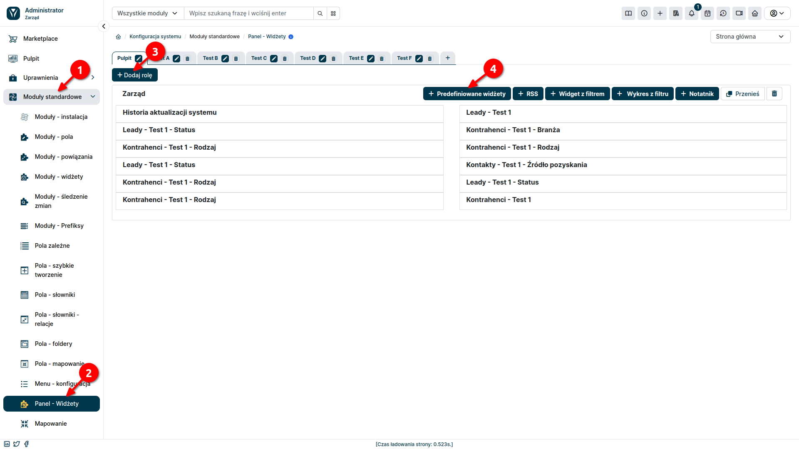
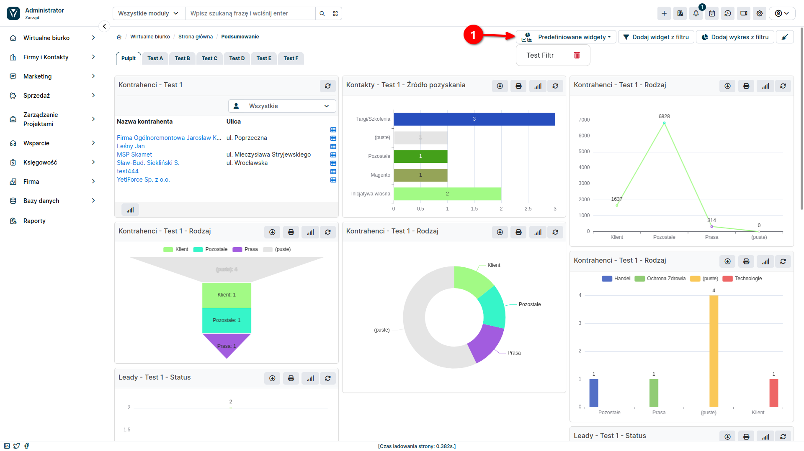

Predefined widgets in YetiForce are ready-to-use elements that can be placed on the system dashboard. They were designed by the YetiForce team and offer a wide range of features that make it easier for users to work with the system. To add a new widget to the dashboard, follow these steps:

### Configuration

In the administration section, from the left menu, select **Standard Modules ➔ Dashboard - Widgets**

### 1. Select Dashboard

In addition to the option to customize the look and layout of widgets, YetiForce also offers the option to create independent dashboards. This allows you to group widgets thematically or according to your own needs, making navigation and access to information easier. To create a new tab, click the <kbd>+</kbd> icon and name the new dashboard.

### 2. Select Role

YetiForce allows you to assign widgets to specific user roles. This means that widgets will only be visible to users with a specific role. If there are no widgets for a given role on the selected dashboard, select the <kbd> + Add role</kbd> button (arrow #3 in the screenshot).

### 3. Add Predefined Widgets

Once you have selected a dashboard and role, you can add a predefined widget to it using the <kbd>Predefined Widgets</kbd> button. Depending on the selected widget, the widget creation form may slightly differ.

After returning to the user section, if the <kbd>Mandatory widget</kbd> checkbox has been selected in the widget configuration form, it will automatically appear on the dashboard. Otherwise, it will be selectable under the <kbd>Predefined widgets</kbd> button. The ability to move widgets using the "drag and drop" method allows you to customize the layout of the dashboard according to your individual needs. The layout of widgets on the home page dashboard is saved individually for each user.

