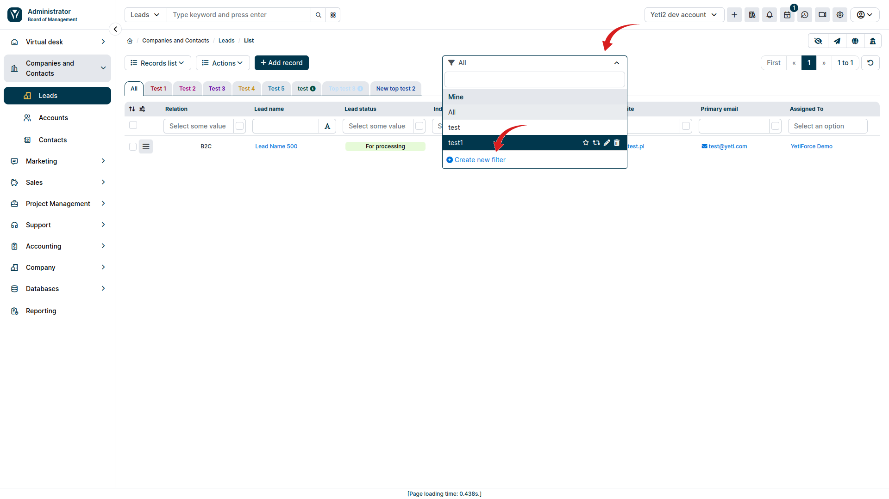
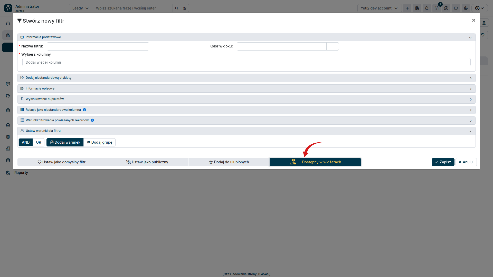
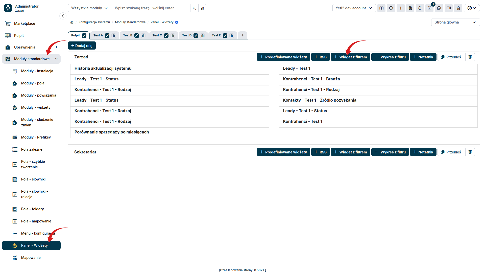
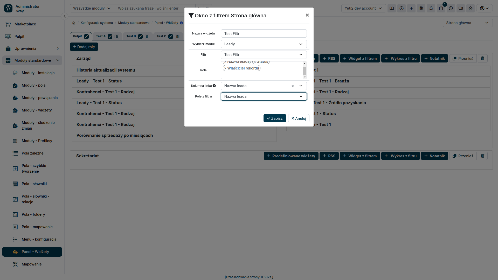
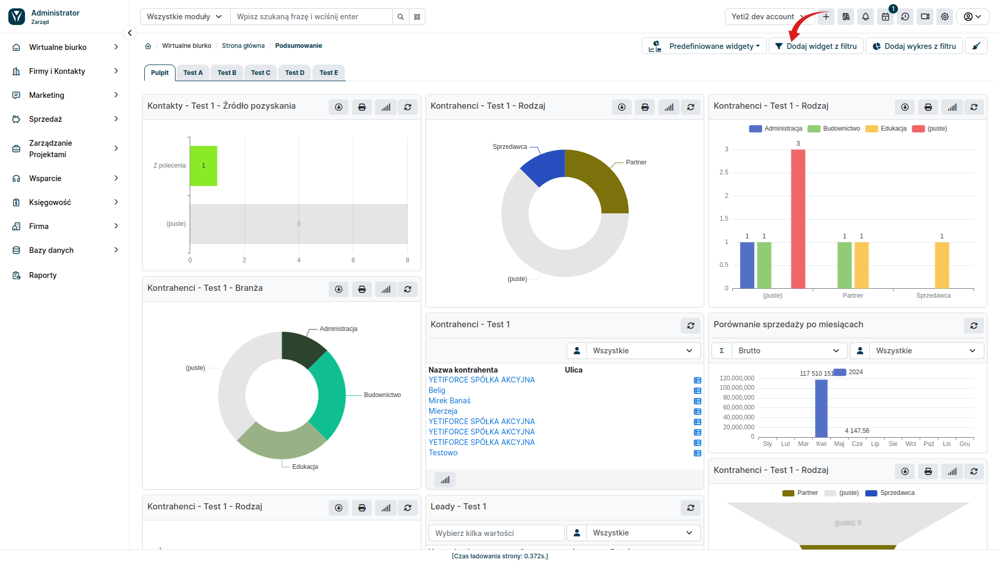
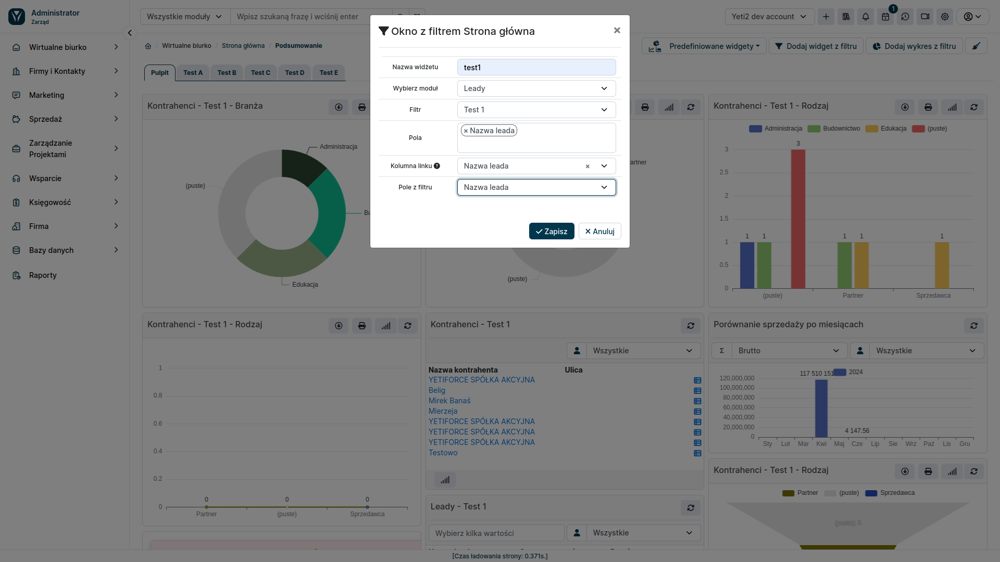

In addition to predefined widgets, YetiForce can create widgets based on filters created on record lists. They allow you to display data according to individually imposed assumptions and restrictions. This allows you to customize the widget specifically to your needs; this type offers much greater possibilities for displaying data but requires more extensive configuration.

## 1. Create filter

In the user section, go to your target module. For example, if you want to create a widget with filters for Leads, go to the "Leads" module. Select the <kbd>Filters</kbd> section located in the center of the screen and then click the <kbd>Create new filter</kbd> button

When you click the <kbd>Create new filter</kbd> button in the list view, a popup window appears that offers a wide range of options for customizing and filtering data.

### Filter creation - form fields

- **Choose columns and order**: Define which columns from the list will be visible in the filter
- **Relationship as a custom column**: It is possible to display data related to other modules in the system. For example, if you filter a list of leads, you can display data from related contacts or companies.
- **Filter conditions**: You can create complex filters using the `AND` and `OR` operators to combine different criteria. This allows you to precisely filter your data and display only the information you need.

To make the filter available in widgets, you must select the <kbd>List in metrics</kbd> option. Then you can save the created filter and use it in any widget in this module.

## 2. Create widget

There are two ways to create a widget with filter in the YetiForce system.

### a) Create widget in the administrator panel

In the administration section, from the left menu, select **Standard Modules ➔ Dashboard - Widgets**.

Then, for the relevant dashboard and role, select the <kbd>Widget with filter</kbd> button

In the popup window that appears, select the module where you created the filter, and fill in the remaining information necessary for the widget to work.

Then go to the Dashboard tab in the user section and add a widget by selecting it from the list that appears after clicking the <kbd>Predefined widgets</kbd> button.

### b) Create widget in the user panel

An alternative method of creating a widget with filter is to add it from the user section. To do this, go to the <kbd>Dashboard</kbd> tab and then click the <kbd>Add widget from filter </kbd> button.

Similarly to creating the widget in the administrator panel, a popup window will appear where you can specify the details of the new widget.

