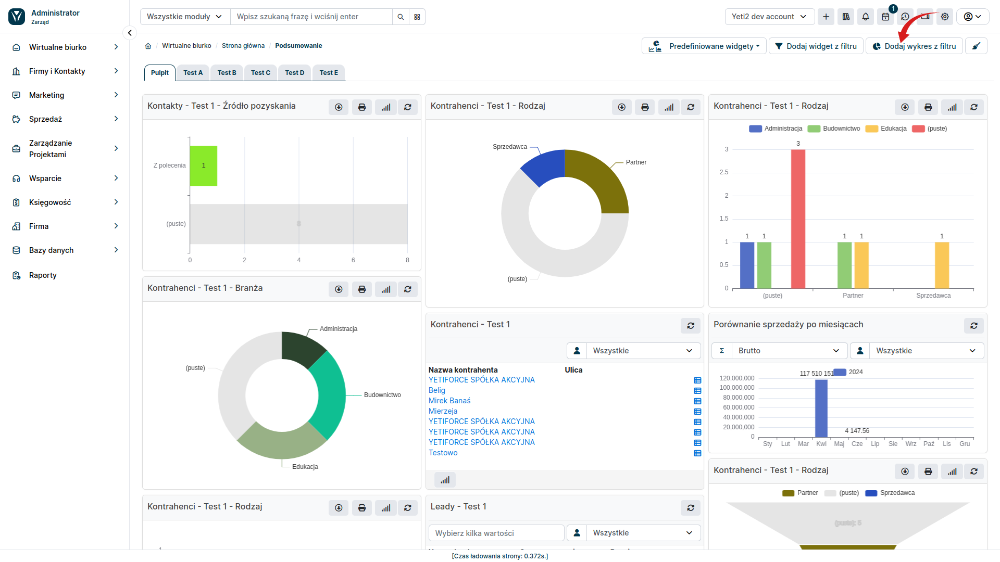

In addition to text-based widgets, YetiForce also offers the ability to add charts to the dashboard. These charts allow for an intuitive and clear presentation of data, making it easier to analyze trends and identify key information. To create a chart from a filter, go to the **Dashboard** tab and then select the <kbd>Add chart from filter</kbd> button. A popup window will then appear, where you can customize the details of the new chart.

