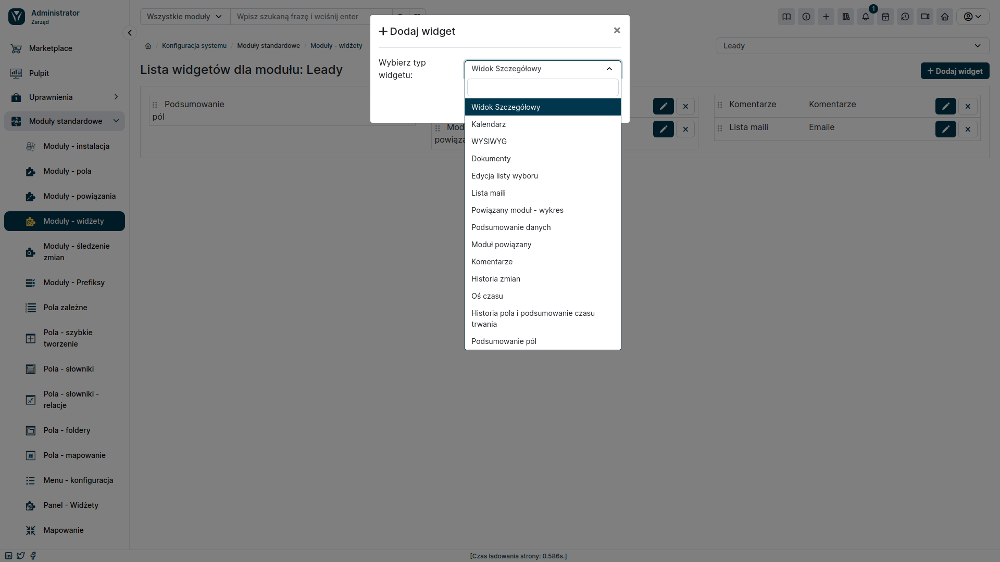

In addition to the widgets placed on the dashboard, YetiForce also offers the ability to add widgets in the detail view of individual records. This feature allows you to personalize the view and quickly access the most important information about a given element, without having to navigate to other modules.

### Configuration

#### Access to configuration menu

- In the administration section, select **Standard Modules** from the main menu.
- Click **Modules - Widgets**

#### Module selection and adding a widget

- From the drop-down list on the right, select the module where you want to add a widget. (arrow #3 in the screenshot)
- Click the <kbd>Add Widget</kbd> button.

Customize all the options for the new widget in the popup window.

The newly created widget will be visible in the detail view of all records from the selected module.

