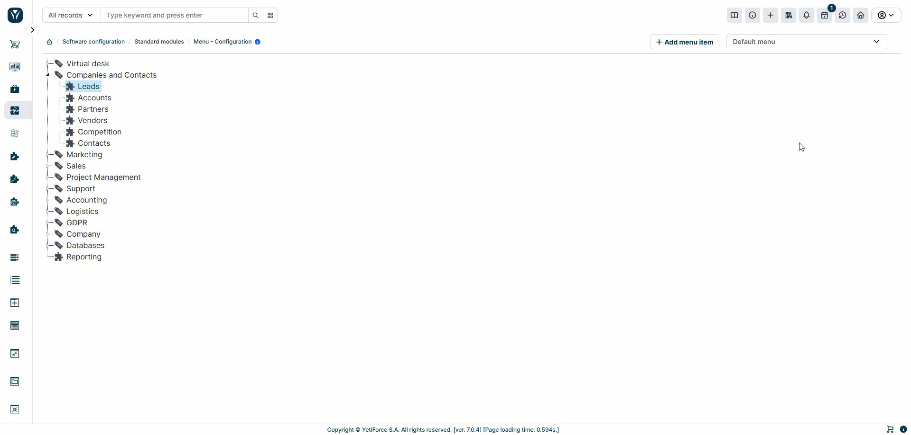
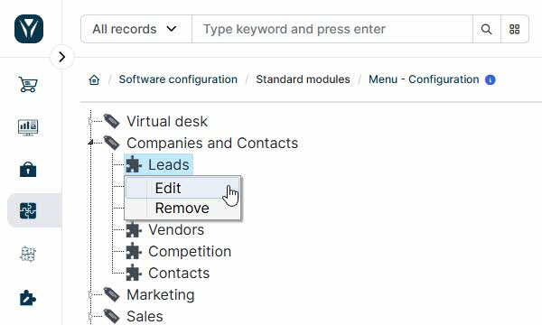
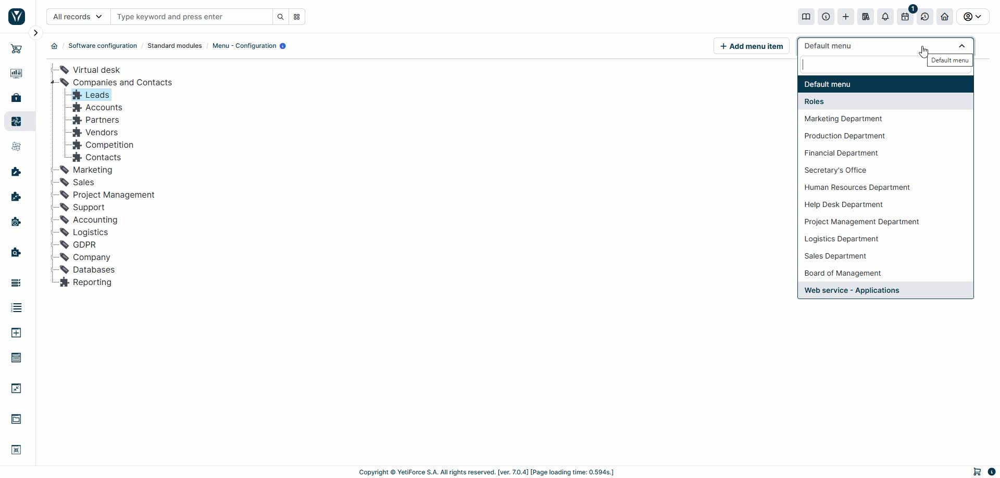

# Menu management in YetiForce

The YetiForce menu is a flexible tool that you can customize to meet your organization's needs. This guide will help you understand how to effectively manage and modify your menu structure.

## Refresh the menu in the system

There are two simple methods of refreshing the menu:

### 1. Via the graphical interface (recommended method)

This is the simplest method and doesn't require any technical knowledge:

1. Open any menu element that you want to modify
2. Introduce the changes and save
3. The system will automatically refresh the current menu structure

**Important** If you want the changes to affect all available menus in the system, you have to follow these steps for all the menus.

### 2. Via the console (advanced users)

A quicker method of refreshing all menus simultaneously via a console command is available for system administrators.

Detailed instructions can be found in the technical documentation: [Developer guides → YetiForce CLI → System](/developer-guides/cli/System#odświeżanie-menu).
