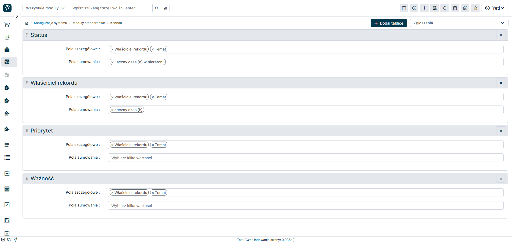
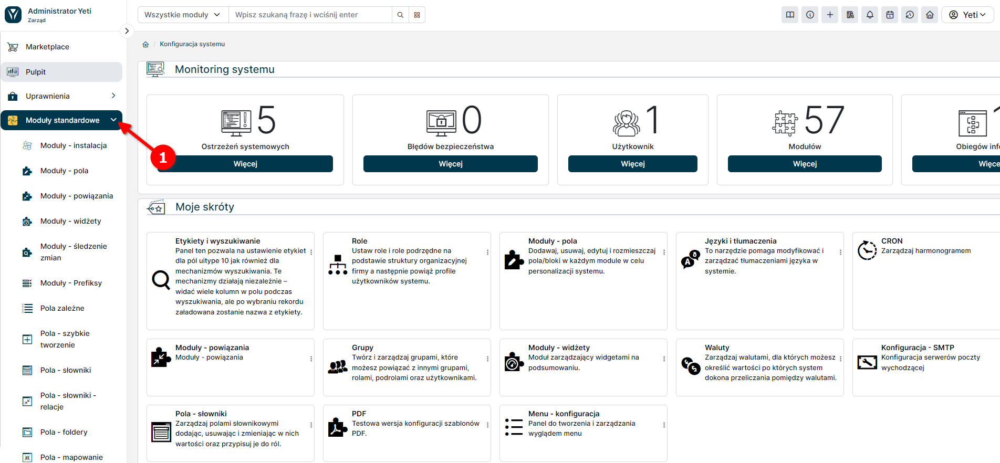
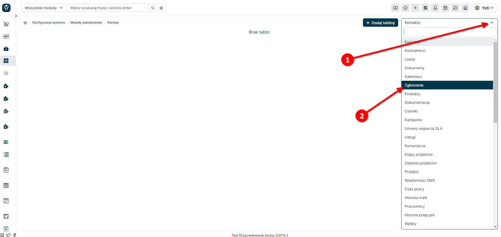
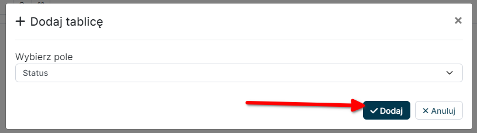
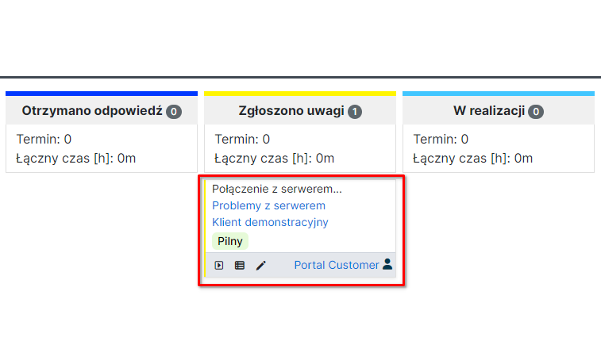
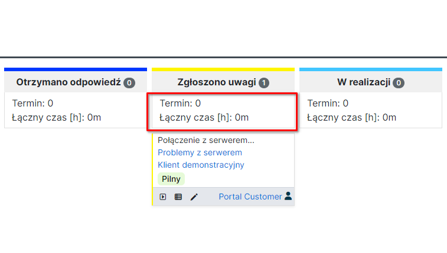
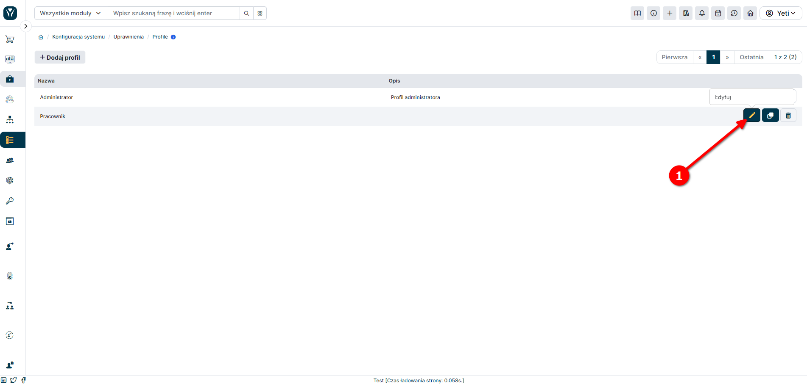

Kanban boards in the YetiForce system are a visual tool for managing processes and projects. They allow you to organize work by dividing it into columns representing process stages (e. g. "To do", "In progress", "Completed") and cards symbolizing specific tasks that can be moved between columns. This allows you to easily track work progress, identify bottlenecks and optimize the flow of tasks. Kanban boards are integrated with other YetiForce modules, which supports task management in the context of sales, design, service and other activities.

:::warning

YetiForce Kanban Board is available for subscription in our Marketplace. - [**More information**](https://yetiforce.com/en/kanban-board.html)

:::

## Configuration

The YetiForce Kanban Board configuration panel is located in <kbd>Software configuration → Standard modules → Kanban</kbd>.

From the list of available modules in the upper right corner of the screen (1), select the module (2) where the Kanban board should be available:

## Create boards

Click <kbd>+ Add board</kbd> and select the field used to create a board in the module selected in the previous step:

Once you click <kbd>Add</kbd> the board will be available in the selected module.

## Board parameters

- Detailed fields - list of fields where the record data is to appear. If a field has an icon set, it will be visible. All fields from the system are available, taking into account user permissions.

  

- Pola sumowania - lista pól które mają być poddane sumowaniu dla danej wartości (słupka kanbana), dla której jest wyświetlany kanban. Dostępne są tylko pola liczbowe, na których można wykonać operacje sumowania.

  

Dane na liście wyboru są zapisane automatycznie podczas każdej zmiany.

## Permissions

In order for a user to use the Kanban view, they must have the appropriate level of permissions.

To do this, go to <kbd>[`System configuration → Permissions → Profiles`](/administrator-guides/permissions/profiles/)</kbd>, and then select the relevant profile:

then select the relevant module where the Kanban Board should be available

and customize permissions.

