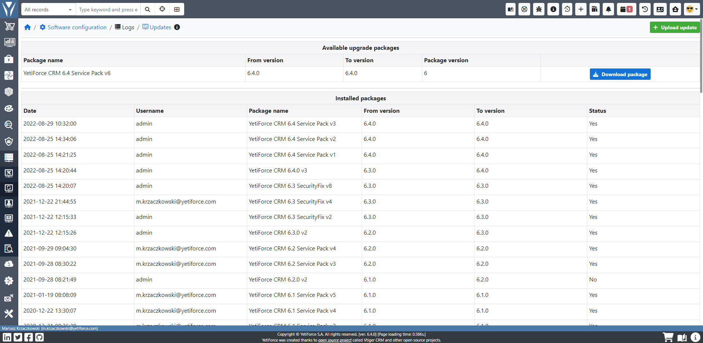
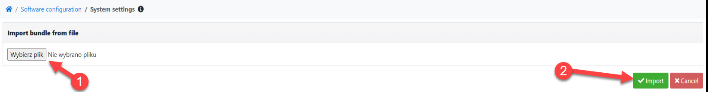
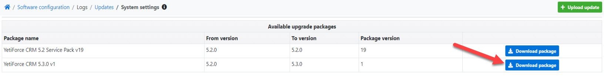
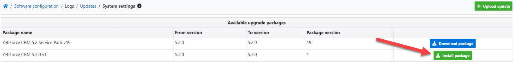
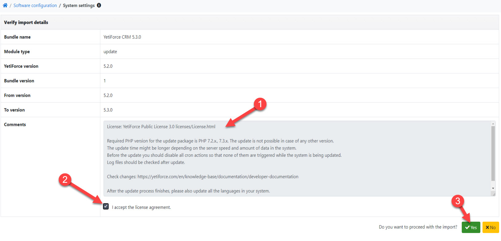
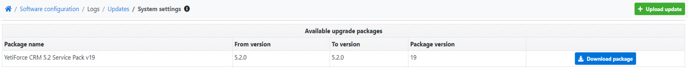

import Tabs from '@theme/Tabs';
import TabItem from '@theme/TabItem';
import ReactPlayer from 'react-player';

The process of system update is simpler than the installation or migration process, so every YetiForce administrator should be able to cope with it. One of the most important things that you need to remember is that before attempting to update the system, you should always make a backup copy and begin the process on the testing environment. Updates performed directly on production are one of the most common mistakes made by young administrators.

:::warning IMPORTANT

If your system is heavily customized, we strognly recommend that the update process be conducted by our experienced specialists.

Contact us to receive a quote.

:::

<Tabs groupId="zhh7fxZ293w">
    <TabItem value="youtube-zhh7fxZ293w" label="🎬 YouTube">
        <ReactPlayer
            url="https://www.youtube.com/watch?v=zhh7fxZ293w"
            width="100%"
            height="500px"
            controls={true}
        /></TabItem>
    <TabItem value="yetiforce-zhh7fxZ293w" label="🎥 YetiForce TV">
        <ReactPlayer url="/video/system-update.mp4" width="100%" height="500px" controls={true} /></TabItem>
</Tabs>

System update can be divided into 3 types of activities, which involve quite important processes:

## Pre-update activities

- Make a full backup of the entire system (all files/folders)
- Backup the database
- Disable Cron - it can be disabled in the administration panel (it is recommended to disable all tasks). You can also disable Cron by renaming the cron.php file
- Enable logs ([Debug](/developer-guides/debug#summary))
- Backup the system and perform test update

## Activities during the update

Go to the Admin Panel (Software Configuration), select `Logs → Updates` in the menu.

In the selected window, there are two options to choose between:

### Manual installation

In this type of installation, it is important to download the appropriate package.

Paczki aktualizacyjne do wersji 6.5 dostępne są w repozytorium GitHub: https://github.com/YetiForceCompany/UpdatePackages/tree/master/. Aktualizacja wymaga zachowania odpowiedniej kolejności paczek. Jeżeli masz wersje `1.1`. a chciałbyś uaktualnić system do wersji `2.0`, powinieneś pobrać następujące paczki aktualizacyjne:

- 1.1.0RC_to_1.2.0RC
- 1.2.0RC_to_1.3.0RC
- 1.3.0RC_to_1.4.0RC
- 1.4.0RC_to_2.0.0

Once you have selected the appropriate version of the update package, you can proceed to its installation by clicking the 'Upload update' button.

Select the appropriate version and click `Import`.

### Installation from the panel

The `Available upgrade packages` table lists the packages that the system automatically detects according to your version.

When your Internet is enabled, click on `Download package`.

After downloading, you can begin the installation by clicking the `Install package` button.

Accept the license - it's the last step, both in the manual installation and in the automatic installation. If everything is correct, you should see a window with information about the version number and a list of important changes that the update introduces, and which may affect its course. If you are prepared and you have enabled the logs, accept the license, and start the update by pressing the `Yes` button.

The properly performed installation will complete by displaying the summary window or redirecting to the desktop.

## Post-update activities

### Verify update

- First check logs and search for any errors or warnings. Log files can sometimes contain 20 thousand lines of code so it is recommended to use keywords, e.g.
- Disable logs after using the system for several days to verify if there are any errors ([Debug](/developer-guides/debug#summary))
- Update the languages in the system.
- Update lib_roundcube library to the version corresponding to your system.
- In the admin panel, in the [`Software configuration → Standard modules → Modules - installation`](/administrator-guides/standard-modules/modules-installation/)you can see whether a previously installed library requires updating.
- Instal the latest version of a Service Pack, if it was released for a given version

After installing the update, you can go to the `Software Configuration → Logs → Updates` to see currently available Service Packs. If there are no available versions in the list view, the latest version is installed.

- Enable Cron and check its correct operation. In order to do it, go to the admin panel to see if the Cron tasks have been started and if they have been completed correctly.

## Tests of proper system operation

- Test the system by clicking to see if all views are working [if you can edit, modify, delete records]. Perform changes primarily as an unprivileged user.
- Perform the necessary tests, for example, sending e-mails, generating PDF documents, editing roles or access rules
- Check communication with external systems, e.g.

## How to cope with problems

Najważniejszą rzeczą jest wiedzieć, jak analizować logi, ponieważ 99% rozwiązań można tam znaleźć. Ważne są zarówno logi aplikacji jak i logi serwera - są one doskonałym źródłem informacji. Kolejnym krokiem może być opisanie problemu na GitHub-ie, gdzie nasza społeczność i zespół YetiForce oferują darmową pomoc. Zanim utworzysz zgłoszenie (https://github.com/YetiForceCompany/YetiForce/issues) przygotuj opis problemu krok po kroku, odpowiednie logi i zrzuty ekranu. Błędnie opisany problem może uniemożliwić jego rozwiązanie. Możesz również sięgnąć po profesjonalne i płatne wsparcie ze strony zespołu YetiForce. Odwiedź naszą stronę [yetiforce.com](https://yetiforce.com/uslugi/wsparcie-techniczne-i-biznesowe.html).
