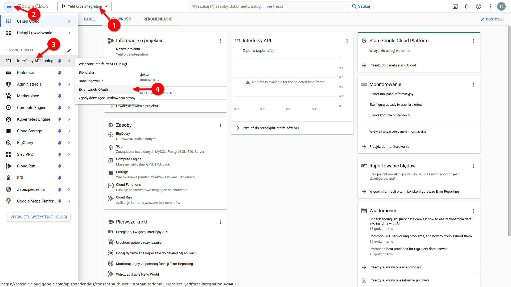
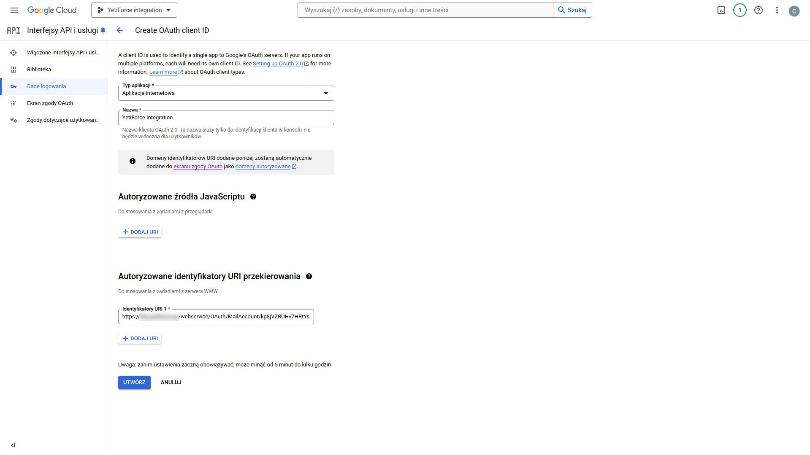
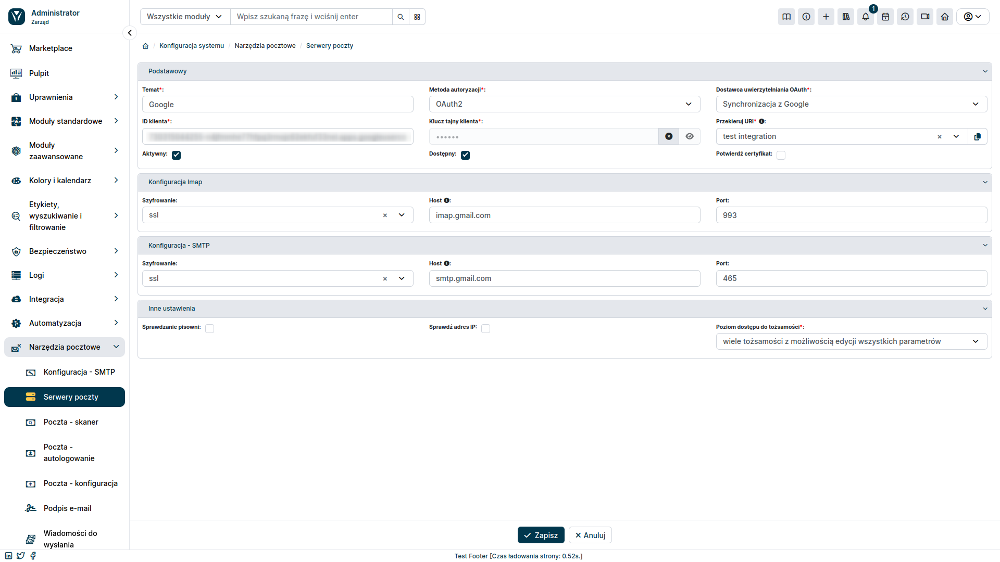

This article is a supplement to the [YetiForce integration with mail clients](/administrator-guides/integration/mailbox) guide.
It focuses on showing how to generate a Client ID and Client Secret in Gmail. These details are necessary to authenticate the connection between YetiForce and your Gmail account.

### Step 1: Create a project in the Google Cloud Platform Console

- Przejdź do Konsoli [Google Cloud Platform](https://console.cloud.google.com/).
- Zaloguj się przy użyciu swojego konta Gmail.
- Wybierz listę rozwijaną z dostępnymi projektami.
- Wybierz <kbd>Utwórz projekt</kbd>.

- Wprowadź nazwę aplikacji.

### Krok 2: Utwórz ekran zgody OAuth

- Z górnej listy wybierz utworzony projekt (strzałka nr 1 na zrzucie).
- Rozwiń lewe menu i wybierz `Interfejsy API i usługi ➔ Ekran zgody OAuth`.

- Następnie należy określić typ integracji:
  - **Internal** - Integracja przeznaczona do użytku produkcyjnego.
  - **External** - Integracja tworzona w celach testowych.

- Wypełnij formularz, podając dowolną nazwę aplikacji oraz adres mailowy Gmail, który chcesz zintegrować z YetiForce.
- Na dole formularza podaj adres mailowy dewelopera i wybierz przycisk <kbd>ZAPISZ I KONTYNUUJ</kbd>.

- Przejdź przez sekcję `Zakresy` wybierając przycisk na dole <kbd>ZAPISZ I KONTYNUUJ</kbd>.

- W przypadku integracji testowej w sekcji `Test users` dodaj adres synchronizowanej poczty i przejdź dalej.

### Krok 3: Utwórz dane logowania

- Rozwiń lewe menu i wybierz `Interfejsy API i usługi ➔ Dane logowania`.
- Wybierz przycisk <kbd>+ UTWÓRZ DANE LOGOWANIA</kbd>.

- Z menu, które się pojawiło wybierz `Identyfikator klienta OAuth`.

- W formularzu, który się pojawił w polu `Typ aplikacji` wybieramy `Aplikacja Internetowa` i wpisujemy dowolną nazwę aplikacji.

Na formularzu trzeba również wpisać `Autoryzowane identyfikatory URI przekierowania` (strzałka nr 3 na zrzucie). Identyfikator ten znajdziemy na platformie YetiForce. Poniżej znajduje się opis, skąd możemy pobrać jego wartość.

### Krok 4: Pobieranie identyfikatora URI przekierowania

Powróć do procesu tworzenia serwera pocztowego, który został opisany w [tym artykule](/administrator-guides/integration/mailbox/#dodanie-serwera-pocztowego). Upewnij się, że w polu `Przekieruj URI`, znajduje się nazwa aplikacji, którą utworzyłeś do integracji z pocztą. Następnie skopiuj wartość URI przekierowania naciskając przycisk <kbd><i class="fa-solid fa-copy"></i></kbd>.

### Krok 5: Kontynuacja tworzenia danych logowania

Skopiowaną wartość `URI Przekierowania` wklej w formularzu Google do pola `Autoryzowane identyfikatory URI przekierowania`. Następnie wybierz przycisk <kbd>Utwórz</kbd>.

Pojawi nam się okno modalne zawierające interesujące nas dane: `Client ID` oraz `Client Secret`. Wartości te należy skopiować i wykorzystać w formularzu tworzenia serwera pocztowego w YetiForce.

### Krok 6: Dodawanie serwera pocztowego w YetiForce

Po uzyskaniu `Client ID` oraz `Client Secret` wypełniamy resztę formularza, który zaczęliśmy tworzyć w [tym artykule](/administrator-guides/integration/mailbox/#dodanie-serwera-pocztowego).

#### Form fields

- **Temat**: Unikalna nazwa, która posłuży do jego identyfikacji.
- **Metoda autoryzacji**: `OAuth2`.
- **Dostawca uwierzytelniania OAuth**: wybieramy `Sync with Google`.
- **ID Klienta**: wartość skopiowana z Google - `Identyfikator klienta`
- **Klucz tajny klienta**: wartość skopiowana z Google - `Tajny klucz klienta`
- **Przekieruj URI**: wybieramy aplikację utworzoną do integracji z usługą pocztową.

Pozostało uzupełnienie konfiguracji IMAP i SMTP zgodnie z zaleceniami dostawcy poczty e-mail.

Po dodaniu konta pocztowego musimy powiązać go z kontami użytkowników. Jak to zrobić, zostało opisane w [tym artykule](/administrator-guides/integration/mailbox#krok-3-powiązanie-serwera-pocztowego-z-kontami-użytkowników).
