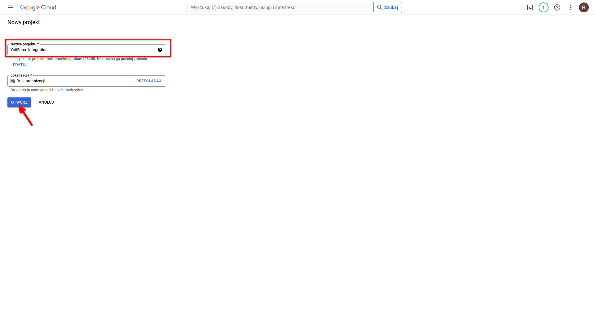
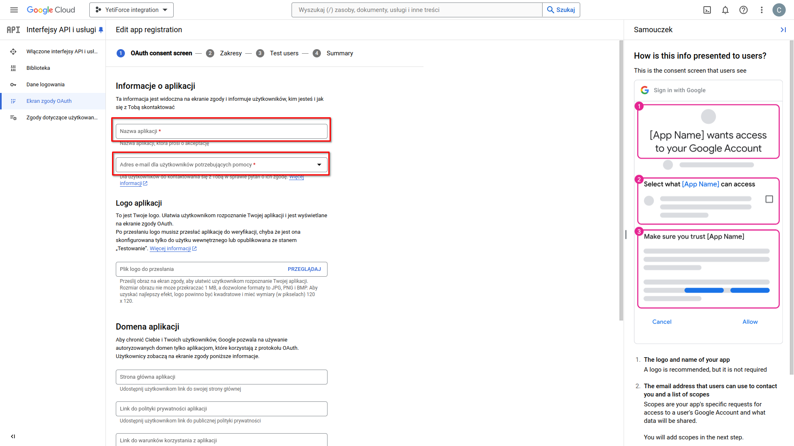
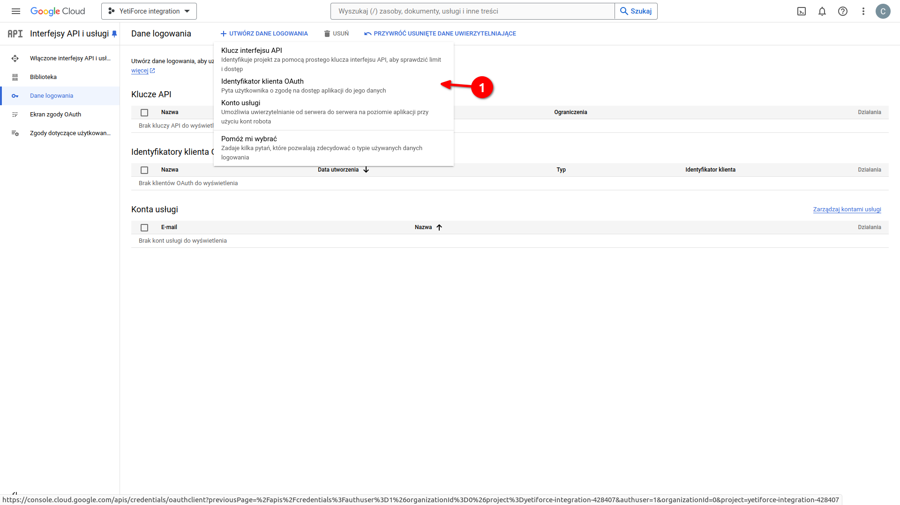
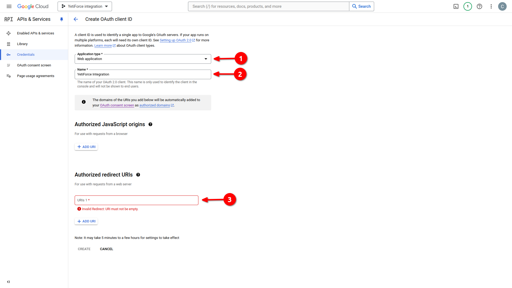
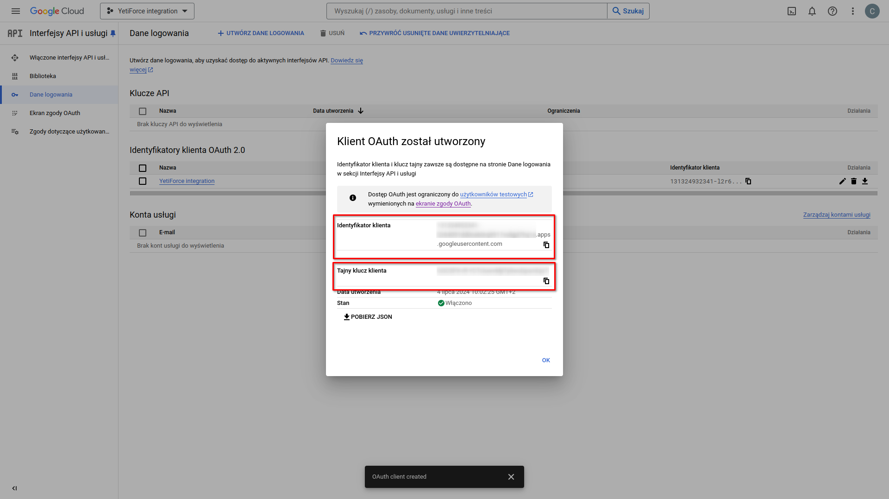

This article is a supplement to the [YetiForce integration with mail clients](/administrator-guides/integration/mailbox) guide.
It focuses on showing how to generate a Client ID and Client Secret in Gmail. These details are necessary to authenticate the connection between YetiForce and your Gmail account.

### Step 1: Create a project in the Google Cloud Platform Console

- Go to the [Google Cloud Platform](https://console.cloud.google.com/) Console.
- Log in using your Gmail account.
- Select the dropdown list of available projects.
- Select <kbd>Create project</kbd>.

- Enter the application name.

### Step 2: Create OAuth confirmation screen

- From the list at the top of the screen, select the project you created (arrow #1 in the screenshot).
- Expand the menu on the left and select "Enabled APIs & services ➔ OAuth consent screen".

- Define integration type:
  - **Internal** - for production use.
  - **External** - for testing purposes.

- Fill out the form with any application name and the Gmail email address you want to integrate with YetiForce.
- At the bottom of the form, provide the developer's email address and click <kbd>SAVE AND CONTINUE</kbd>.

- Scroll down the `Scopes` section and click the <kbd>SAVE AND CONTINUE</kbd> button at the bottom.

- In case of test integration, in the `Test users` section, add the address of the synchronized mail and proceed.

### Step 3: Create credentials

- Expand the menu on the left and select "Enabled APIs & services ➔ Credentials".
- Click the <kbd>+ CREATE CREDENTIALS</kbd> button.

- Select `OAuth Client ID` from the menu.

- In the form, select `Web Application` from the `Application type` list, and enter any application name.

The form also requires you to enter `Authorized Redirect URIs` (arrow #3 in the screenshot). This identifier can be found on the YetiForce platform. Below is a description of where to find it.

### Step 4: Find the Redirect URI value

Return to the mail server creation process described in [this article](/administrator-guides/integration/mailbox/#add-mail-server). Make sure that the `Redirect URI` field contains the name of the application you created for mail integration. Then copy the redirect URI value by pressing the <kbd><i class="fa-solid fa-copy"></i></kbd> button.

### Step 5: Continue creating credentials

Paste the copied `Redirect URI` value into the `Authorized Redirect URIs` field in the Google form. Then select the <kbd>Create</kbd> button.

A modal popup window with the `Client ID` and `Client Secret` will appear. These values ​​should be copied and used in the mail server creation form in YetiForce.

### Step 6: Add mail sever in YetiForce

Once you have the `Client ID` and `Client Secret`, fill out the rest of the form that you started creating in [this article](/administrator-guides/integration/mailbox/#add-mail-server).

#### Form fields

- **Subject** - A unique name that will be used for identification.
- **Authorization method**: `OAuth2`.
- **OAuth Provider**: select `Sync with Google`.
- **Client ID** - copy from Google - `Client ID`.
- **Client secret** - copy from Google - `Client secret`.
- **Redirect URI** - we select an application created for integration with the mail service.

Now complete the IMAP and SMTP configuration according to your email provider's recommendations.

After adding the mail account, you need to link it with user accounts. This process is described in [this article](/administrator-guides/integration/mailbox#step-3-link-mail-server-with-user-accounts).
