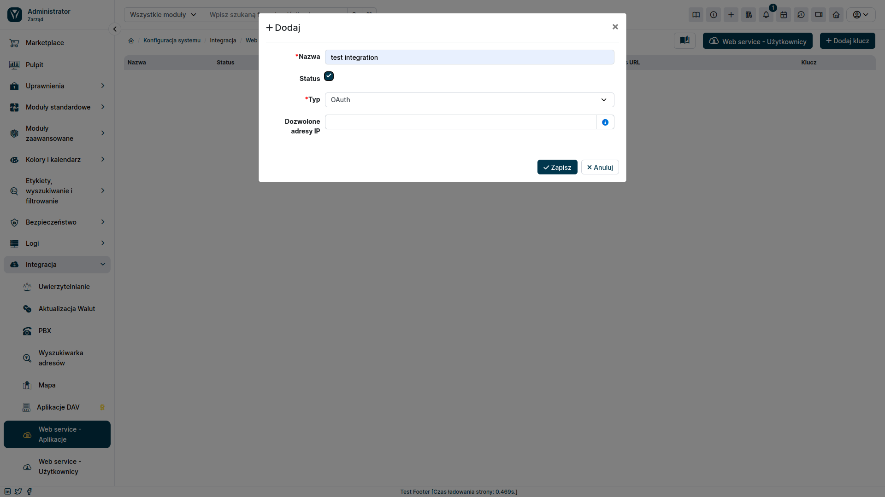
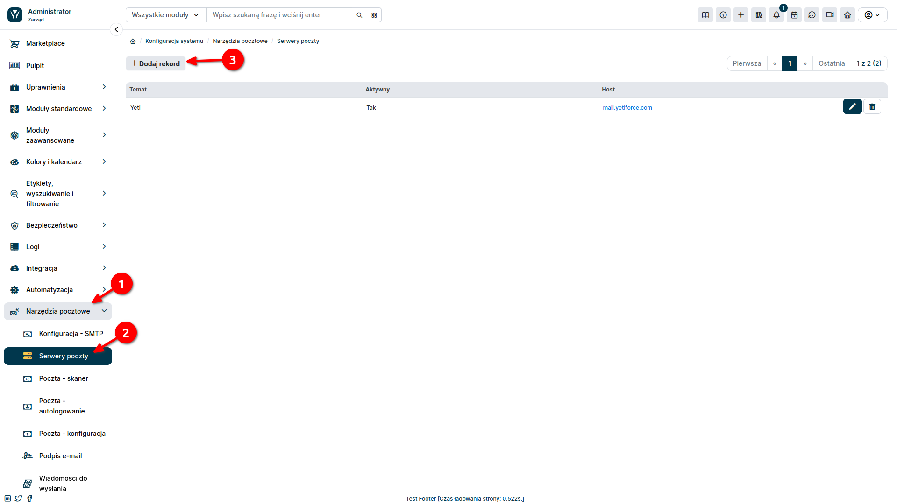
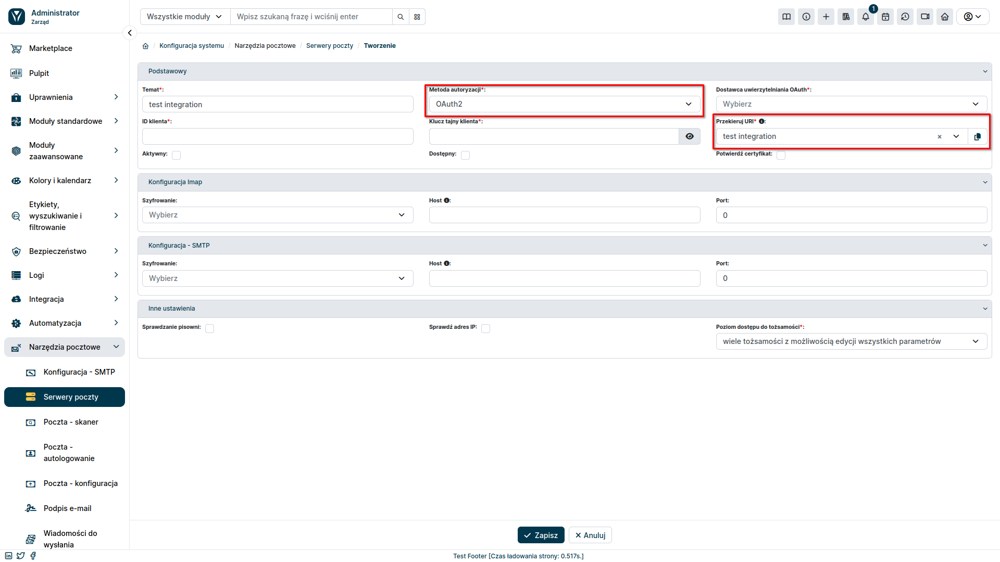
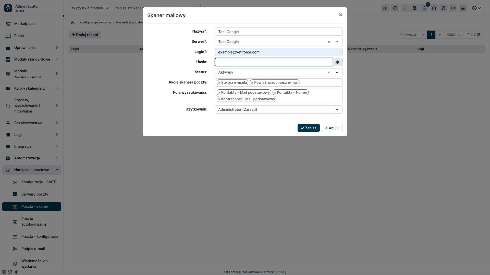
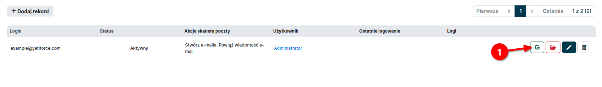

One of YetiForce's key features is its ability to integrate with popular email platforms, such as Gmail and Outlook. It allows for the automation of many tasks that are usually time-consuming, for example automatic Lead generation or linking messages to Accounts.

## Integration

:::info

In order to integrate YetiForce with an external email service, you will need to perform configuration on both - the YetiForce system side, and the service provider side.

:::

### Step 1: Add key

The connection with an external service starts with generating an integration key. This can be done in the administration section in the `Integration ➔ Web service - Applications` tab. Click the <kbd>+ Add key</kbd> button.

A popup window will appear where you can configure the key.

- **Name**: A unique name for the key that will be used to identify it. The name should be descriptive and easy to remember.
- **Status**: Specifies whether the integration key is active or inactive. Active keys can be used to authenticate requests from external applications. Inactive keys will be blocked and will not be able to be used.
- **Type**: select "OAuth".
- **Allowed IP addresses**: Optionally, you can limit access to the integration key to specific IP addresses. Enter a list of IP addresses, separated by commas. If you don't enter any IP addresses, access to the key will be allowed from any address.

### Step 2: Add mail server

The next step is to add a mail server. To do this, in the administration section, select `Mail Tools ➔ Mail Servers` from the left menu and then click the <kbd>+ Add record</kbd> button.

Fill the form according to the list below:

- **Authorization method**: \`OAuth
- **Redirect URI**: select previously created integration in the `Integration ➔ Web service - Applications` tab

After changing the value of the `Authorization method` field to OAuth, new fields will appear in the form: Client ID and Client secret. The values ​​for these fields should be obtained from the email service provider. This process will look different depending on whether you want to integrate YetiForce with Gmail or Outlook. Below are instructions on how to do it for both cases.

import DocCardList from '@theme/DocCardList';

<DocCardList />

### Step 3: Link mail server to user accounts

The next step after creating a mail server is to link it to YetiForce system users. You can assign it to one user account as an individual email, or as a general email that can be accessed by several users. Below are instructions for both cases.

#### A) Linking to private email

To configure your private mailbox, select the user icon in the upper right corner and then select <kbd>My preferences</kbd> from the menu

Select the `Mailbox` tab and fill the form fields as follows:

- **Name**: A unique name that will be used to identify the mailbox.
- **Server**: The mail server created to connect to the mail service.

After pressing the <kbd>Save</kbd> button, you will be redirected to confirm the connection of the account with the selected email service. After passing all the verification steps, you will be transferred back to the YetiForce page. To make sure the connection is working properly, press the <kbd>Run test</kbd> button. A message will then appear indicating whether the email service was successfully integrated.

#### B) Linking to corporate mailbox

In the administration section, from the left menu, select `Mail Tools ➔ Mail - Scanner` and then click the <kbd>+ Add record</kbd> button.

Fill in the form that shows up in the popup window.

- **Name**: A unique name that will be used to identify the mailbox.
- **Server**: Mail server created for integration with email.
- **Login**: Mailbox address.
- **Password**: This field can be left blank.
- **Status**: Active.

Select acanner actions, search fields, and user according to your preferences. After saving the form, the new mail scanner will appear in the list.

Then go through email authorization. To do this, press the red Google/Outlook button next to the created scanner and go through the authorization steps on the email service provider's website.

Once authorization has been completed, the icon should turn green.

To be able to log in to the email, you also need to set the appropriate entry in the `Email Tools ➔ Mail - Scanner` tab. Add users who should have access to the created email account.

