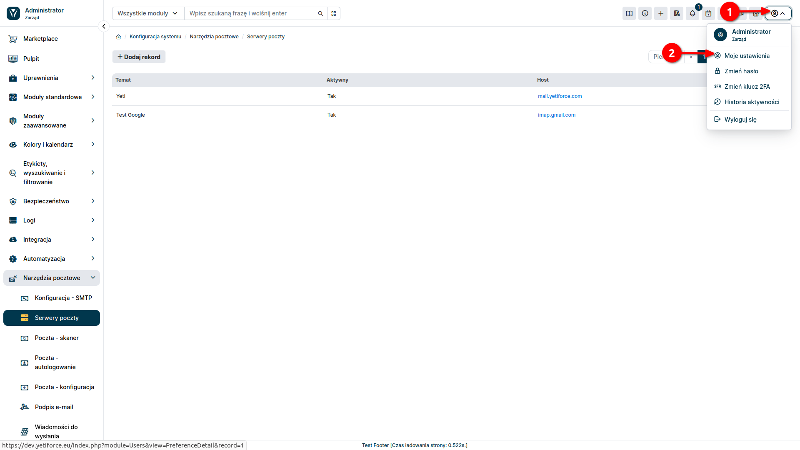
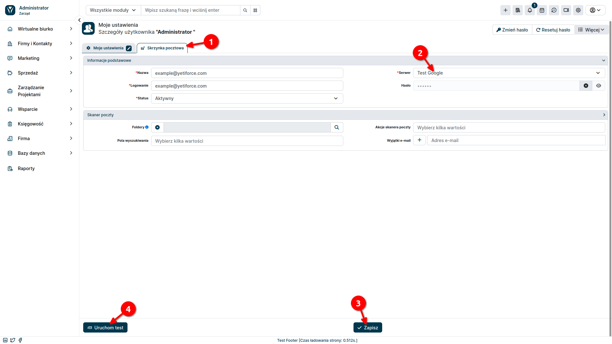
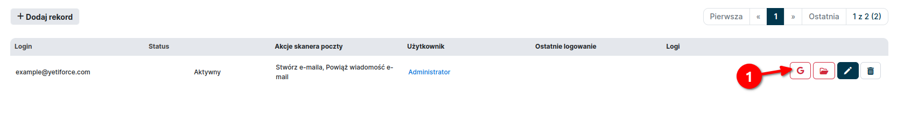
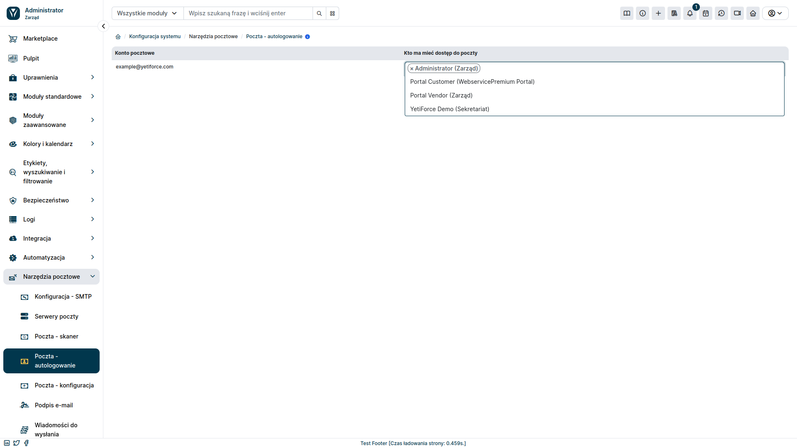

Jedną z istotnych funkcjonalności YetiForce jest możliwość integracji z popularnymi platformami pocztowymi, takimi jak Gmail i Outlook. Pozwala na automatyzację wielu zadań, które zwykle pochłaniają czas, takimi jak np. automatyczne tworzenie leadów czy też wiązanie wiadomości z kontrahentami.

## Integracja

:::info

W celu powiązania YetiForce z zewnętrzną usługą pocztową, konieczne będzie wykonanie konfiguracji zarówno po stroni CRM, jak i dostawcy usługi.

:::

### Krok 1: Dodanie Klucza

Powiązanie z usługą zewnętrzną należy rozpocząć od wygenerowania klucza integracyjnego. Można to zrobić w sekcji administracyjnej, przechodząc do zakładki ```Integracja ➔ Web service - Aplikacje``` a następnie wybierając przycisk <kbd>+ Dodaj klucz</kbd>.


Pojawi nam się wówczas okno modalne, w którym możemy skonfigurować tworzony klucz.


* **Nazwa**: Unikalna nazwa klucza, która posłuży do jego identyfikacji. Nazwa powinna być opisowa i łatwa do zapamiętania.
* **Status**: Określa, czy klucz integracyjny jest aktywny, czy nieaktywny. Aktywne klucze mogą być używane do uwierzytelniania żądań zewnętrznych aplikacji. Nieaktywne klucze zostaną zablokowane i nie będą mogły być używane.
* **Typ**: Jako typ autoryzacji, należy wybrać "OAuth".
* **Dozwolone adresy IP**: Opcjonalnie możesz ograniczyć dostęp do klucza integracyjnego do określonych adresów IP. Wprowadź listę adresów IP, oddzielając je przecinkami. Jeśli nie wprowadzisz żadnych adresów IP, dostęp do klucza będzie dozwolony z dowolnego adresu.

### Krok 2: Dodanie Serwera Pocztowego

Kolejnym krokiem jest dodanie serwera pocztowego. W tym celu w sekcji administracyjnej należy wybrać z lewego menu ```Narzędzia pocztowe ➔ Serwery poczty``` a następnie nacisnąć przycisk <kbd>+ Dodaj rekord</kbd>.


Pojawi nam się formularz dodawania serwera pocztowego. Uzupełniamy go następująco:

* **Metoda autoryzacji**: OAuth
* **Przekieruj URI**: wybierz wcześniej utworzoną integrację w zakładce ```Integracja ➔ Web service - Aplikacje```


Po zmianie wartości pola ```Metoda autoryzacji``` na OAuth, pojawią się nowe pola w formularzu: Client ID oraz Client secret. Wartości dla tych pól należy pobrać od dostawcy usługi pocztowej. Proces ten będzie wyglądał inaczej w zależności czy chcemy zintegrować YetiForce z Gmail, czy też z Outlook. Poniżej znajdują się instrukcje jak to zrobić dla obu przypadków.

import DocCardList from '@theme/DocCardList';

<DocCardList />

### Krok 3: Powiązanie Serwera Pocztowego z kontami użytkowników

Kolejnym krokiem po utworzeniu serwera pocztowego jest powiązanie go z użytkownikami systemu YetiForce. Możemy przypisać do jednego konta użytkownika jako mail indywidualny albo jako mail ogólny, do którego może mieć dostęp kilka użytkowników. Poniżej przedstawiono instrukcję dla obu przypadków.

#### A) Powiązanie z mailem indywidualnym

W celu skonfigurowania skrzynki prywatnej wybierz ikonę użytkownika znajdującą się w prawym górnym rogu, a następnie z menu, które się pojawi, wybierz <kbd>Moje ustawienia</kbd>



Wybierz zakładkę ```Skrzynka pocztowa``` i uzupełnij pola formularza następująco:

* **Nazwa**: Unikalna nazwa, która posłuży do identyfikacji skrzynki.
* **Serwer**: Serwer pocztowy utworzony do połączenia z usługą pocztową.



Po naciśnięciu przycisku <kbd>Zapisz</kbd> zostaniemy przekierowani do potwierdzenia połączenia konta z wybraną usługą pocztową. Po przejściu wszystkich kroków weryfikacyjnych zostaniemy przeniesieni z powrotem do strony YetiForce. W celu sprawdzenia poprawności połączenia możemy nacisnąć przycisk <kbd>Uruchom test</kbd>. Pojawi się wówczas komunikat z informacją czy udało się prawidłowo zintegrować usługę pocztową.

#### B) Powiązanie ze skrzynką korporacyjną

W sekcji administracyjnej z lewego menu wybierz ```Narzędzia pocztowe  ➔ Poczta - skaner``` a następnie kliknij przycisk <kbd>+ Dodaj rekord</kbd>.


Uzupełnij formularz, który pojawi się w oknie modalnym.


* **Nazwa**: Unikalna nazwa, która posłuży do identyfikacji skrzynki.
* **Serwer**: Serwer pocztowy utworzony do integracji z pocztą.
* **Login**: Adres skrzynki.
* **Hasło**: Pole może pozostać puste.
* **Status**: Aktywna.

Akcje skanera, pola wyszukiwania i użytkownika wybieramy według własnych preferencji. Po zapisaniu formularza nowy skaner poczty pojawi się na liście.

Następnie musimy przejść przez autoryzację poczty. W tym celu naciśnij na czerwony przycisk Google/Outlook znajdujący się przy utworzonym skanerze i przejdź kolejne kroki autoryzacji na stronie dostawcy usługi pocztowej.



Po przejściu autoryzacji ikona powinna zmienić kolor na zielony.


By móc zalogować się do maila należy jeszcze ustawić odpowiedni wpis w zakładce ```Narzędzia pocztowe  ➔ Poczta - skaner```. Do utworzonego konta pocztowego dodajemy użytkowników, którzy mają mieć do niego dostęp.


