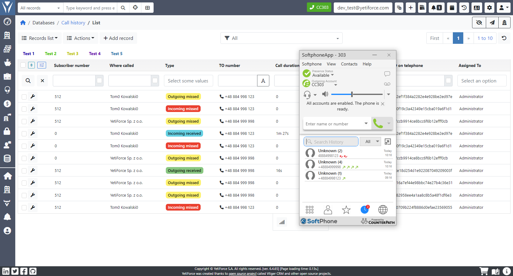
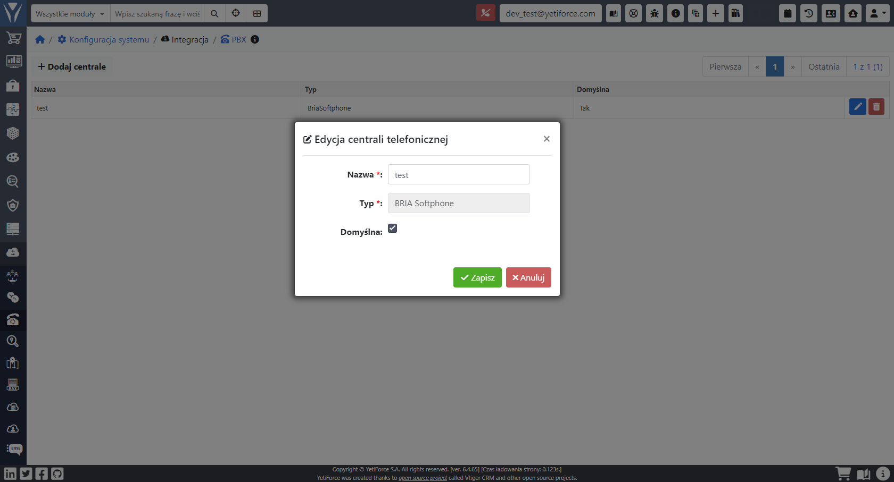
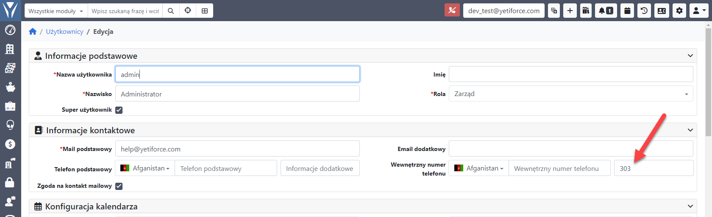
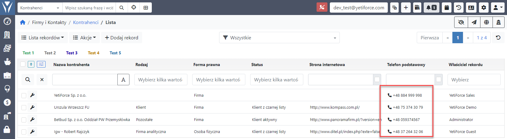
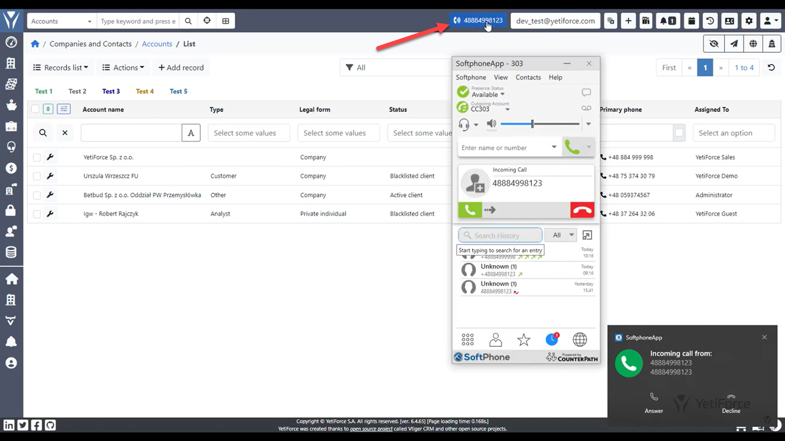
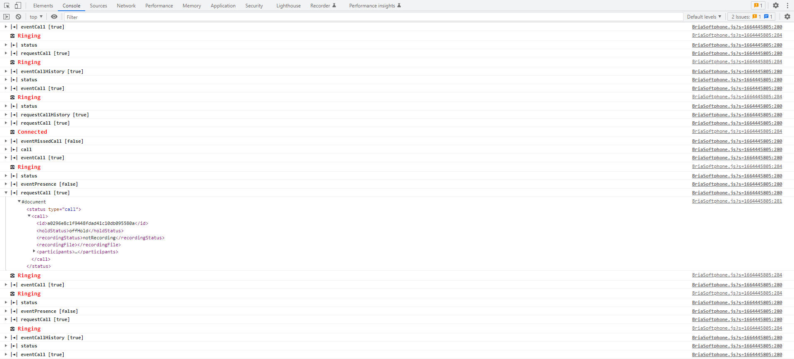

:::tip This functionality is available for YetiForce version 7.0 and later
:::

PBX integration via the Bria Softphone application.

The integration with Bria Softphone is based on `Bria Desktop API`, that allows the user to to receive information on calls in real time.

Advantages and capabilities:

- Compatible with market leading call servers or VoIP services (https://www.counterpath.com/international-voip-providers/)
- Dedicated application for the user
- ability to dial a phone number from the YetiForce system window
- synchronization of all call history
- graphical presentation of your phone's status
- Supported plans: Bria Solo, Bria Teams, Bria Enterprise (https://www.counterpath.com/product-comparison/) does not support "Bria Solo Free" plan
- integration with YetiForce via an active browser window



## Video presentation

import Tabs from '@theme/Tabs';
import TabItem from '@theme/TabItem';
import ReactPlayer from 'react-player';

<Tabs groupId="sWyz4oqKYwI">
    <TabItem value="youtube-sWyz4oqKYwI" label="🎬 YouTube">
        <ReactPlayer
            url="https://www.youtube.com/watch?v=sWyz4oqKYwI"
            width="100%"
            height="500px"
            controls={true}
        /></TabItem>
    <TabItem value="yetiforce-sWyz4oqKYwI" label="🎥 YetiForce TV">
        <ReactPlayer url="/video/integration-BriaSoftphone.mp4" width="100%" height="500px" controls={true} /></TabItem>
</Tabs>

## Configuration

### Add configuration to PBX

Add a `BRIA Softphone` type entry



### Enter internal number in users

Enter the internal number for users whose Bria Softphone integration you want to activate.



## Bria Softphone connection status

The icon on the top bar shows the current Bria Softphone integration status.

 No connection with the phone

 Connection with the phone is active; shows the current Bria Softphone user's number/name

 Incoming or outgoing call; shows the caller's name/number

## Dialing

If the integration has been activated correctly, all `phone` type field will show an additional phone icon.

When you click on a phone number or icon, a method will be called to create a call to the selected phone number.



## Incoming calls

When you receive an incoming call the system will inform you about it using a different icon and color, and will display the caller's number.



## External links

- https://www.counterpath.com/softphone-clients/
- https://www.counterpath.com/teams-pricing/
- https://www.counterpath.com/bria-desktop-api/

## Debugging

In order to enable logs in the browser for the Bria Softphone integration set the [$JS_DEBUG](https://doc.yetiforce.com/code/classes/Config-Debug.html#property_JS_DEBUG) to `true` in the [config/Debug.php](https://doc.yetiforce.com/code/classes/Config-Debug.html#property_JS_DEBUG) file.

```php
/** Turn on/off error debugging in javascript */
public static $JS_DEBUG = true;
```


