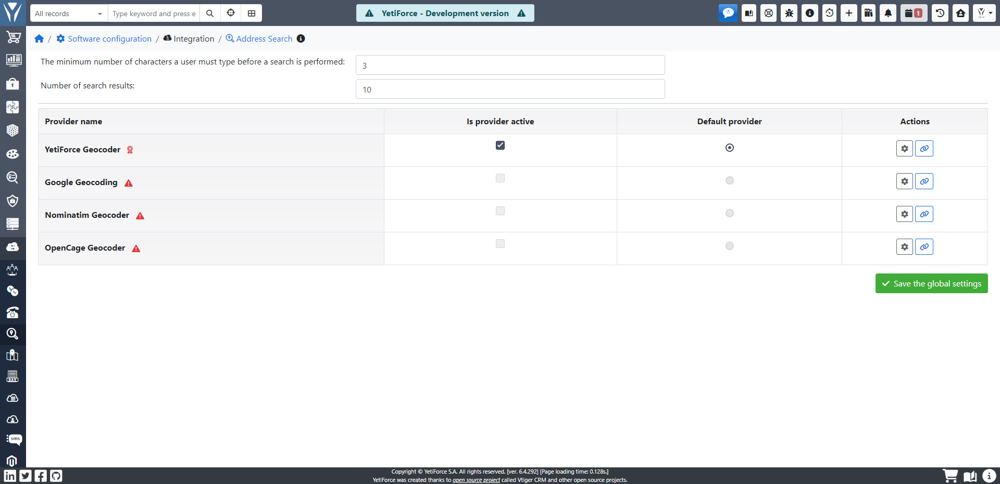

YetiForce offers its users many convenient functionalities. One of them is the ability to integrate it with the Google maps system or OpenCage Geocoder, which allows the system to later display "suggestions" to the user when they enter addresses into the database (e.g. the address of an Account).

## Vendors List

### Google Geocoding

The search engine is based on Google's `Geocoding API` service and Google Maps.

- Documentation: https://developers.google.com/maps/documentation/geocoding/
- Settings: https://console.cloud.google.com/apis
- Pricing: https://developers.google.com/maps/billing-and-pricing/pricing#geocoding

Requires a project with active `Geocoding API` service

#### Sample setup

- key: cccaSyDX2hI1YTV9B06ayBQ_99oClRp82kCZJ_2

### Nominatim Geocoder

Nominatim is a service based on OSM maps

- Documentation: https://nominatim.org/release-docs/develop/api/Search/

#### Sample setup

- Country code: pl
- Map URL: https://nominatim.openstreetmap.org/search

### OpenCage Geocoder

OpenCage is a service based on OSM maps

- Documentation: https://opencagedata.com/api
- Pricing: https://opencagedata.com/pricing

#### Sample setup

- Country code: pl
- key: 62672c4d90064d0589f6hbaeb058ll1c
