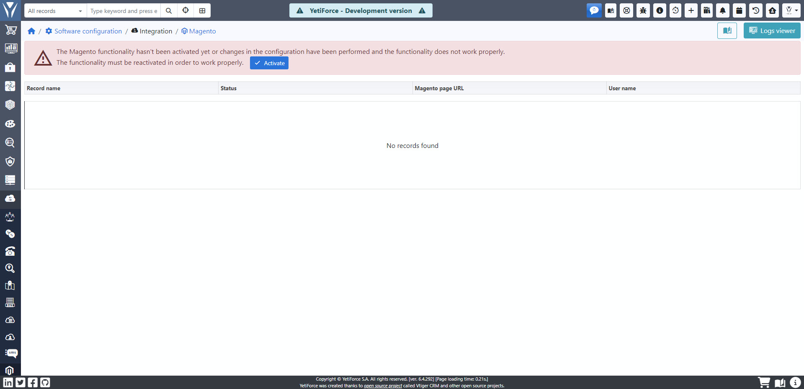

## Main assumptions of integration

In the YetiForce system, you can use the built-in integration with Magento. The integration works on the principle of data synchronization in cron using API (Magento Admin REST endpoints), which synchronizes data between YetiForce and Magento. Flexible design allows for multi-shop functionality, i.e. you can integrate many stores based on the Magento engine with the YetiForce system. Regardless of the number of stores, the YetiForce system is always the master system that centralizes data from various sub-systems [eg. Magento].

Communication between the systems is one-way [the YetiForce system queries the Magento API, downloading and updating data in two directions]. Theoretically, there is no need to install any extensions for Magento, however, in practice, we recommend adjusting the mapping and unifying the types of fields and dictionaries between systems [more information later in the document].

Integration largely protects itself from changes in Magento [as described in the sections below], however, keep in mind that it is an integration between large systems that often process thousands of information daily. Each modification of values ​​in the picklists, removal of a product, or removal of a client may affect both systems, so employees with administrative rights should be trained.

## Synchronization

The system synchronizes many elements, the most important of which are: currencies, categories, products, customers, orders. If, during synchronization, a product, category or customer that does not exist in YetiForce appears in the order, the mechanism will automatically apply the missing data.

Synchronization requires a user with administrator privileges for all elements that are synchronized.

### Magento > YetiForce

#### Currencies

By default, both systems have the same list of supported currencies. Adding a currency in Magento requires verification if the new currency is also properly supported in the other system. If a currency is enabled in the Magento store, which is not included in YetiForce, then the integration adds a new currency to the list of supported currencies [this can only be done when the new currency is on the list of currencies supported by the system, which can be checked in the system configuration panel].

**If the currency is removed on the Magento side, then nothing will change in the YetiForce system.**

#### Categories

All categories are synchronized only in one direction [from Magento to YetiForce], thus category management can be done on the store's side. In case of a new category, the synchronization mechanism will add this category to the YetiForce system [currently only the necessary fields are synchronized, according to the field mapping described in the sections below].

For the security of integration, a change of category in one system does not change the category in the other system [e.g. when we change the name of the category] in this way, the systems will not affect each other, e.g. changing the name of the category could affect filters, charts in the YetiForce system and categories in other stores, which should not happen, especially when the stores are managed by different teams of people. During synchronization, the system ignores the category status, and deleting a category in Magento does not delete it in YetiForce.

Category synchronization is based on the unique category ID in the Magento system, while in the YetiForce system, apart from the category ID, the store ID is also taken into account [the combination of these two IDs is a unique value in the YetiForce system]. The Magento system cannot allow more than one category with the same ID.

#### Products

Product Synchronization is technically very similar to Category Synchronization. The unique field by which products are synchronized between systems is SKU. An important difference is that categories in YetiForce are unique on the basis of category ID + store ID, and in the case of products, only the SKU field is a unique value, so two stores selling a product with the same SKU will have the same product in YetiForce [but may have different categories].

#### Contacts

Synchronization of contacts works technically very much like synchronization of categories. The unique field after which contacts between systems are synchronized is the email field. The contact is synchronized when synchronizing customers and when creating an order/invoice [the system checks the contact details and creates a new contact in the YetiForce system if it does not exist, or links the contact to an order if it already exists].

#### Accounts

Accounts synchronization works technically very much like category synchronization. The unique field after which the accounts are synchronized between the systems is the TAX ID field or the e-mail address. The account is synchronized when synchronizing customers and when creating an order/invoice [the system checks the account's data on the contact - if it does not exist in the YetiForce system, it creates it, and if it does, it links it with the order].

Unfortunately, the Magento system itself has very complicated mechanics of creating an account [data about the account can be completed in different places and at different times of creating an order], therefore the following logic has been implemented when it comes to searching and associating accounts between the systems:

- [Magento] We check if the TAX ID number has been entered in the "Default billing address" block
- [Magento] We check if the TAX ID number has been entered in the "Default delivery address" block;
- If we do not find the TAX ID number, we look for an e-mail address in all fields of the "E-mail" type Account module;

If we do not find an account, it is created; if we find an account in YetiForce, it is linked to the order.

#### Orders

Synchronization of an order is performed similarly to the synchronization of products, with the following differences:

1. Synchronization takes place when YetiForce downloads information about a new order in the store from the API.

2. The system determines the uniqueness of the order on the Magento side based on the "Order number" field, and on the YetiForce side based on the combination of the "Magento order ID" + "Magento Store ID" fields. Both fields are system fields and cannot be edited.

3. If there is no contact/account/product/category, they are created based on data from Magento.

4. If the order contains additional services [listed below], then additional services will be added to the YetiForce order and the price will be taken from the Magento order:

- Shipping
- Paypal payment service
- Cash on delivery

5. Creating/editing an order with the "Completed" status will automatically create a delivery note (the mechanism is disabled by default, you must enable it in the admin panel → “Workflows”). After creating the delivery note, remember that both documents [Order and delivery note] are independent; changing one of them does not affect the other, the only exception is when the status of the order receives a value other than "Completed", then all the delivery notes for this order are canceled.

Comments:

- If the order does not have the required information, e.g. a currency supported by YetiForce, then the order **will be skipped**.
- If the order contains a product that does not exist in YetiForce and does not exist in Magento [the product was removed after the order was created], then the order **will be skipped**.

#### Sales invoices

Synchronization of invoices is carried out in the same way as the synchronization of orders, only delivery note documents are not generated.

### YetiForce > Magento

#### Stock levels (based on delivery note documents)

One of the most important integration elements is the synchronization of stock levels from YetiForce to Magento. Each store can have its own "warehouse" on the YetiForce side and the information about the stock level can come either from the warehouse assigned to the store or directly from the product [i.e. stock from all warehouses together]. It is required to enable the generation of a delivery note when creating/editing an order.

Magento itself also affects the YetiForce system inventory, only through orders [the change in Magento inventory does not affect the YetiForce inventory in any way] on the basis of which the YetiForce system creates a delivery note, which is a warehouse document reducing the inventory of products. The system associates the products and their inventory on the basis of the EAN/SKU field, which should be a unique field in both systems [more information in the field mapping section].

In practice, this means that Magento itself should not change the inventory locally [in Magento], but even if it does [and in the default version of the system without modifying the code, this is exactly how Magento works], then the YetiForce system will overwrite the Magento inventory to the one in YetiForce. Information about the stock is synchronized in a short period of time [it depends on the configuration of the CRON action, by default the action is performed once a minute when the entire CRON mechanism is triggered every minute].

#### Updating order statuses

The YetiForce system synchronizes the order statuses and payment statuses between the systems in both directions.

## Field mapping

Keep in mind that most of the fields are filled only during creation, which in practice means that changing the name of a category in one system does not affect the other system, so in the other system the name should also be manually changed [if it is justified business-wise]. The mere change of, for example, a name of a category or product, does not affect the synchronization, as it is always based on unique fields.

1. Categories

   - Category name [Magento] > Category name [YetiForce]
   - Enable Category [Magento] > Active [YetiForce]
   - Parent Category [Magento] > Parent Category [YetiForce]

2. Products

   - Product Name [Magento] > Product Name [YetiForce]
   - Enable Product [Magento] > On sale [YetiForce]
   - SKU [Magento] > SKU [YetiForce]
   - Description [Magento] > Description [YetiForce]

3. Contacts

   - Gender [Magento] > Gender [YetiForce]
   - First name [Magento] > First name [YetiForce]
   - Surname [Magento] > Surname [ YetiForce]
   - E-mail [Magento] > Primary email [YetiForce]
   - Phone number [Magento] > Primary phone [YetiForce]
   - Fax [Magento] > Secondary phone [YetiForce]
   - Date of birth [Magento] > Date of birth [YetiForce]
   - [Default billing address] field [Street and building number 1] [Magento] > [Primary address] field [Street] [YetiForce]
   - [Default billing address] field [Street and building number 2] [Magento] > [Primary address] field [Building number] [YetiForce]
   - [Default Billing Address] field [Postcode] [Magento] > [Primary Address] field [Postcode] [YetiForce]
   - [Default billing address] field [City] [Magento] > [Primary address] field [City] [YetiForce]
   - [Default billing address] field [Province] [Magento] > [Primary address] field [Province] [YetiForce]
   - [Default billing address] field [Country] [Magento] > [Primary address] field [Country] [YetiForce]
   - [Default delivery address] field [Street and number 1] [Magento] > [Delivery address] field [Street] [YetiForce]
   - [Default delivery address] field [Street and number 2] [Magento] > [Delivery address] field [Building number] [YetiForce]
   - [Default delivery address] field [Post code] [Magento] > [ Delivery address] field [Post code] [YetiForce]
   - [Default delivery address] field [City] [Magento] > [Delivery address] field [City] [YetiForce]
   - [Default delivery address] field [Province] [Magento] > [Delivery address] field [Province] [YetiForce]
   - [Default delivery address] field [Country] [Magento] > [Delivery address] field [Country] [YetiForce]

4. Accounts

   - Company [Magento] > Account name [YetiForce] - if there is a private person in the order, the YetiForce system will create an Account designated as a private person, where the Account's name is his first and last name.
   - TAX ID (EU VAT) [Magento]> TAX ID [YetiForce]
   - E-mail [Magento] > Primary e-mail [YetiForce]
   - Phone number [from the appropriate block] [Magento] > Primary phone [YetiForce]
   - Fax [from the appropriate block] [Magento] > Secondary phone [YetiForce]
   - [Default billing address] field [Street and building number 1] [Magento] > [Primary address] field [Street] [YetiForce]
   - [Default billing address] field [Street and building number 2] [Magento] > [Primary Address] field [Building number] [YetiForce]
   - [Default billing address] field [Postcode] [Magento] > [Primary Address] field [Postcode] [YetiForce]
   - [Default billing address] field [City] [Magento] > [Primary address] field [City] [YetiForce]
   - [Default billing address] field [Province] [Magento] > [Primary address] field [Province] [YetiForce]
   - [Default billing address] field [Country] [Magento] > [Primary address] field [Country] [YetiForce]
   - [Default delivery address] field [Street and building number 1] [Magento] > [Delivery address] field [Street] [YetiForce]
   - [Default delivery address] field [Street and building number 2] [Magento] > [Delivery address] field [Building number] [YetiForce]
   - [Default delivery address] field [Post code] [Magento] > [Delivery address] field [Post code] [YetiForce]
   - [Default delivery address] field [City] [Magento]> [Delivery address] field [City] [YetiForce]
   - [Default delivery address] field [Province] [Magento] > [Address for delivery ] field [Province] [YetiForce]
   - [Default delivery address] field [Country] [Magento] > [Delivery address] field [Country] [YetiForce]

5. Sales orders

   - Order number [Magento] > Subject [YetiForce]
   - Account relationship [according to the logic described above] [YetiForce]
   - Contact relationship [according to the logic described above] [YetiForce]
   - Storage relationship [YetiForce] - field filled in automatically in YetiForce.
   - Link to the previous order [Magento] - Parent sales order [YetiForce]
   - Customer note [Magento] - Comments [YetiForce]
   - Source [YetiForce] - the default value is Magento.
   - Payment information [Magento] - Payment method [YetiForce] - mapped dictionary
   - Payment status [Magento] - Payment status [YetiForce] - mapped dictionary
   - Order date [Magento] > Start date [YetiForce]
   - Order status [Magento] - Magento status, Status [YetiForce]
   - First name [Magento] > First name [YetiForce] - for address blocks for printouts
   - Last name [Magento] > Surname [YetiForce] - for address blocks for printouts
   - Company name [Magento] > Company name [YetiForce] - for address blocks for printouts
   - VAT ID [Magento]> VAT ID [YetiForce] - for address blocks for printouts
   - Mail [Magento]> Email [YetiForce] - for address blocks for printouts
   - [Default billing address] field [Street and number 1] [Magento] > [Main address] field [Street] [YetiForce]
   - [Default billing address] field [Street and number 2] [Magento]> [Main address] field [Building number] [YetiForce]
   - [Default billing address] field [Postcode] [Magento]> [Main address] field [Postcode] [YetiForce]
   - [Default billing address] field [City] [Magento]> [Primary address] field [City] [YetiForce]
   - [Default billing address] field [Province] [Magento]> [Primary address] field [Province] [YetiForce]
   - [Default billing address] field [Country] [Magento]> [Primary address] field [Country] [YetiForce
   - [Default delivery address] field [Street and building number 1] [Magento]> [Delivery address] field [Street] [YetiForce]
   - [Default delivery address] field [Street and building number 2] [Magento]> [Delivery address] field [Building number] [YetiForce]
   - [Default delivery address] field [Postcode] [Magento]> [Delivery address] field [Postcode] [YetiForce]
   - [Default delivery address] field [City] [Magento]> [Delivery address] field [City] [YetiForce]
   - [Default delivery address] field [Province] [Magento]> [Delivery address] field [Province ] [YetiForce]
   - [Default delivery address] field [Country] [Magento] > [Delivery address] field [Country] [YetiForce]

6. Order - block with products/services

   - Product [Magento]> Item name [YetiForce] - SKU mapping
   - Quantity [Magento]> Quantity [YetiForce]Unit
   - Price [Magento] > Price [YetiForce]
   - Discount [Magento]> Discount [%] + Discount [value] [YetiForce]
   - Tax [Magento]> Tax [YetiForce]
   - Currency [set based on the order currency] [YetiForce]
   - Discount type [set automatically to individual] [YetiForce ]
   - Tax type [set automatically to individual] [YetiForce]

7. Sales invoices

   - Order number [Magento] > Topic [YetiForce]
   - Account relationship [according to the logic described above] [YetiForce]
   - Payment information [Magento] - Payment method [YetiForce] - mapped dictionary
   - Payment method [Magento] - Payment method [YetiForce] - mapped dictionary
   - Creation date [Magento] > Issue date [YetiForce]
   - Creation date [Magento] > Sale date [YetiForce]
   - Invoice status [Magento] - Status [YetiForce]
   - First name [Magento] > First name [YetiForce] - for address blocks for printouts
   - Last name [Magento] > Last name [YetiForce] - for address blocks for printouts
   - Company name [Magento] > Company name [YetiForce] - for address blocks for printouts
   - VAT ID [Magento] > VAT ID [YetiForce] - for address blocks for printouts
   - E-mail [Magento] > E-mail [YetiForce] - for address blocks for printouts
   - [Default billing address] field [Street and building number 1] [Magento] > [Primary address] field [Street] [YetiForce]
   - [Default billing address] field [Street and building number 2] [Magento] > [Primary address] field [Building number] [YetiForce]
   - [Default billing address] field [Post code] [Magento] > [Primary address] field [Post Code] [YetiForce]
   - [Default billing address] field [City] [Magento] > [Primary address] field [City] [YetiForce]
   - [Default billing address] field [Province] [Magento] > [Primary address] field [Province] [YetiForce]
   - [Default billing address] field [Country] [Magento] > [Primary address] field [Country] [YetiForce
   - [Default delivery address] field [Street and number 1] [Magento] > [Delivery address] field [Street] [YetiForce]
   - [Default delivery address] field [Street and number 2] [Magento]> [Delivery address] field [Building number] [YetiForce]
   - [Default delivery address] field [Postcode] [Magento]> [Delivery address] field [Postcode] [YetiForce]
   - [Default delivery address] field [City] [Magento] > [Delivery address] field [City] [ YetiForce]
   - [Default delivery address] field [Province] [Magento] > [Delivery address] field [Province] [YetiForce]
   - [Default delivery address] field [Country] [Magento] > [Delivery address] field [Country] [YetiForce]

8. Sales invoices - block with products/services
   - Product [Magento]> Item name [YetiForce] - SKU mapping
   - Quantity [Magento]> Quantity [YetiForce]
   - Price [Magento]> Unit price [YetiForce]
   - Discount [Magento]> Discount [%] + Discount [value] [YetiForce]
   - Tax [Magento]> Tax [YetiForce]
   - Currency [set based on the order currency] [YetiForce]
   - Discount type [set automatically to individual] [YetiForce ]
   - Tax type [set automatically to individual] [YetiForce]

## Integration troubleshooting

The integration has separate logs that are stored in the database and uses standard logging mechanisms. The logs contain all the most important information, including integration errors [e.g. skipped records and the reason for skipping them]. All bugs that are unacceptable for business should be resolved before the first production launch.
