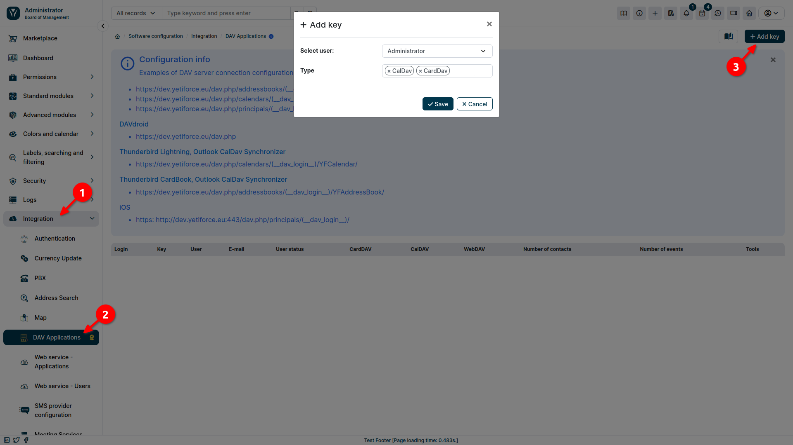

The YetiForce system enables integration with other applications, which allows for smooth cooperation between these programs simultaneously, without the need to constantly switch between them. The **CalDAV** and **CardDAV** protocols are used for this purpose, to synchronize the calendar and contacts, respectively, between different devices and applications. It allows for the integration of YetiForce with email clients, calendars, and contact applications.

**What does this mean for the user?**

- **Calendar Sync**: You can add, edit, and delete events in your YetiForce calendar from any device that supports CalDAV (e. g., mobile phone, tablet, computer). Changes will be automatically synced across all devices.
- **Contact Sync**: Similar to your calendar, you can manage your contacts in YetiForce using any CardDAV client. Adding, editing, and deleting contacts will be synced across devices.

:::warning

**Note!** To integrate YetiForce with DAV you need the paid **Outlook Integration Panel & DAV** add-on, available in the YetiForce Marketplace.

:::

Below is a step-by-step guide to configuring DAV integration in the YetiForce system.

## 1. YetiForce configuration

To use the DAV service you must first make sure your YetiForce system has been properly configured.

### a. Permissions

- Select the user icon in the upper right corner.
- From the menu that appears, select <kbd>My Settings</kbd>.
- In the settings list, go to the `DAV Integration` section.
- Set appropriate access permissions for CardDAV and CalDAV.


### b. Launch relevant CRON jobs

CRON jobs play a key role in data synchronization between YetiForce and external services such as DAV. They allow scripts to be run automatically at specified intervals, ensuring continuous and seamless exchange of information. Therefore, it is important to make sure that the necessary CRON jobs are run. To do this:

- In the administration section in the left menu, select `Automation ➔ CRON`
- Make sure that the `CardDAV Integration` and `CalDAV Integration` triggers have the `Active` status.


### c. Activation in code

- Open the file `config/Api.php`.
- Add the `dav` element to the array in the `$enabledServices` variable.
- Set the values ​​of the `enableCardDAV` and `enabledCalDAV` variables to true, depending on what you want to sync (contacts, calendars, or both).

Below is some sample PHP code:

```php
public static $enabledServices = ['webservice', 'dav'];

public static $enableCardDAV = true;

public static $enableCalDAV = true;

```

---

## 2. Add key

Once the YetiForce system is properly set up, you need to generate a key that will enable integration with the DAV service.

- In the administration section in the left menu, select `Integration ➔ DAV application`.
- Click the <kbd>Add Key</kbd> button.
- In the popup window select the user for whom you want to generate a key, and then specify the synchronization type:
  - CalDav: Calendar synchronization.
  - CardDav: Contact synchronization.



---

## 3. Integration of YetiForce with mail tools

We will demonstrate how to integrate YetiForce with an email tool, using Thunderbird as an example.

### a. CalDAV: Calendar Sync

- Launch Thunderbird on your computer.
- From the left menu, select the **Calendars** tab
- In the list of available calendars, right-click and select <kbd>New Calendar</kbd> from the menu that appears.


- In the modal window, select <kbd>Remote Calendar</kbd> and proceed.


- In the next step, fill the form as follows:
  - **Username**: the `Login` value that appeared with the generated key.
  - **Location**: An appropriately configured address, in the form: `https://dev.yetiforce.eu/dav.php/calendars/(__dav_login__)/YFCalendar/`, where the string `(__dav_login__)` is replaced with the `Login` value from the generated key.
- Click the <kbd>Find calendar</kbd> button.


After completing the steps described above, your YetiForce calendar should be successfully synced with your email tool. This means that adding, editing, or deleting an event or task in one place will be reflected in the others.

### b. CardDAV: Contacts Sync

- Launch Thunderbird on your computer.
- From the left menu, select the **Address Book** tab
- Click the <kbd>New Address Book</kbd> button.
- From the menu select <kbd>Add CardDAV Address Book</kbd>.


- Fill out the form in the popup window:
  - **Username**: the `Login` value that appeared with the generated key.
  - **Location**: An appropriately configured address, in the form: `https://dev.yetiforce.eu/dav.php/addressbooks/(__dav_login__)/YFAddressBook/`, where the string `(__dav_login__)` is replaced with the `Login` value from the generated key.
- Click <kbd>Continue</kbd>.


- Fill out the form in the popup window:
  - **Username**: the `Login` value that appeared with the generated key.
  - **Password**: generated key.
- Click <kbd>OK</kbd>.


### Related articles

[Sabre DAV Integration](/administrator-guides/apps/#sabredav-integration)
