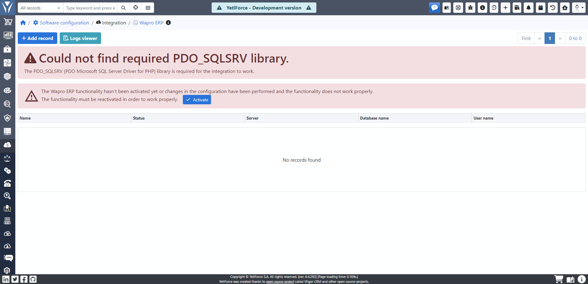

## Wymagania i aktywacja Wapro ERP

### Nie znaleziono wymaganej biblioteki PDO_SQLSRV

Jeśli widzisz poniższy komunikat to znaczy że nie masz zainstalowanego rozszerzenia `PDO Microsoft SQL Server Driver for PHP`

Rozszerzenie jest wymagane na potrzeby integracji z Wapro ERP, dzięki temu jest możliwa komunikacja z bazą danych Microsoft SQL Server.

### Instalacja PDO_SQLSRV

Instrukcja instalacji znajduje się na stronie https://docs.microsoft.com/en-us/sql/connect/php/installation-tutorial-linux-mac

#### Możliwe błędy

`SQLSTATE[08001]: [Microsoft][ODBC Driver 17 for SQL Server]TCP Provider: Error code 0x2746`

Jeśli podczas dodawania dostępu do bazy danych pokaże się powyższy komunikat to należy zapoznać się z opisem rozwiązania tego problemu:

https://github.com/microsoft/msphpsql/issues/1021

### Aktywacja

Powyższy komunikat pokazuje się gdy nie została wgrana konfiguracja wymagana dla integracji lub została wyłączona/zmieniona.

Podczas aktywacji w systemie zostaną wprowadzone następujące zmiany:

- Tworzone są pola WAPRO ERP ID w modułach w których są synchronizowane dane
- Tworzone jest pole Typ sumowania rabatu
- Tworzone są tabele z konfiguracją oraz logami
- Dodane zostaje zadanie w CRON
