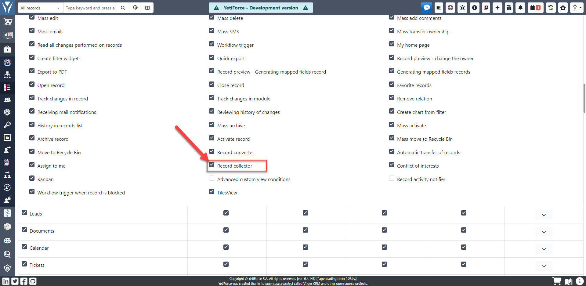

## Video presentation

import Tabs from '@theme/Tabs';
import TabItem from '@theme/TabItem';
import ReactPlayer from 'react-player';

<Tabs groupId="XlIXiQpC9ug">
    <TabItem value="youtube-XlIXiQpC9ug" label="🎬 YouTube">
        <ReactPlayer
            url="https://www.youtube.com/watch?v=XlIXiQpC9ug"
            width="100%"
            height="500px"
            controls={true}
        />
    </TabItem>
    <TabItem value="yetiforce-XlIXiQpC9ug" label="🎥 YetiForce TV">
        <ReactPlayer url="https://public.yetiforce.com/tutorials/record-collector.mp4" width="100%" height="500px" controls={true} />
    </TabItem>
</Tabs>

## Privileges

For the collector to work properly you have to check (☑) the "Record collector" field in the profile permission configuration panel (`Software configuration → Permissions → Profiles`) shown below:

If you can't see the "records collector" action in profiles you should edit the following file: modules/Settings/ModuleManager/models/Module.php and add in the variable the following text (only if it's missing)

## Automation

Collectors that have the ability to autocomplete data can be used in workflow actions to automatically update data, for example when importing records to the system.

All you have to do is set the conditions so that the record collector is always launched during creation and select the appropriate fields to be updated, which will allow you to easily automate the process of importing data, e.g.
