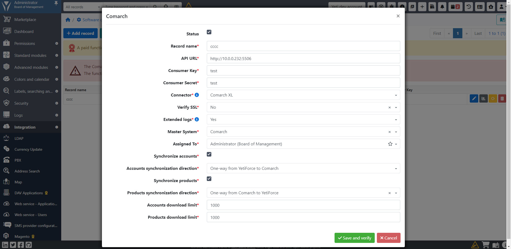
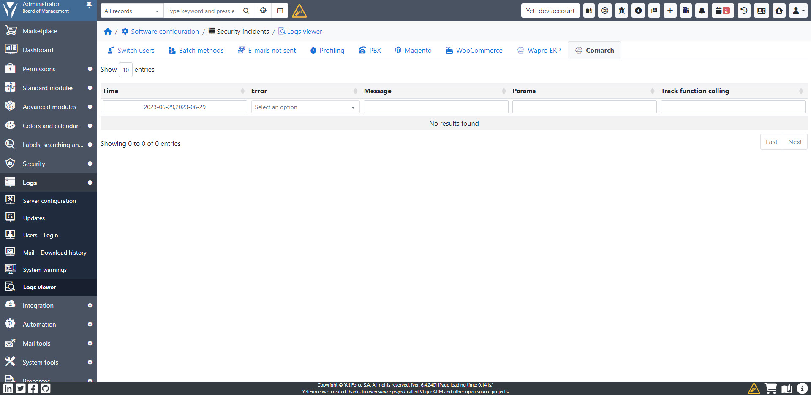

The integration between YetiForce and Comarch ERP guarantees fast and convenient two-way data synchronization, which allows for even more effective customer management in CRM.

## Comarch ERP XL

### Synchronization

#### Accounts

##### One-way from YetiForce to Comarch

In order for the Account to be sent to Comarch, it is necessary to set the appropriate values ​​in the following fields:

- Comarch server - specify to which Comarch instance the entry is to be sent (if there is one value and all invoices are to be sent, you can set the default value)
- Short name - a unique name of the Account, the so-called acronym
- Payment date (in days) - field specifying the payment date, the value is set in days and is used when issuing invoices for the payments

#### Invoices

##### One-way from YetiForce to Comarch

In order for the invoice to be sent to Comarch, it is necessary to set the appropriate values ​​in the following fields:

- Comarch server - specify to which Comarch instance the entry is to be sent (if there is one value and all invoices are to be sent, you can set the default value)
- Comarch integration status - the appropriate status for integration must be set, below is the description of the values:
  - Draft - editing and changes possible without sending to Comarch
  - To be sent - waiting to be sent, after sending, the system will automatically change the status to `Sent` or `An error occurred`
  - Sent - the invoice has been successfully sent to Comarch
  - An error occurred - an unexpected error occurred, the invoice was not sent. You should verify the error messages in the `Comarch error logs` field
  - Downloaded from Comarch - value used for integration when invoices are downloaded from Comarch (Invoice synchronization direction = `One-way from Comarch to YetiForce`)
- Currency - consistent with the currency from the block above the items (next to the discount type)

## Logs

Full error and synchronization logs are available in the logs panel.

Error logs for a specific record are available in the `Comarch error logs` field
