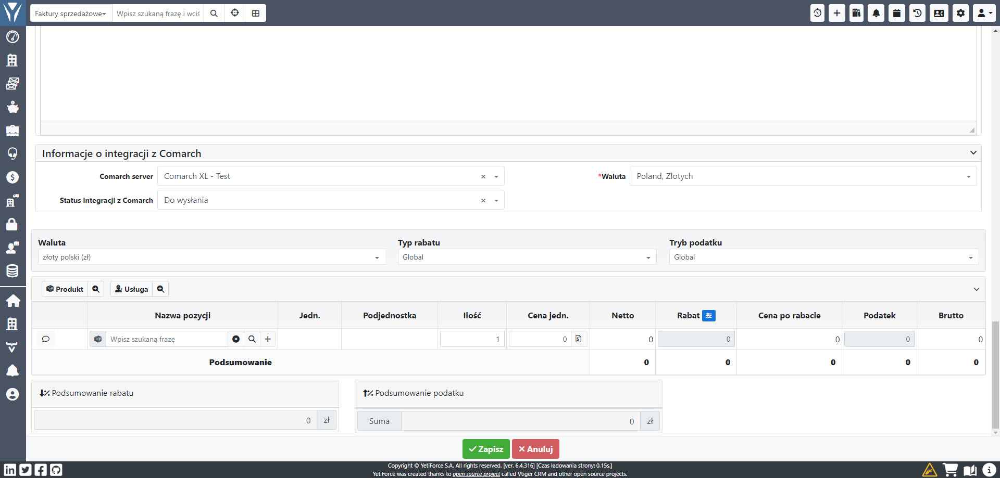

The integration between YetiForce and Comarch ERP guarantees fast and convenient two-way data synchronization, which allows for even more effective customer management in CRM.

## Comarch ERP XL

### Synchronization

#### Kontrahenci

##### Jednokierunkowa z YetiForce do Comarch

Aby kontrahent został wysłany do Comarch wymagane jest odpowiednie ustawienie wartości w polach:

- Comarch server - okreslenie do której instancji Comarch ma zostać wysłany wpis (jak jest jedna wartość i wszystkie faktury mają być wysyłane można ustawić wartość domyślną)
- Nazwa skrócona - unikalna nazwa kontrahenta, tzw. akronim
- Termin płatności (w dniach) - pole okreslajace termin płatności, wartość jest podana w dniach i używana przy wystawianiu faktur dla terminu płatności

#### Faktury

##### Jednokierunkowa z YetiForce do Comarch

Aby faktura została wysłana do Comarch wymagane jest odpowiednie ustawienie wartości w polach:

- Comarch server - okreslenie do której instancji Comarch ma zostać wysłany wpis (jak jest jedna wartość i wszystkie faktury mają być wysyłane można ustawić wartość domyślną)
- Status integracji z Comarch - musi być ustawiony odpowiedni status dla integracji, poniżej opis wartości:
  - Wersja robocza - możliwa edycja oraz wprowadzanie zmian bez wysłania do Comarch
  - Do wysłania - oczekuje na wysłanie, po wysłaniu system automatycznie zmieni na `Wysłano` lub `Wystąpił błąd`
  - Wysłano - faktura została prawidłowo wysłana do Comarch
  - Wystąpił błąd - wystąpił nieoczekiwany błąd, faktura nie została wysłana. Należy zweryfikować komunikaty błędów w polu `Logi błędów Comarch`
  - Pobrane z Comarch - wartość używana dla integracji gdy faktury są pobierane z Comarch (Kierunek synchronizacji faktur = `Jednokierunkowa z Comarch do YetiForce`)
- Waluta - zgodna z walutą z bloku nad pozycjami (obok typu rabatu)

## Logs

Pełne logi błędów i synchronizacji są dostepne w panelu logów.

Logi dotyczace błędów dla konkretnego rekordu są dostępne w polu `Logi błędów Comarch`
