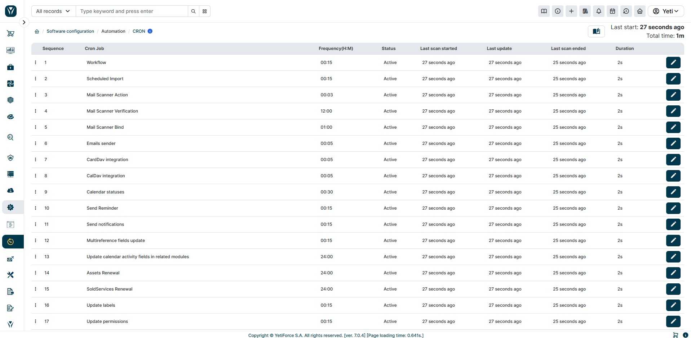
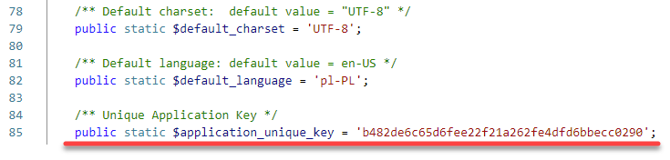

CRON is a Unix daemon that triggers other programs periodically. It uses crontabs to save information about cron tasks that will be enabled. It is recommended to use it on Linux, but if the same file will be added to the scheduler on Windows, it will also work. In practice, YetiForce can perform certain tasks automatically with cron and trigger them in the background.



## Jak uruchomić cron-a?

CRON can be enabled in a few simple steps:

### Linux - edit /etc/crontab file, /etc/cron.d/yetiforce file, or 'crontab -e':

- Add an entry to crontab, or a file to CRON, e.g.

  :::warning
  It is important that the script is run with the same permissions as the owner of the system files.
  :::

```bash
*/2 * * * * www-data __YETIFORCE_PATH__/cron/cron.sh > __YETIFORCE_PATH__/cache/logs/cron.log 2>&1
*/2 * * * * www-data sh /var/www/cron/cron.sh > /var/www/cache/logs/cron.log 2>&1
*/2 * * * * sh __YETIFORCE_PATH__/cron/cron.sh > __YETIFORCE_PATH__/cache/logs/cron.log 2>&1
*/2 * * * * php __YETIFORCE_PATH__/cron.php > __YETIFORCE_PATH__/cache/logs/cron.log 2>&1
*/2 * * * * cd __YETIFORCE_PATH__; /usr/local/bin/php -f cron.php > __YETIFORCE_PATH__/cache/logs/cron.log 2>&1
```

- Change file permissions `__YETIFORCE_PATH__`/cron/cron.sh to 744 (or to other permissions that are compatible with an internal security policy in a company).


- Set a path in the file `__YETIFORCE_PATH__`/cron/cron.sh do PHP: export USE_PHP=/usr/local/php74/bin/php74 (pay attention to the file, as it can be located differently on each server, and also keep an eye on a path to PHP that is different for various servers. An administrator can provide information about this path, or it can be checked in phpinfo).

  

- Pay attention to the end of line because it should be Unix (LF). If it is Windows on Linux servers, it may cause errors and the system won't be able to run the SH file.

  

### Windows - it's not recommended to use Windows as a server for the YetiForce system.

### URL can be used to run CRON, e.g.

The `app_key` is the key located in the [config/Main.php](https://doc.yetiforce.com/code/classes/Config-Main.html#property_application_unique_key) file in the `$application_unique_key` variable.



### If there is a problem with triggering CRON from CLI, there is an alternative, but it is not recommended:

```bash
*/2 * * * * /usr/bin/lynx -source https://gitdeveloper.yetiforce.com/cron.php?app_key=xxxx
*/2 * * * * /usr/bin/wget -O - -q -t 1 https://gitdeveloper.yetiforce.com/cron.php?app_key=xxxx
*/2 * * * * curl -s https://gitdeveloper.yetiforce.com/cron.php?app_key=xxxx
```
