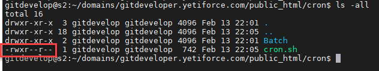
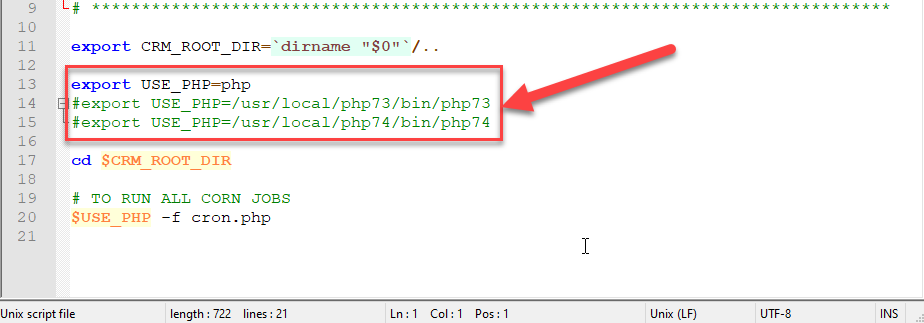
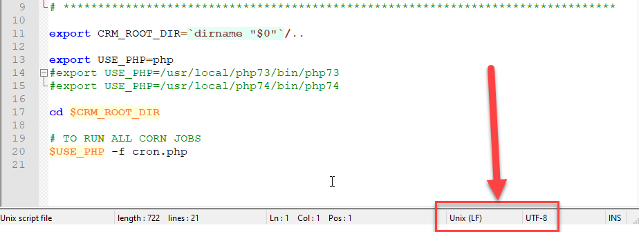

CRON is a Unix daemon that triggers other programs periodically. It uses CRONTAB tables to store information about what task to run. It allows YetiForce to perform certain tasks automatically by triggering them in the background.


## How to enable CRON?

CRON can be enabled in a few simple steps:

### Linux

#### Edit CRONTAB via command

```bash
crontab -u www-data -e
```

Add the following line:

```bash
*/2 * * * * sh __YETIFORCE_PATH__/cron/cron.sh > __YETIFORCE_PATH__/cache/logs/cron.log 2>&1
```

`__YETIFORCE_PATH__` is the full absolute path to the YetiForce system folder, e.g. /var/www/yetiforce.

:::note

If the above-mentioned method doesn't work on the Linux server distribution you are using, you can edit the /etc/crontab file directly or create a new /etc/cron.d/yetiforce file and add one of the following entries:

```bash
*/2 * * * * www-data sh __YETIFORCE_PATH__/cron/cron.sh > __YETIFORCE_PATH__/cache/logs/cron.log 2>&1
```

```bash
*/2 * * * * php __YETIFORCE_PATH__/cron.php > __YETIFORCE_PATH__/cache/logs/cron.log 2>&1
```

```bash
*/2 * * * * cd __YETIFORCE_PATH__; /usr/local/bin/php -f cron.php > __YETIFORCE_PATH__/cache/logs/cron.log 2>&1
```

:::

:::warning

- the script must be run by a user with the same permissions as the owner of the system files.
- only one CRON task for the YetiForce system can be added in CRONTAB.

:::

#### Permissions

Change file permissions for `__YETIFORCE_PATH__`/cron/cron.sh to `744`, so the only person permitted to execute it is its owner.



#### PHP path

Check that the PHP path settings in the `cron.sh` file are correct.

The `cron.sh` file is located at: `__YETIFORCE_PATH__`/cron/cron.sh. By default, it points to the alias name "php".

```bash
export USE_PHP=php
```

If the server has the correct version of PHP aliased, you don't need to do anything. You can verify this by running the following command:

```bash
php -v
```

If PHP is not aliased or the server has multiple versions of PHP installed, and you want to point to a specific one, set the exact path to PHP in the `cron.sh` file, e.g.:

```bash
export USE_PHP=/usr/local/php83/bin/php83
```

:::warning
Make sure the PHP path is correct as it may be different for different servers.
:::



Make sure the file has Unix line endings (LF).



### Windows

Due to the lack of official support, it is not recommended to use Windows as a server for YetiForce.

### Alternative ways to trigger YetiForce scheduler tasks (not recommended)

#### In case CRON is missing on Linux server

If your Linux server doesn't support CRON, you can alternatively run scheduled tasks via a URL.

```text
https://`YETIFORCE_URL`/cron.php?app_key=xxxx
```

#### In case of problems with triggering CRON from the CLI

If your Linux server supports CRON, but there is a problem with the `cron.sh` script, you can add one of the following example call configurations to CRONTAB:

```bash
*/2 * * * * curl -s https://YETIFORCE_URL/cron.php?app_key=xxxx
```

or

```bash
*/2 * * * * /usr/bin/lynx -source https://YETIFORCE_URL/cron.php?app_key=xxxx
```

or

```bash
*/2 * * * * /usr/bin/wget -O - -q -t 1 https://YETIFORCE_URL/cron.php?app_key=xxxx
```

`app_key` is a key in the `config/Main.php` file, in the `$application_unique_key` variable.


