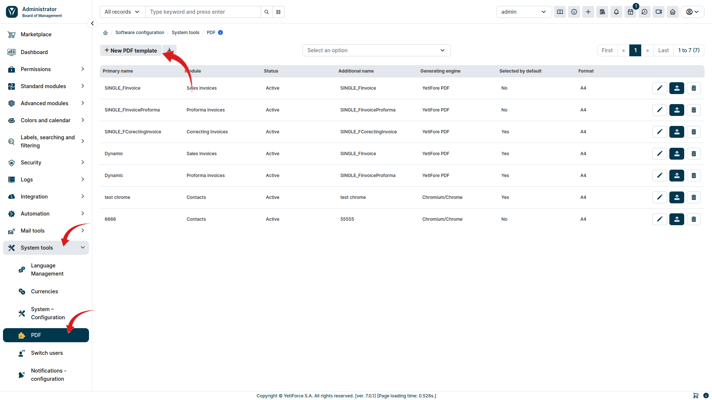
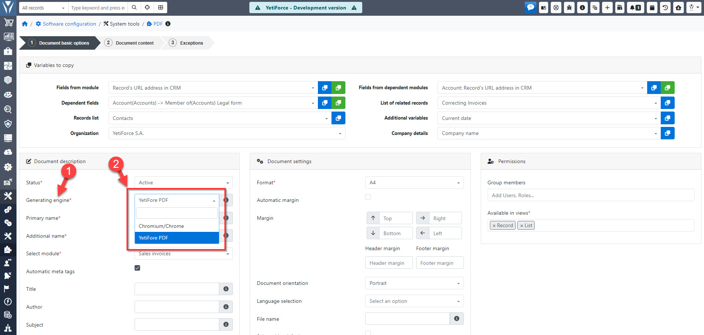

:::tip

For the PDF Premium add-on to function properly, you must purchase the paid add-on **YetiForce PDF Premium**.

You can find instructions on how to do this here: [YetiForce PDF Premium activation instructions](/administrator-guides/marketplace/addons/YetiForce-pdf-premium/)

:::

Chromium/Chrome must be installed on the server where the YetiForce system is located in order for the add-on to work properly. This engine enables advanced PDF rendering, ensuring high quality documents and full compatibility with system features.

### Download Chromium/Chrome

The Chromium engine should be downloaded from the project's official website linked below. It also contains helpful information, instructions, and links to the latest versions of the Chromium browser.

- Chromium - https://www.chromium.org/getting-involved/download-chromium/

### Configuring the PDF generator path

To ensure proper PDF document generation in YetiForce, it is necessary to configure the path to the PDF generator. This process involves modifying the configuration file and setting the appropriate path to the Chromium/Chrome engine. Below is a detailed instruction on how to do this.

#### Configuration file location

The configuration file responsible for the PDF generator settings is located in the **config/Components/** directory and is named **Pdf.php**.

PDF configuration file: [config/Components/Pdf.php](https://doc.yetiforce.com/code/classes/Config-Components-Pdf.html)

#### Setting the path to the PDF generator

In the **Pdf.php** file, find the **[$chromiumBinaryPath](https://doc.yetiforce.com/code/classes/Config-Components-Pdf.html#property_chromiumBinaryPath)** parameter and set its value to the local path to the installed Chromium/Chrome engine, or specify a command that starts this engine.

```php
/**
 * Configuration file: Config\Components\Pdf.
 */
class Pdf
{
	/**
	 * The name or path of the chrome/chromium engine.
	 *
	 * @see https://www.chromium.org/getting-involved/download-chromium
	 *
	 * @var string
	 */
	public static $chromiumBinaryPath = 'chromium';

	/**
	 * Chromium browser options available for the browser factory.
	 *
	 * @see https://github.com/chrome-php/chrome#available-options
	 *
	 * @var array
	 */
	public static $chromiumBrowserOptions = ['noSandbox' => true, 'noProxyServer' => true];
}
```

#### Example `$chromiumBinaryPath` values:

- chromium
- chromium-browser
- google-chrome
- /usr/bin/google-chrome
- c:\Program Files (x86)\Google\Chrome\Application\chrome.exe
- c:\ungoogled-chromium\chrome.exe

### Select new engine

In the administration section, go to the `System Tools` tab in the left menu, then `PDF`. To verify that the Chromium/Chrome engine is configured correctly, select the <kbd>New PDF Template</kbd> button.



Once `$chromiumBinaryPath` is set correctly and the system has access to the location/command, the new engine will appear in the `Engine` field.



### Installing Chromium on Linux Using a Bash Script

First, make sure your system has all the required dependencies installed. Thanks [Puppeteer](https://github.com/puppeteer/puppeteer/blob/main/docs/troubleshooting.md#chrome-headless-doesnt-launch-on-unix) ❤

The list of required packages may vary depending on the distribution and system version. Therefore, it is necessary to verify the necessary dependencies for your own system, and this list can help: [List of dependencies by version](https://source.chromium.org/chromium/chromium/src/+/main:chrome/installer/linux/debian/dist_package_versions.json)

Example command to install dependencies for `Debian 12.4 bookworm` system

```bash
apt-get install -y --no-install-recommends libnss3-tools libatk1.0-0 libatk-bridge2.0-0 libdrm-dev libxkbcommon-dev libxcomposite1 libxdamage1 libxfixes3 libxrandr2 libgbm-dev libasound2 libcups2 libpango-1.0-0 libcairo2
```

If your system is on a Linux-based server, you can easily download Chrome/Chromium using a bash script.

Execute the script below which will download the latest version of Chromium/Chrome and place it ready to work on your server in the `./latest` location

```bash
#! /bin/bash

cd $(dirname $0)

LASTCHANGE_URL="https://www.googleapis.com/download/storage/v1/b/chromium-browser-snapshots/o/Linux_x64%2FLAST_CHANGE?alt=media"

REVISION=$(curl -s -S $LASTCHANGE_URL)

echo "latest revision is $REVISION"

if [ -d $REVISION ] ; then
  echo "already have latest version"
  exit
fi

ZIP_URL="https://www.googleapis.com/download/storage/v1/b/chromium-browser-snapshots/o/Linux_x64%2F$REVISION%2Fchrome-linux.zip?alt=media"

ZIP_FILE="${REVISION}-chrome-linux.zip"

echo "fetching $ZIP_URL"

rm -rf $REVISION
mkdir $REVISION
pushd $REVISION
curl -# $ZIP_URL > $ZIP_FILE
echo "unzipping.."
unzip $ZIP_FILE
popd
rm -f ./latest
find chromium/* -type d -ctime +1 -exec rm -rf {} \;
ln -s $REVISION/chrome-linux/ ./latest
```

<details>
<summary>Troubleshooting</summary>

- [#290](https://github.com/puppeteer/puppeteer/issues/290) - Debian <br/>
- [#391](https://github.com/puppeteer/puppeteer/issues/391) - CentOS <br/>
- [#379](https://github.com/puppeteer/puppeteer/issues/379) - Alpine <br/>

</details>
