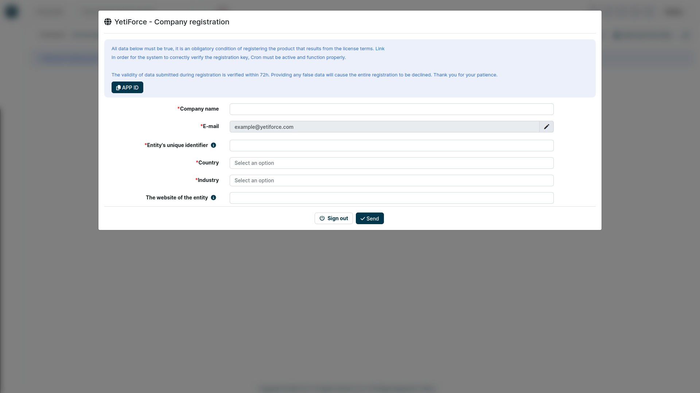
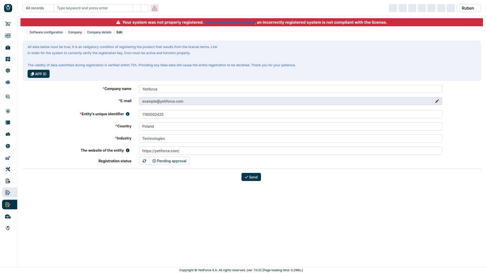
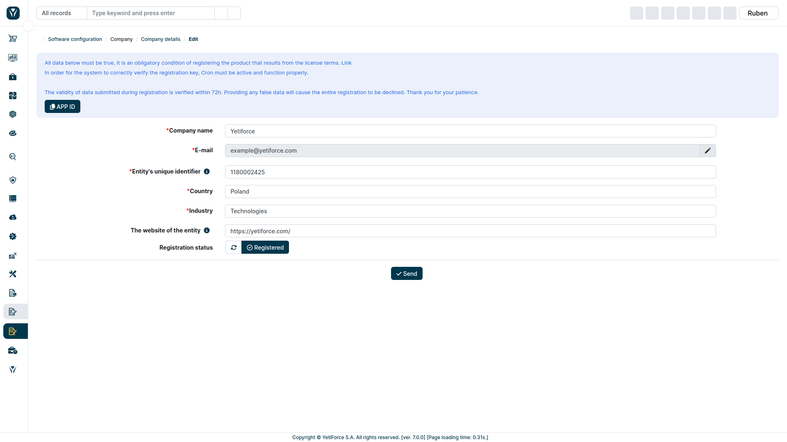
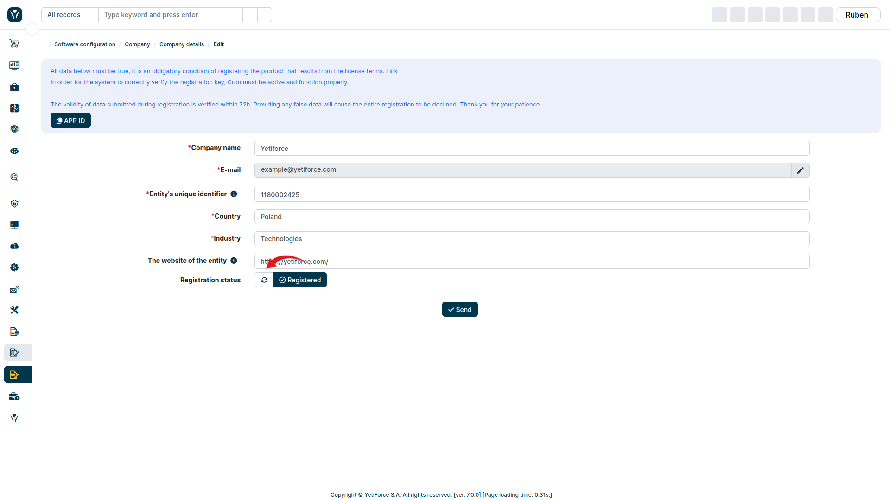
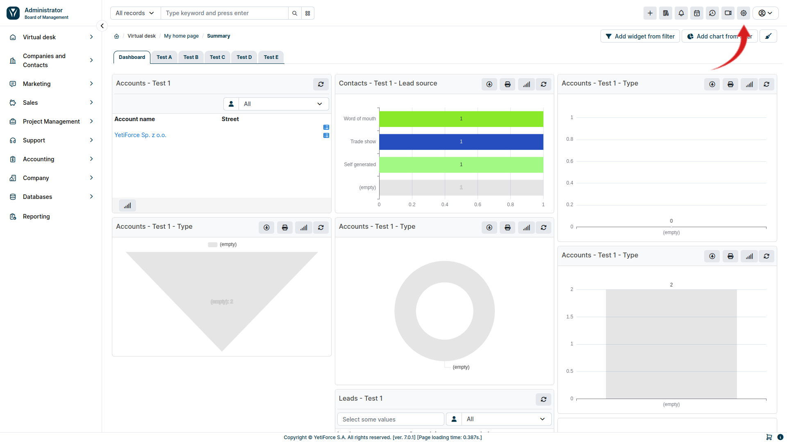
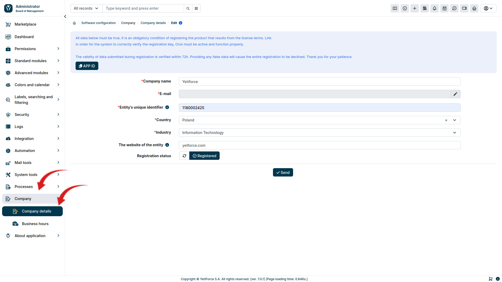

[The YetiForce License](/introduction/license-open-source) requires the YetiForce system to be registered. Registration is also necessary if you want to purchase products or services from the Marketplace.

## How to register YetiForce?

The registration process is the last step of the installation of the YetiForce software that was described in the [YetiForce installation](/introduction/installation-manual) article.

Fill out the registration form with real and true data relevant to your company; all fields marked with red asterisks are mandatory. Providing fake information will cause the registration to be rejected.

### Form fields

#### Company name

- Provide the full name of your company. In case of private individuals, please enter your first and last name

#### E-mail

- Field populated by default with the email provided during registration

#### Entity's unique identifier

- In case of companies, provide unique tax identifier applicable in your country, for example VAT ID.

#### Country

- The country where your company operates

#### Branża

- Select the industry from the list

#### Website

- Enter the entity's website or a personal website.

:::tip

**DO NOT enter the URL where your YetiForce is installed!**

:::

Once you send the form, please wait for the system to be registered.

:::warning
Klucze rejestracyjne generowane są automatycznie i wysyłane na adres email podany podczas rejestracji. W przypadku podania nieprawidłowych informacji, rejestracja zostanie odrzucona.
:::

If the data is valid, the registration will be accepted. Wówczas w polu **status rejestracji** pojawi się wartość **zarejestrowano** a na górze zniknie czerwony komunikat o braku rejestracji.

## Check status

Jeśli status rejestracji nie został automatycznie zaktualizowany, można odświeżyć go ręcznie za pomocą przycisku <kbd><i className="fas fa-refresh"></i></kbd>, który znajduje się na formularzu rejestracji w kolumnie **status rejestracji**

## Incorrect registration

If the data provided during registration is incorrect, the registration will be declined. In this case, in order to register your system, you have to correct the data in the form and send it once again.
W tym celu, przejdź do konfiguracji systemu za pomocą kółka zębatego <kbd><i className="ti ti-settings"></i></kbd> widocznego w prawym górnym rogu ekranu.

In the menu panel on the left, select `Company` and then `Company details`. Correct the data and send the form once again.

:::warning
Każdorazowa zmiana danych w formularzu, automatycznie zmieni status rejestracji na "**oczekuje na akceptację**" i będzie wymagana ponowna weryfikacja wprowadzonych danych.
:::

The data entered in the form will be sent to us for verification. The verification may take up to 2 business days.
