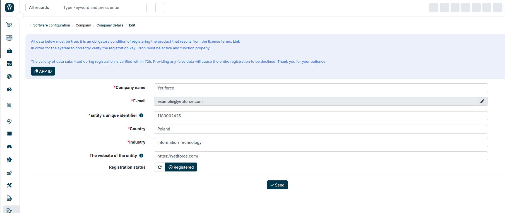

The following article will help you if you have problems with confirming the registration, or your registration status is stuck at `Pending approval`.

If the status has not changed a few days after registration, please follow the steps below:

## Update the registration status

Przejdź do ustawień aplikacji, w panelu menu po lewej stronie wybierz "Firma" a następnie "Dane firmy".

Kliknij przycisk "Sprawdź status". Click the `Check status` button, on the right side the time of the last update should change to `a moment ago`.

If the time does not change, please go to point 2.

## If nothing changes during status check, make sure your server has the correct configuration

To do this, go to [`System configuration → Logs → Server - configuration`](/administrator-guides/logs/server-configuration/)

The most common cause of errors in the system and registration is incorrect server configuration. You can find more information about server configuration in [this article](/introduction/requirements/).

## Check logs

If there is any error while checking the registration status, it will definitely be visible in the system or PHP or FPM, or web server logs.

Run verbose logs in system as described in the [Debugging article](/developer-guides/debug).

## Your app id has changed

Sometimes changes are made on the server after registration, which changes the [APP ID](/administrator-guides/app-id/) of the system.

For this reason, the system cannot retrieve up-to-date information, because the ID is different from the one that was provided during registration and the new ID does not exist in the database.

In this case, re-registration is required; please go the [`System settings → Company → Company`](/administrator-guides/company/company-details/#registration)

## Check your firewall

Check if your firewall is not blocking outgoing traffic to the following address:

- api.yetiforce.com (YetiForce versions < 6.5)
- api.yetiforce.eu (YetiForce versions >= 6.5)

These addresses are used for system registration and marketplace purchases.

## Jeśli problemy nadal występują - napisz do nas

:::warning

Please click the `check registration status` button **BEFORE SENDING US A MESSAGE** because all registrations are verified manually.

:::

If you have a problem with registration and this article did not help you solve the problem, send a message to hello@yetiforce.com with the following information:

- [APP ID](/administrator-guides/app-id/)
- [CRM logs](/developer-guides/debug)
- [PHP logs](/developer-guides/debug#php-logs)
- web server logs
- FPM login (optional)
