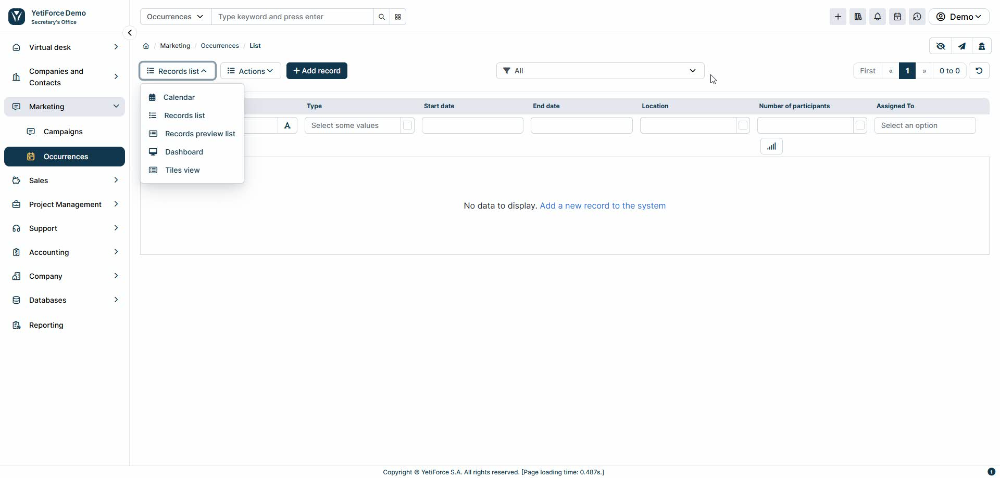
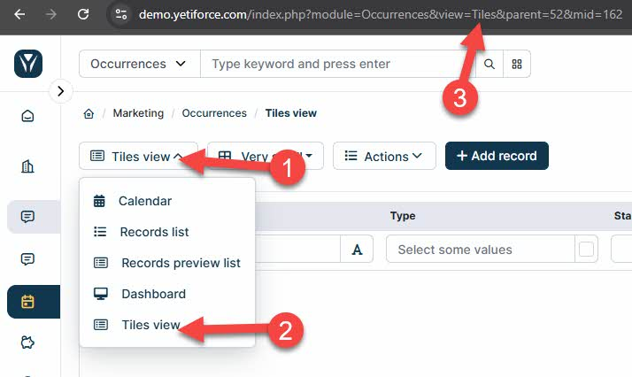

## Introduction

This guide explains step-by-step the process of changing the default view of a module in the YetiForce system. This function allows you to adjust the module layout to match your preferences and work comfort.



:::tip

The guide uses the “Occurrences” module as an example, but you can follow the same steps for any other module in YetiForce.

:::

## Find the system name of the module

In order to change the view, you first have to check the system name of the module you want to modify. The name can be found in the address bar, in the `module` parameter. For example:

`https://demo.yetiforce.com/index.php?module=Occurrences&view=List&mid=162&parent=52`

In this case, the system name of the module is **Occurrences**.

## Change the default view — step-by-step instructions

1. **Create a configuration file (if it doesn't already exist)**

  - Go to `config/Modules/` on the server where YetiForce is installed.
  - Create a new file (if it doesn't already exist) with a name corresponding to the system name of the module, eg. `Occurrences.php` for the Occurrences module.

2. **Paste the code below into the file**
  - Copy and paste the code below, adapting the class name to your chosen module:

```php
<?php

namespace Config\Modules;

class Occurrences
{
	public static $defaultViewName = 'Tiles';
}

```

3. **Save the file**

  - Once you save the file, the default view for the module will be changed to the one you selected.

4. Rebuild the menu

  - Aby zmiany zostały w pełni uwzględnione, konieczne jest [przebudowanie menu](/administrator-guides/standard-modules/menu/#odświeżanie-menu-w-systemie) w YetiForce, szczególnie dla pozycji menu powiązanych ze zmienionym modułem.

## Available views

In order to check the views available for each module, follow these steps:

- Open the module in the YetiForce system.
- Click the view selection button in the upper left corner of the list.
- In the drop-down menu you can find all available views.
- The `view` parameter together with the name of the module, e. g. `Tiles`, `List`, will be displayed in the URL.



## List of basic views

- **List** – [List view, displays data in table form.](/user-guides/interface-guide/list-view/)
- **ListPreview** – List view with preview, allowing for quick insight into record details.
- **DashBoard** – Dashboard view for quick access to the most important information.
- **Tiles** – Tile view, perfect for data visualization.
- **Calendar** – [Calendar view, useful for managing events and appointments.](/user-guides/interface-guide/calendar-view/)
- **Kanban** – [Kanban view, allows you to manage tasks in the form of cards.](/user-guides/interface-guide/kanban-view/)

:::warning

Each module may have a different list of available views

:::

## Additional tips

- If you don't have access to the configuration files, contact your system administrator.
- Changing the view will not affect the system security or behavior of other modules.
- You can switch back to the previous default view at any time by editing the configuration file.
