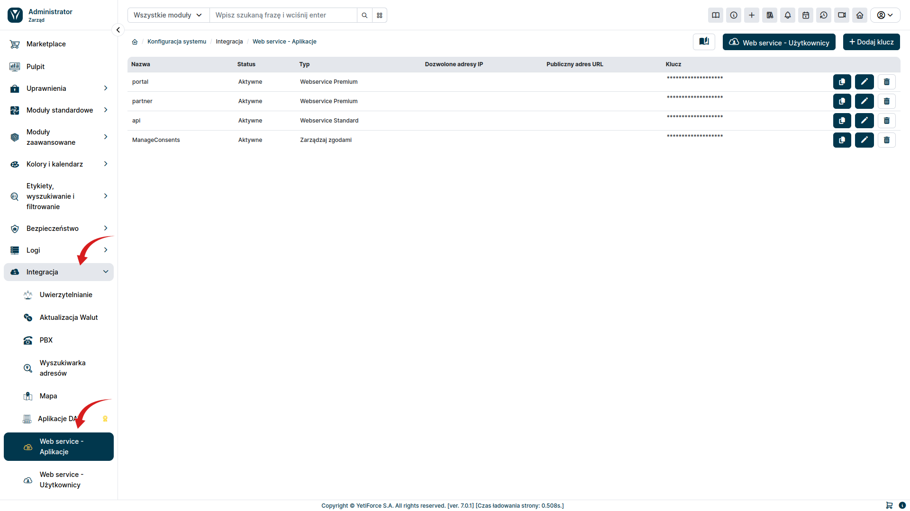
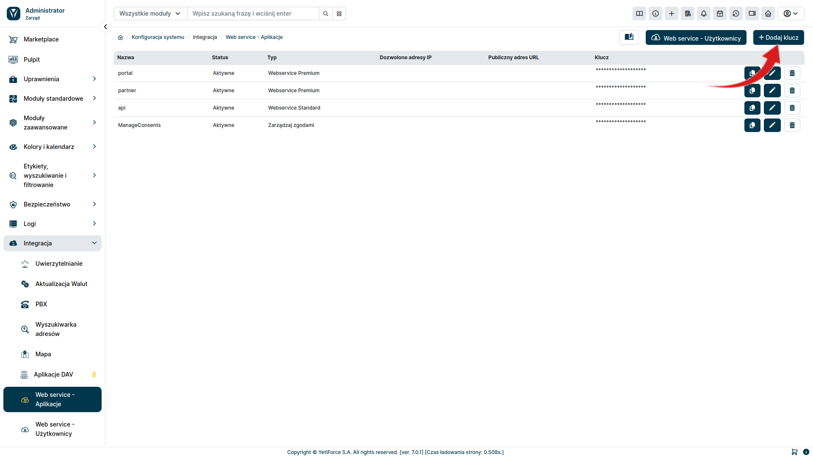
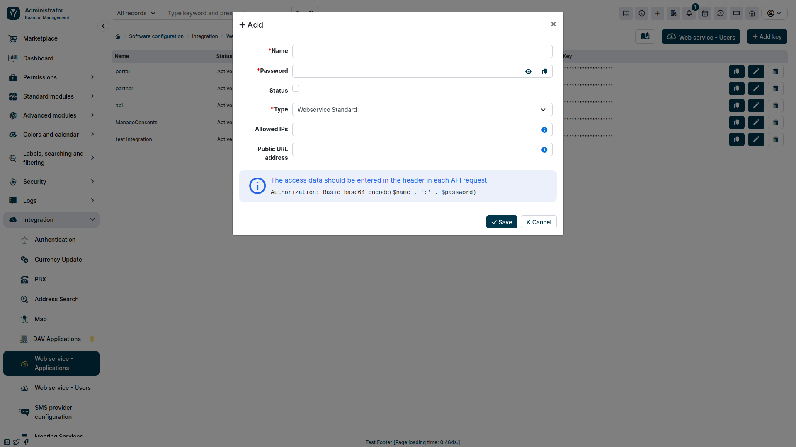
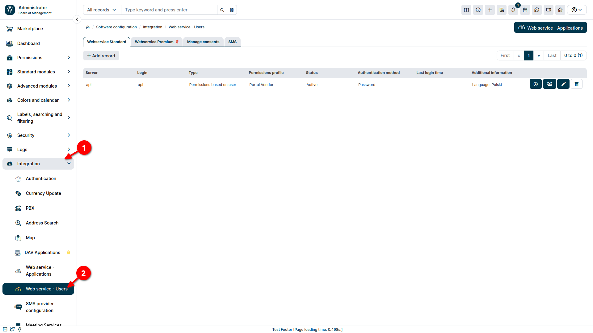
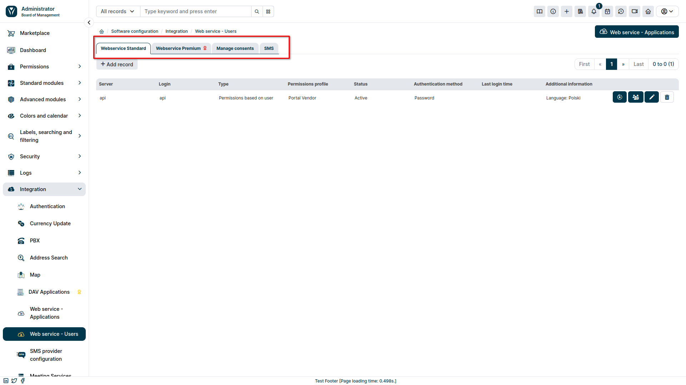
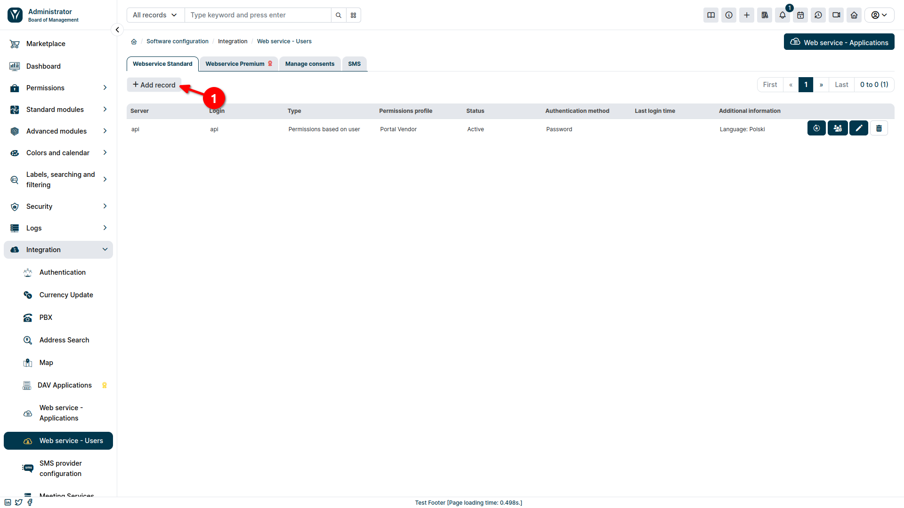
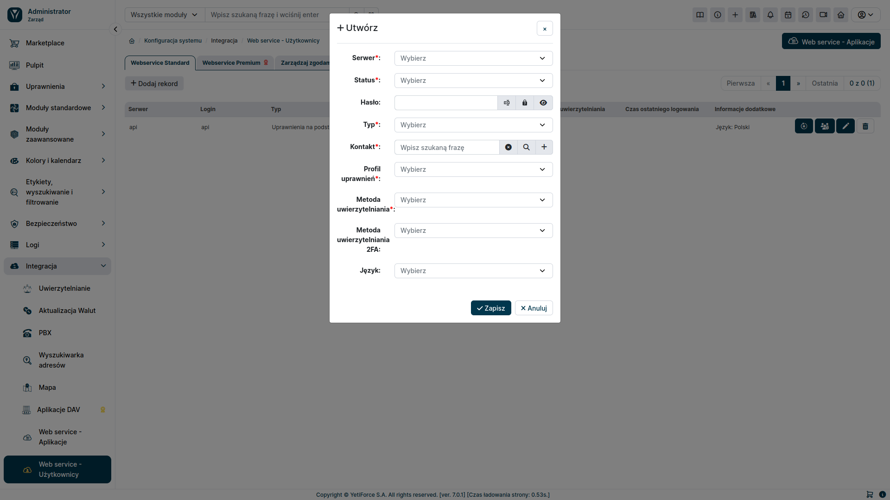

## Konfiguracja

W celu skonfigurowania połączenie API, należy najpierw wygenerować klucz API oraz utworzyć użytkownika do autoryzacji.

### Generowanie API Key

Pierwszym krokiem w celu podłączenia się do API, jest wygenerowanie `API Key`. W tym celu, w sekcji administracyjnej należy wybrać w lewym menu ```Integracja``` a następnie ```Web service - Alikacje```.



W celu dodania nowego API Key, wybieramy ```Dodaj klucz``` z prawej górnej strony.



Pojawi nam się okno dodawania nowego API Key:



#### Nazwa
- dowolna nazwa, pozwlająca nam zidentyfikować dodany API Key 

#### Hasło
- ciąg znaków wykorzystywany do uwierzytelniania

#### Status
- odznaczenie checkboxa, spowoduje, że API Key nie będzie aktywne

#### Typ
- określa jakich funkcjonalności będzie dotyczył API Key

#### Dozwolone adresy IP
- Pusta wartość - dostęp ze wszystkich serwerów.
  Jeśli adresy IP zostaną wprowadzone (po przecinku), to dostęp do API będzie dozwolony tylko z tych adresów IP.
  Przykład: x.x.x.x , y.y.y.y

#### Publiczny adres URL
- Adres URL będzie używany do wysyłania powiadomień mailowych gdzie w treści będzie można używać adresu URL np. reset hasła w Portalu Klienta, link do podglądu rekordu w Portalu Klienta


### Utworzenie użytkownika

Kolejnym krokiem jest utworzenie danych walidacyjnych do API. W tym celu w sekcji administracyjnej z lewym menu wybieramy ```Integracja ➞ Web service - Użytkownicy```.



Użytkownika będziemy dodawać dla konkretnego rodzaju usługi, dlatego w pierwszej kolejności wybieramy odpowiednią zakładkę.



W celu dodania nowego użytkownika, wybieramy przycisk <kbd>Dodaj rekord</kbd>. Pojawi się nam wówczas okno modalne, w którym będziemy mogli skonfigurować dostępy.





#### Serwer
- wybieramy, API Key, który będzie powiązany z tworzonym użytkownikiem

#### Status
- określamy, czy dany użytkownik jest aktywny

#### Hasło
- ciąg znaków wykorzystywany do autoryzacji

#### Typ
- podstawa uprawień do rekordów

#### Kontakt
- opcjonalny w zależności od wybranego ```Typu``` uprawień do rekordów

#### Profil uprawnień
- użytkownik, na którym bazują uprawnienia do akcji i danych

#### Metoda uwierzytelniania i Metoda uwierzytelniania 2FA
- określa szczegóły odnośnie uwierzytelniania użytkownika

Po utworzeniu API Key i użytkownika, możemy przystąpić do nawiązania połączenia przez API. Jak to zrobić zostało opisane w tym artykule: [Pierwsze połączenie API](/developer-guides/api/first-connect)