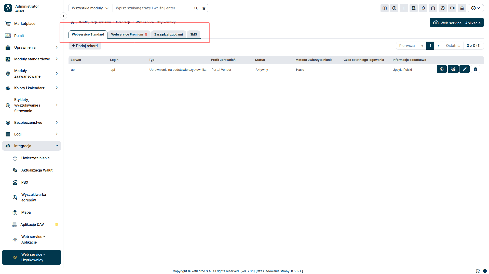

## Configuration

To configure an API connection, you must first generate an API key and create a user for authorization.

### Generate API Key

The first step to connect to the API is to generate an `API Key`. To do this, in the administration section, select `Integration` in the left menu and then `Web service - Applications`.

To add a new API Key, select `Add Key` from the top right.

A popup window will appear where you can add a new API Key:

#### Name

- any name that allows us to identify the added API Key

#### Password

- string of characters used for authentication

#### Status

- leaving this checkbox unticked will cause the API to be inactive

#### Type

- determines what functionalities the API Key will cover

#### Allowed IPs

- Empty value - access from all servers.
  If IP addresses are entered (after a comma), then API access will be allowed only from these IP addresses.
  Example: x.x.x.x , y.y.y.y

#### Public URL address

- The URL will be used to send email notifications where the URL address can be used in the content, e.g., password reset in the Customer Portal, link to view the record in the Customer Portal

### Create user

The next step is to create validation data for the API. To do this, in the administration section from the left menu, select `Integration ➞ Web service - Users`.

The user will be added for a specific type of service, so first select the relevant tab.

To add a new user, select the <kbd>Add record</kbd> button. A popup window will then appear, where you can configure credentials.

#### Server

- choose the API Key that will be associated with the new user

#### Status

- defines if the user is active

#### Password

- string of characters used for authentication

#### Type

- basis for record permissions

#### Contact

- optional depending on the selected `Type` of record permissions

#### Permission profile

- permissions for actions and data are based on the selected user

#### Authentication Method and 2FA Authentication Method

- specifies the details for user authentication

After creating the API Key and user, you can start connecting via API. How to do that is described in this article: [First API Connection](/developer-guides/api/first-connect)
