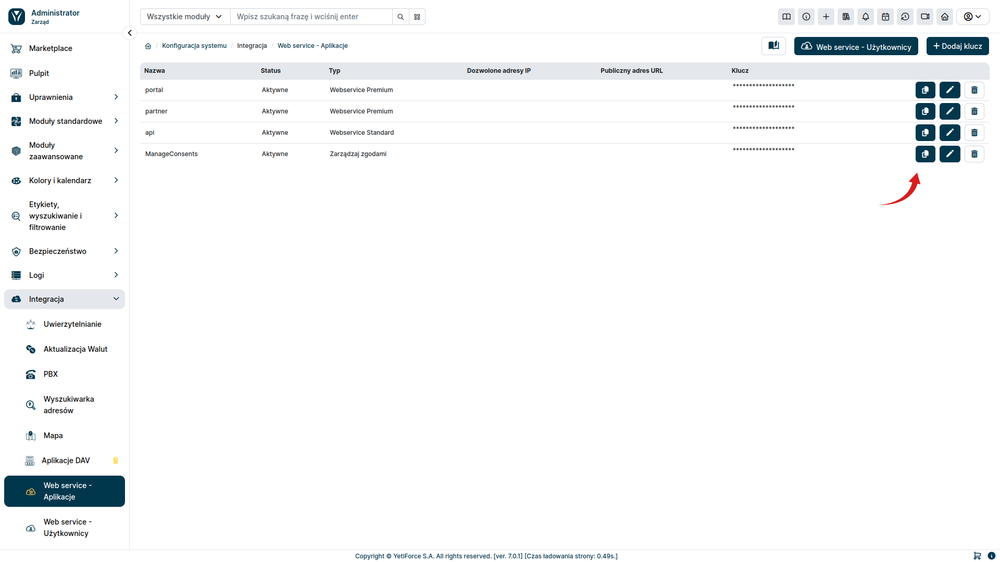

Once you have the API key and credentials properly configured (according to the [configuration](/developer-guides/api/config) instructions), you can establish a connection. To retrieve data from the server, you must first obtain an authentication token. The instructions below explain how to do this.

## Obtain an Authentication Token

To obtain a token, send a request to your server at the following address:

You can use `Postman` to test this process. The following screenshots will guide you step by step how to do it.

First, you will need the `API Key` value. To download it, in the administration section, select `Integration ➞ Web service - applications` from the left menu, select the relevant key, and click the <kbd><i class="fa-solid fa-copy"></i></kbd> button to copy its value.

In `Postman` add the `X-API-KEY` header. Instead of the `{{APi-KEY}}` value enter the API Key value copied from the YetiForce system.

Then enter the credentials, according to the screenshot below. Instead of the `{{URL}}` variable, provide the address of your YetiForce platform. Enter the `userName` and `password` credentials according to the values ​​set in the administration section in the `Integration ➞ Web service - users` tab.

You will receive the `token` parameter as feedback, which you will pass in subsequent requests.

## Next requests

Once you get the `token` value, you can proceed to query the API for the relevant data. To do this, add the `x-token` header with the value of the obtained token to subsequent requests.

Depending on whether you have purchased the `WebService Premium` service or use `WebService Standard`, you will have a different range of available endpoints at your disposal.

### List of Endpoints for services

- [Webservice Standard](/developer-guides/api/WebserviceStandard)
- [Webservice Premium](/developer-guides/api/WebservicePremium)
- [Manage consents](/developer-guides/api/ManageConsents)
- [PBX](/developer-guides/api/PBX)
- [SMS](/developer-guides/api/SMS)
- [Token](/developer-guides/api/Token)
